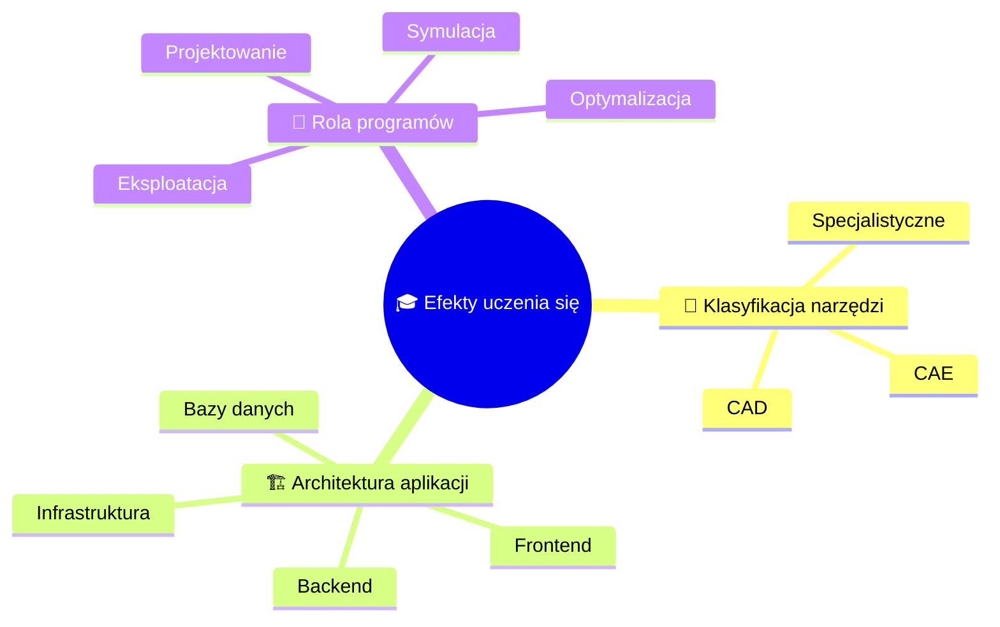

# Prompt 05: Lecture Content Creation

## Context
With the folder structure in place, create actual lecture content with a consistent format optimized for both student learning and instructor presentation.

## Task
Develop lecture slides and materials using MDX format with embedded instructor notes, interactive elements, and clear learning progression.

## Lecture Structure Template

Each lecture folder should contain:
- `index.md` - Lecture overview and navigation
- `01-[topic].mdx` - Individual slide sections
- `02-[topic].mdx` - Continuing content
- Supporting files (images, PDFs, etc.)

### 1. Lecture Index File Template (`index.md`)

```markdown
---
sidebar_position: [X]
title: "Lecture [X]: [Topic Name]"
---

# Lecture [X]: [Main Topic]

## 📋 Overview

Brief description of what this lecture covers and why it's important.

**Duration**: [X] minutes  
**Difficulty**: [Beginner/Intermediate/Advanced]

## 🎯 Learning Objectives

After completing this lecture, students will be able to:

1. [Specific, measurable objective 1]
2. [Specific, measurable objective 2]
3. [Specific, measurable objective 3]
4. [Specific, measurable objective 4]

## 📚 Topics Covered

1. [**Introduction**](./01-introduction) - Overview and context
2. [**Core Concepts**](./02-core-concepts) - Main theoretical content
3. [**Practical Applications**](./03-applications) - Real-world examples
4. [**Tools and Software**](./04-tools) - Technical implementation
5. [**Summary and Review**](./05-summary) - Key takeaways

## 📖 Required Reading

- [Resource 1]
- [Resource 2]

## 🔧 Required Tools

- [Tool/Software 1]
- [Tool/Software 2]

## 💡 Preparation

Before this lecture:
- [ ] Complete previous lecture exercises
- [ ] Install required software
- [ ] Review prerequisite concepts

## 📝 Assessment

- Quiz: [Link if applicable]
- Homework: [Link if applicable]
- Lab exercise: [Link if applicable]
```

### 2. Individual Slide Section Template (`01-[topic].mdx`)

**ACTUAL IMPLEMENTATION FORMAT** (tested and working):

```mdx
---
title: "Wprowadzenie do tematyki"
---

import { 
  SlideContainer, 
  Slide, 
  KeyPoints, 
  SupportingDetails, 
  InfoBox,
  InstructorNotes,
  VisualSeparator 
} from '@site/src/components/SlideComponents';

<SlideContainer>

<Slide title="🎓 Wprowadzenie do tematyki" type="info">

<KeyPoints title="🌱 Witamy na wykładzie!">

**🎯 Cel kursu:**
- **Klasyfikacja i architektura** narzędzi programowych
- **Systemy fotowoltaiczne** - PV*SOL, Sunny Design, PVsyst
- **Systemy solarne termiczne** - T-SOL i procesy modelowania
- **Pompy ciepła** - GeoT-SOL i systemy geotermalne
- **Energia wiatrowa** - QBlade, TOPFARM, farmy wiatrowe
- **Technologie przyszłości** - IoT, AI, digital twins

</KeyPoints>

<InstructorNotes>
**Szanowni Państwo, witam na pierwszym wykładzie kursu. Ten cykl zajęć pokaże, jak nowoczesne narzędzia informatyczne wspierają każdy etap projektowania – od koncepcji po eksploatację.**

**🎯 Kontekst wykładu:**
- Jesteśmy w erze cyfryzacji energetyki, gdzie tradycyjne metody projektowania są zastępowane przez zaawansowane narzędzia komputerowe
- Projektant OZE musi dziś być nie tylko inżynierem, ale także specjalistą od narzędzi IT
- Współczesne projekty OZE wymagają integracji wielu systemów

**🔧 Kluczowe wyzwania:**
- **Złożoność techniczna**: Nowoczesne instalacje OZE to systemy wielodyscyplinarne
- **Dynamika rynku**: Szybki rozwój technologii wymaga ciągłego aktualizowania wiedzy
- **Wymagania prawne**: Coraz bardziej restrykcyjne normy wymagają precyzyjnych analiz

**💡 Praktyczne podejście:**
- Każde narzędzie omówimy w kontekście rzeczywistych projektów
- Pokażemy przykłady z branży i studia przypadków
</InstructorNotes>

</Slide>

<VisualSeparator type="default" />

<Slide title="🎯 Efekty uczenia się" type="tip">

<KeyPoints title="📚 Po wykładzie student potrafi:">



</KeyPoints>

<InstructorNotes>
**Efekty uczenia się:**

**🔧 Klasyfikacja narzędzi:**
- **CAD (Computer-Aided Design)** - modelowanie geometryczne, dokumentacja techniczna
  - *Przykłady:* AutoCAD, SolidWorks, SketchUp, Revit
- **CAE (Computer-Aided Engineering)** - obliczenia wytrzymałościowe, symulacje fizyczne
  - *Przykłady:* ANSYS, COMSOL, MATLAB/Simulink
- **Specjalistyczne** - branżowe oprogramowanie dedykowane dla OZE

**🎯 Rola programów w procesie:**
- **Projektowanie** - od koncepcji do dokumentacji wykonawczej
- **Symulacja** - modelowanie wydajności, prognozy produkcji
- **Optymalizacja** - algorytmy optymalizacyjne, analizy ekonomiczne
- **Eksploatacja** - monitoring, utrzymanie predykcyjne
</InstructorNotes>

</Slide>

<VisualSeparator type="default" />

<Slide title="⚡ Dlaczego to ważne?" type="note">

<SupportingDetails title="🌐 Środowisko wielodyscyplinarne">

**🔧 Środowisko wielodiscyplinarne:**
- **Elektrotechnika** - układy elektryczne, falowniki
- **Mechanika** - konstrukcje nośne, wytrzymałość
- **Meteorologia** - zasoby wiatrowe i słoneczne
- **Ekonomia** - analizy finansowe, LCOE
- **Informatyka** - narzędzia IT, bazy danych

**📈 Korzyści z właściwego doboru narzędzi:**
- ⏱️ **Skrócenie czasu** projektowania
- ❌ **Ograniczenie błędów** projektowych
- ✅ **Wiarygodne wyniki** analiz

</SupportingDetails>

<InstructorNotes>
**Dlaczego to ważne?**

**⚡ Korzyści z właściwego doboru narzędzi:**
- **Czas projektu**: Skrócenie czasu projektowania z miesięcy do tygodni
- **Jakość wyników**: Ograniczenie ryzyka błędów projektowych
- **Wiarygodność**: Uzyskanie wiarygodnych wyników energetycznych i ekonomicznych
- **Konkurencyjność**: Szybsze i tańsze projekty = przewaga na rynku

**🎯 Praktyczne przykłady:**
- **Błędny dobór narzędzia** → nieprawidłowe wymiary → problemy montażowe
- **Nieodpowiednia symulacja** → zawyżone prognozy → rozczarowanie inwestora
- **Brak analizy ekonomicznej** → nieoptymalne rozwiązania → niższa rentowność
</InstructorNotes>

</Slide>

</SlideContainer>
```

**Key Features of This Approach:**

1. **Component-Based Structure** - Uses custom React components for consistent styling
2. **SlideContainer** - Wraps all slides in a container
3. **Slide Component** - Each major topic is a slide with type (`info`, `tip`, `warning`, `note`)
4. **KeyPoints** - Highlight main learning content
5. **InstructorNotes** - Collapsible detailed notes for teaching (CRITICAL!)
6. **VisualSeparator** - Clean transitions between slides
7. **Mermaid Diagrams** - Embedded directly in MDX
8. **Polish Language** - Default labels support multilingual courses

## Content Creation Best Practices

### 1. Slide Design Principles
- **One main idea per slide**
- **5-7 bullet points maximum**
- **Clear visual hierarchy**
- **Consistent formatting**

### 2. Instructor Notes Guidelines
- Keep detailed for substitute instructors
- Include timing estimates
- Note common student misconceptions
- Provide backup examples
- Reference additional resources

### 3. Interactive Elements
Use Docusaurus admonitions:
- `:::tip` - Key learning points
- `:::info` - Additional information
- `:::caution` - Warnings or challenges
- `:::note` - Side notes
- `:::danger` - Critical information

### 4. Code Examples
- Always include comments
- Use realistic examples
- Show both correct and incorrect approaches
- Explain output/results

### 5. Visual Content
- Use diagrams for complex concepts
- Include screenshots of software
- Add charts for data visualization
- Ensure all images have alt text

## Required Content for Each Lecture

1. **Introduction** (5-10% of content)
   - Context and motivation
   - Connection to previous lectures
   - Preview of topics

2. **Core Content** (60-70% of content)
   - Theoretical foundations
   - Key concepts and definitions
   - Examples and demonstrations

3. **Practical Applications** (15-20% of content)
   - Real-world use cases
   - Tool demonstrations
   - Hands-on exercises

4. **Summary** (5-10% of content)
   - Review of key points
   - Connections to future topics
   - Assessment preparation

### Example: Monitoring Systems Lecture Content

**Lecture 3: PLC/SCADA/OPC UA and IIoT**

1. **Introduction** (10 min)
   - Why industrial protocols matter in OZE
   - Evolution from proprietary to open standards
   - Connection to previous lecture on sensors

2. **Core Content** (60 min)
   - SCADA topologies and architectures
   - OPC UA servers and information models
   - Modbus/TCP protocol basics
   - MQTT publish-subscribe pattern
   - REST/GraphQL for integration
   - Edge gateways and buffering
   - Tags, namespaces, roles, permissions
   - Redundancy and high availability

3. **Practical Applications** (20 min)
   - Demo: Setting up OPC UA connection
   - Example: MQTT broker for PV farm
   - Case study: Edge computing for wind farm
   - Tool demonstration: Node-RED for protocol bridging

4. **Summary** (10 min)
   - Protocol selection criteria
   - Best practices for OZE monitoring
   - Preview: Integration with energy management systems
   - Lab exercise preparation

## Validation Checklist

- [ ] Each lecture has clear learning objectives
- [ ] Content progresses logically
- [ ] Examples are relevant and clear
- [ ] Instructor notes are comprehensive
- [ ] Interactive elements included
- [ ] All images load correctly
- [ ] Code examples are tested
- [ ] Links to resources work
- [ ] Slides are properly numbered
- [ ] Summary captures key points

## Next Steps
Proceed to Prompt 06 to set up visual assets and media files.
