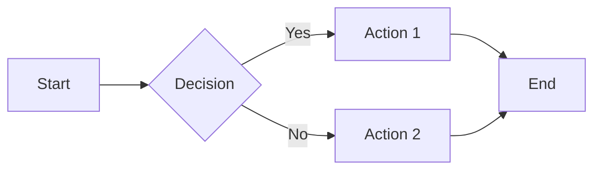
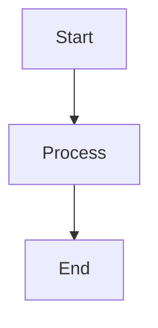
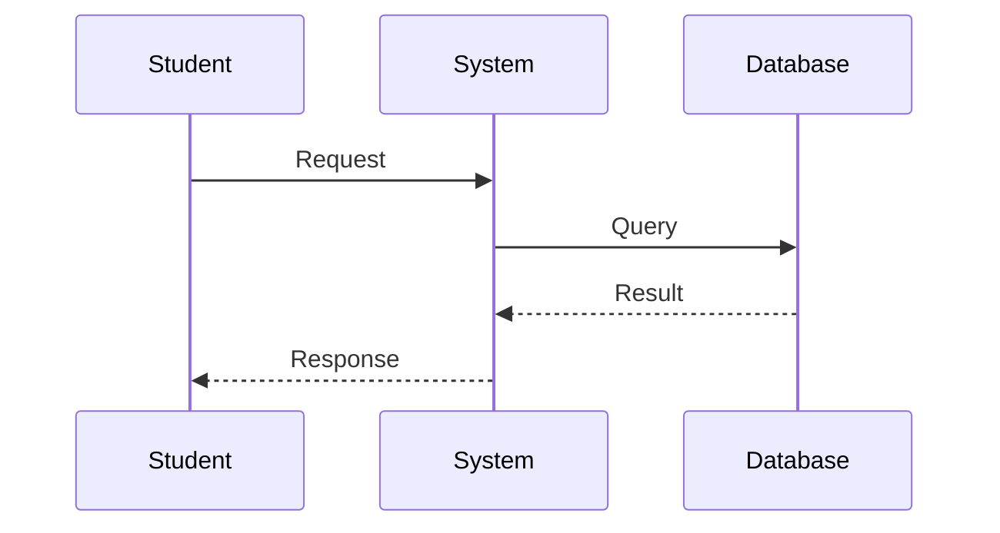
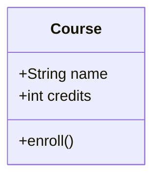
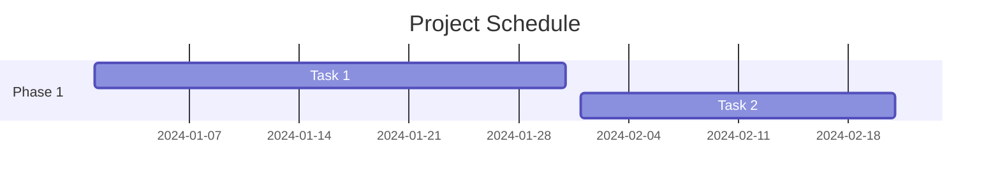

# Prompt 06: Visual Assets Setup

## Context
Visual elements are crucial for educational content. Set up a proper structure for images, icons, diagrams, and other media assets to enhance the learning experience.

## Task
Organize and implement visual assets including logos, icons, lecture images, diagrams, and downloadable materials in the `static/` directory.

## Directory Structure

```
static/img/
├── favicon.ico                    # Browser tab icon (16x16, 32x32)
├── logo.svg                       # Main course logo (navbar)
├── docusaurus.png                # Social media preview image
├── docusaurus-social-card.jpg    # Social sharing card (1200x630)
├── icons/                        # Topic/category icons
│   ├── [topic-1].svg
│   ├── [topic-2].svg
│   └── [topic-3].svg
├── lecture-01/                   # Lecture 1 specific images
│   ├── diagram-1.png
│   ├── screenshot-1.png
│   └── example-1.jpg
├── lecture-02/                   # Lecture 2 specific images
│   ├── diagram-2.png
│   └── flow-chart.svg
└── shared/                       # Reusable images across lectures
    ├── logo-company.png
    ├── generic-diagram.svg
    └── background-pattern.png
```

## Asset Requirements

### 1. Essential Branding Assets

#### Favicon (`favicon.ico`)
- Format: ICO (with multiple sizes: 16x16, 32x32, 48x48)
- Purpose: Browser tab icon
- Design: Simple, recognizable at small sizes
- Alternative formats: Can also provide PNG favicons

#### Main Logo (`logo.svg`)
- Format: SVG (preferred) or PNG (300x80px recommended)
- Purpose: Navbar branding
- Requirements:
  - Works on light and dark backgrounds
  - Clear at different sizes
  - Represents course topic

#### Social Card (`docusaurus-social-card.jpg`)
- Format: JPG or PNG
- Dimensions: 1200x630px (Facebook/LinkedIn standard)
- Purpose: Social media preview when sharing links
- Content: Course name, logo, brief description

### 2. Homepage Feature Icons

Create or source 3-5 SVG icons for homepage features:

```javascript
// Reference in HomepageFeatures/index.js
const FeatureList = [
  {
    title: 'Feature Name',
    Svg: require('@site/static/img/icons/feature-1.svg').default,
    description: 'Feature description'
  },
];
```

**Icon Guidelines**:
- Size: 200x200px or larger
- Style: Consistent across all icons
- Format: SVG preferred for scalability
- Colors: Match theme colors or use monochrome

### 3. Lecture-Specific Images

For each lecture, create a folder and add:

#### Diagrams
- **Format**: SVG (editable) or PNG (high resolution)
- **Purpose**: Explain concepts visually
- **Tools to create**:
  - Mermaid (inline in markdown)
  - draw.io / diagrams.net
  - Microsoft Visio
  - Adobe Illustrator
  - Figma

#### Screenshots
- **Format**: PNG (lossless) or JPG (if large file)
- **Resolution**: At least 1920x1080 for full screen, or actual size
- **Purpose**: Show software interfaces, results, examples
- **Best practices**:
  - Annotate important areas
  - Crop to relevant content
  - Use high contrast
  - Include captions

#### Charts and Graphs
- **Format**: SVG or PNG (300 DPI minimum)
- **Purpose**: Display data, comparisons, trends
- **Tools**:
  - Excel/Google Sheets export
  - Python matplotlib
  - R ggplot2
  - Chart.js

## Referencing Images in Content

### In Markdown/MDX Files

```markdown
<!-- Standard image -->


<!-- Image with caption -->

*Figure 1: System architecture overview*

<!-- Sized image -->

{: width="200px"}

<!-- Linked image -->
[](/img/full-size.png)
```

### Image Best Practices

1. **Always include alt text** for accessibility
2. **Use descriptive filenames**: `solar-panel-diagram.png` not `img1.png`
3. **Optimize file sizes**:
   - Compress images before uploading
   - Use appropriate formats (SVG for vectors, PNG for screenshots, JPG for photos)
4. **Organize by lecture/topic**
5. **Version control**: Include images in git (if not too large)

## Creating Diagrams with Mermaid

For simple diagrams, use Mermaid inline (no external files needed):

```markdown

```

### Common Mermaid Diagram Types

```markdown
<!-- Flowchart -->


<!-- Sequence Diagram -->


<!-- Class Diagram -->


<!-- Gantt Chart -->

```

## Downloadable Materials

For PDFs, datasets, or other downloadable files:

```
static/
├── downloads/
│   ├── lecture-01/
│   │   ├── slides.pdf
│   │   ├── exercises.pdf
│   │   └── dataset.csv
│   └── resources/
│       ├── installation-guide.pdf
│       └── reference-sheet.pdf
```

### Linking to Downloads

```markdown
Download the [lecture slides](/downloads/lecture-01/slides.pdf)

Download the [exercise dataset](/downloads/lecture-01/dataset.csv)
```

## Asset Creation Tools

### Free Tools
- **Vector Graphics**: Inkscape, Figma (free tier)
- **Diagrams**: draw.io, Mermaid, PlantUML
- **Image Editing**: GIMP, Photopea (web-based)
- **Icons**: Font Awesome, Heroicons, Material Icons
- **Screenshots**: Built-in OS tools, ShareX (Windows)

### Online Resources
- **Free Icons**: [Heroicons](https://heroicons.com/), [Lucide](https://lucide.dev/)
- **Free Images**: [Unsplash](https://unsplash.com/), [Pexels](https://pexels.com/)
- **SVG Optimization**: [SVGOMG](https://jakearchibald.github.io/svgomg/)
- **Image Compression**: [TinyPNG](https://tinypng.com/), [Squoosh](https://squoosh.app/)

## Implementation Checklist

- [ ] Create logo and favicon
- [ ] Design social media card
- [ ] Create homepage feature icons
- [ ] Set up lecture image folders
- [ ] Add first set of diagrams
- [ ] Optimize all images
- [ ] Test image loading
- [ ] Verify responsive display
- [ ] Add alt text to all images
- [ ] Document image sources/licenses

## Validation

1. Check all images load correctly
2. Verify images display on mobile
3. Confirm alt text is present
4. Test download links work
5. Review image quality and clarity
6. Ensure consistent visual style

## Next Steps
Proceed to Prompt 07 to create custom React components for enhanced interactivity.
