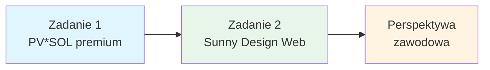

# Projekty - Systemy fotowoltaiczne

Witaj w sekcji projektów dotyczących systemów fotowoltaicznych! Tutaj znajdziesz kompleksowe materiały do nauki projektowania instalacji PV z wykorzystaniem profesjonalnego oprogramowania **PV*SOL premium**.

---

## 📚 Dostępne materiały

### 1. [Zadanie 1 - Wprowadzenie do PV*SOL premium](./pr-1-task-for-students.md)

**Zadanie przygotowawcze** dla studentów rozpoczynających pracę z oprogramowaniem PV*SOL.

**Co znajdziesz:**
- Krok po kroku instrukcję obsługi PV*SOL premium
- Prosty projekt instalacji 5-6 kWp dla domu jednorodzinnego
- Wymagania dotyczące przeszkód (komin, okno dachowe, drzewa)
- Analizę zacienienia i dobór komponentów
- Kryteria oceny i wymagane pliki do oddania
- FAQ z najczęstszymi problemami

**Czas realizacji:** 4 godziny (2 zajęcia)

**Wymagania:** Instalacja PV*SOL premium (wersja próbna 30-dniowa)

---

### 2. [Zadanie 2 - Sunny Design Web](./pr-2-task-sunny-design.md)

**Zadanie z narzędziem webowym** do szybkiego projektowania instalacji PV z wykorzystaniem platformy SMA.

**Co znajdziesz:**
- Przewodnik po platformie Sunny Design Web (darmowe narzędzie online)
- Projekt instalacji 40-50 kWp dla budynku użyteczności publicznej
- Konfiguracja dachu płaskiego z systemami montażowymi
- Automatyczny dobór stringów i falowników SMA
- Analizę ekonomiczną i porównanie z PV*SOL premium
- Wskazówki dotyczące DC/AC ratio i optymalizacji

**Czas realizacji:** 3 godziny (1.5 zajęcia)

**Wymagania:** Darmowe konto na platformie Sunny Design Web

---

### 3. [Perspektywa zawodowa - Projektant PV](./pv-professional-perspective.md)

**Przewodnik zawodowy** pokazujący, jak wygląda prawdziwa praca projektanta instalacji fotowoltaicznych.

**Co znajdziesz:**
- **Faza 1:** Wstępny kontakt z klientem - jakie dane zebrać przez telefon
- **Faza 2:** Wizyta w terenie - dokumentacja fotograficzna, pomiary geometryczne, analiza zacienienia
- **Faza 3:** Zbieranie danych klimatycznych i środowiskowych
- **Faza 4:** Analiza ekonomiczna - koszty, taryfy, dotacje
- **Faza 5:** Dokumentacja i pozwolenia
- Porównanie: zadanie edukacyjne vs. rzeczywisty projekt
- Kluczowe narzędzia i zasoby dla projektanta PV (oprogramowanie, sprzęt pomiarowy)

**Dla kogo:** Studenci planujący karierę jako projektanci instalacji PV

**Zawartość:** Praktyczne wskazówki, ceny sprzętu, źródła danych, normy i przepisy

---

## 🎓 Ścieżka nauczania

Zalecana kolejność pracy z materiałami:

1. **Rozpocznij od Zadania 1** - naucz się obsługi PV*SOL premium (dach skośny, szczegółowa analiza)
2. **Wykonaj Zadanie 2** - poznaj Sunny Design Web (dach płaski, szybkie projektowanie)
3. **Przeczytaj Perspektywę zawodową** - zrozum pracę projektanta PV w praktyce

---

## 🔗 Dodatkowe zasoby

### Oprogramowanie do projektowania PV
- **PV*SOL Help:** [https://help.valentin-software.com/pvsol/en/](https://help.valentin-software.com/pvsol/en/)
- **Sunny Design Web (SMA):** [https://www.sunnydesignweb.com/sdweb#/](https://www.sunnydesignweb.com/sdweb#/)
- **Valentin Software YouTube:** [https://www.youtube.com/@valentinsoftware](https://www.youtube.com/@valentinsoftware)

### Dane klimatyczne i narzędzia online
- **PVGIS (dane klimatyczne):** [https://re.jrc.ec.europa.eu/pvg_tools/en/](https://re.jrc.ec.europa.eu/pvg_tools/en/)
- **SMA Solar Academy:** [https://www.sma-sunny.com](https://www.sma-sunny.com)

---

*Ostatnia aktualizacja: Październik 2025*
