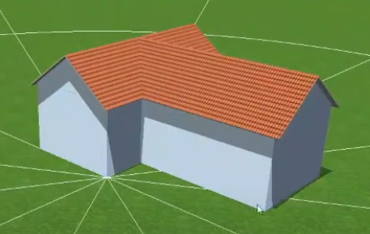

# Zadanie 1: Pierwsze kroki w PV*SOL premium

## 🎯 Cel zadania

Zapoznanie się z interfejsem i podstawowymi funkcjami oprogramowania **PV*SOL premium** poprzez wykonanie prostego projektu instalacji fotowoltaicznej.

**Czas realizacji:** 4 godziny (2 zajęcia)

**Wymagania wstępne:**

- Zainstalowane oprogramowanie PV*SOL premium (wersja próbna 30-dniowa)
- Obejrzenie materiału wideo wprowadzającego (link poniżej)
- Podstawowa wiedza z wykładu o systemach fotowoltaicznych

## 📺 Materiał wprowadzający
Proszę zapoznać się z **[Dokumentacja PV*SOL.](https://help.valentin-software.com/pvsol/en/pages/welcome/)**

Przed rozpoczęciem zadania obejrzyj szczegółowy tutorial wideo:
**[PV*SOL Premium - Complete Walkthrough - YouTube](https://www.youtube.com/watch?v=ps7kqx3JhBA&list=PL6BROuPUfyxKD10vazL3utRzROU4mRBfR&index=3)**. 
Film prezentuje krok po kroku cały proces projektowania instalacji PV w oprogramowaniu PV*SOL premium, od utworzenia projektu po wygenerowanie raportu końcowego.

:::tip Wskazówka
Zalecamy obejrzenie filmu przynajmniej raz w całości przed rozpoczęciem pracy, a następnie korzystanie z niego jako referencji podczas wykonywania zadania.
:::

## 📋 Specyfikacja zadania

### Dane projektowe

Zaprojektuj prosty system fotowoltaiczny on-grid dla domu jednorodzinnego o następujących parametrach:

#### Lokalizacja

- **Kraj:** Polska
- **Miasto:** Szczecin (lub najbliższa dostępna lokalizacja w bazie PV*SOL)
- **Dane klimatyczne:** Meteonorm (wbudowana baza PV*SOL)

#### Budynek

- **Typ dachu:** Dach dwuspadowy. Proszę znalieżć na mapie podobny w Szczenienie lub okolicę.
- **Konstrukcja budynku:** Dom składa się z dwóch części, każda o wymiarach fundamentu 10 m × 8 m.
- **Wymiary każdej części:** 10 m × 8 m (fundament)
- **Nachylenie:** 35°
- **Azymut:** 180° (orientacja południowa)
- **Wysokość okapu:** 3.0 m

#### Przeszkody

Zamodeluj następujące **obowiązkowe przeszkody**:

1. **Komin:** 0.5 m × 0.5 m, wysokość 1.5 m nad dachem
2. **Okno połaciowe (okno dachowe):** dowolne wymiary realistyczne (np. 1.2 m × 0.8 m)
3. **Drzewa:** minimum 2 sztuki (wysokość 8-15 m, w odległości 10-30 m od budynku)
4. **Opcjonalnie:** antena, wentylacja dachowa, lub inne elementy

#### Profil energetyczny

- **Roczne zużycie:** 4000 kWh/rok.
- **Typ odbiorcy:** Gospodarstwo domowe (rodzina 4-5 osobowa)
- **Profil zużycia:** Użyj wbudowanego profilu "Household" lub podobnego

#### Wymagania systemowe

- **Moc instalacji:** 5-6 kWp
- **Typ systemu:** On-grid (połączony z siecią)
- **Moduł PV:** Zbadaj typy modółów dostępnaych w Polsce. Wybierz dowolny moduł monokrystaliczny o mocy 300-400 Wp.
- **Falownik:** Dobierz odpowiedni falownik jednofazowy lub trójfazowy (uzasadnij wybór)

## 📐 Kroki do wykonania

Realizując zadanie, przejdź przez wszystkie etapy procesu projektowego w PV*SOL premium:

### Krok 1: Utworzenie projektu (Project Data)

- [ ] Utwórz nowy projekt: `Nazwisko_PV_Szczecin_Zadanie1`
- [ ] Wprowadź dane inwestora (fikcyjne):
  - Nazwa klienta: Pan/Pani [Twoje imię i nazwisko]
  - Adres: Szczecin, ul. Przykładowa 1
- [ ] Zapisz projekt w lokalizacji roboczej

### Krok 2: Ustawienia systemu (System Type, Climate, Grid)

- [ ] **Typ systemu:** Grid-connected system with loads (system połączony z siecią z obciążeniami)
- [ ] **Dane klimatyczne:**
  - Wybierz Szczecin lub najbliższą lokalizację polską/
  - Weryfikuj nasłonecznienie: ~950-1100 kWh/m²/rok dla regionu
- [ ] **Parametry sieci:**
  - Napięcie: 230V (jednofazowe) lub 400V (trójfazowe)
  - Częstotliwość: 50 Hz

### Krok 3: Profil zużycia (Consumption)

- [ ] Dodaj profil zużycia energii (Add Consumption)
- [ ] **Opcja A - Profil standardowy** (zalecana dla tego zadania):
  - Wybierz "Load Profiles" → "Household" (gospodarstwo domowe)
  - Ustaw roczne zużycie: 4000 kWh
- [ ] **Opcja B - Import profilu** (opcjonalnie, jeśli masz dane):
  - Utwórz prosty plik CSV z danymi godzinowymi
  - Zaimportuj jako "Load profile from measured values"

:::info Uwaga
W filmie instruktażowym pokazano różne metody dodawania profilu zużycia (min. 3:30-6:00). Dla tego zadania wystarczy użyć wbudowanego profilu standardowego.
:::

### Krok 4: Geometria 3D (3D Design - Building)

- [ ] Otwórz moduł "3D Design"
- [ ] Utwórz budynek składający się z dwóch części z dachem dwuspadowym (Gable Roof):
  - **Część 1:** Fundament 10 m × 8 m, wysokość okapu 3.0 m, kąt nachylenia 35°
  - **Część 2:** Fundament 10 m × 8 m, wysokość okapu 3.0 m, kąt nachylenia 35°
  - Części mogą być ustawione w linii lub pod kątem (zgodnie ze zdjęciem przykładowym)
- [ ] Zorientuj budynek:
  - Dachy powinny być skierowane na południe (180°)
  - Użyj kompasu w lewym górnym rogu do weryfikacji orientacji

:::tip Wskazówka
Film pokazuje tworzenie budynku w czasie 6:30-10:00. Możesz wielokrotnie edytować budynek, klikając prawym przyciskiem myszy i wybierając "Edit". Dla dwuczęściowego budynku możesz utworzyć dwa osobne budynki lub użyć złożonej geometrii.
:::

### Krok 5: Przeszkody i zacienienie (3D Design - Obstacles)

- [ ] **Dodaj komin:**
  - Narzędzie: "3D Box" lub "Obstacle"
  - Wymiary: 0.5 m × 0.5 m × 1.5 m (nad dachem)
  - Pozycja: umieść w realistycznym miejscu na dachu (np. przy kalenicy)
- [ ] **Dodaj okno połaciowe (okno dachowe):**
  - Narzędzie: "Window" lub "3D Box"
  - Wymiary: np. 1.2 m × 0.8 m (standardowe okno dachowe)
  - Pozycja: na połaci dachu, w miejscu gdzie mogłoby być rzeczywiste okno
- [ ] **Dodaj drzewa (minimum 2 sztuki):**
  - Narzędzie: "Tree" (biblioteka 3D) lub "Obstacle"
  - Wysokość: 8-15 m (realistyczna dla drzew w otoczeniu domu)
  - Odległość: 10-30 m od budynku
  - **Cel:** Drzewa powinny powodować częściowe zacienienie dachu (szczególnie rano lub wieczorem)
- [ ] **Opcjonalnie:** antena, wentylacja dachowa, sąsiednie budynki, horyzont terenowy

### Krok 6: Rozmieszczenie modułów (Module Coverage)

- [ ] Aktywuj powierzchnię dachu (kliknij na połać)
- [ ] Wybierz moduł PV z bazy danych:
  - Producent: np. JA Solar, Canadian Solar, Longi, Trina
  - Moc: 300-400 Wp
  - Technologia: Monocrystalline
- [ ] Ustaw orientację: Portrait (pionowo) lub Landscape (poziomo)
- [ ] Ustaw strefy bezpieczeństwa (Keep-out zones):
  - 30-40 cm od krawędzi dachu
  - Narzędzie: "Area around building"
- [ ] Rozmieść moduły:
  - **Opcja A - Automatyczna:** "Fill Area" z odstępami 2-5 cm
  - **Opcja B - Ręczna:** Dodawaj moduły jeden po drugim
- [ ] Cel: 15-18 modułów (łącznie 5-6 kWp)

:::info Kontrola
Weryfikuj całkowitą moc DC systemu w lewym panelu. Powinna wynosić 5-6 kWp.
:::

### Krok 7: Analiza zacienienia (Shading Analysis)

- [ ] Uruchom analizę zacienienia: przycisk "Shade Frequency"
- [ ] PV*SOL wykona symulację roczną zacienienia dla każdego modułu
- [ ] Zinterpretuj wyniki:
  - **Zielony:** brak/minimalne zacienienie (doskonale)
  - **Żółty:** umiarkowane zacienienie (akceptowalne)
  - **Pomarańczowy/Czerwony:** znaczące zacienienie (rozważ przesunięcie modułu)
- [ ] Jeśli któryś moduł ma duże zacienienie, spróbuj zmienić rozmieszczenie

:::tip Optymalizacja
Możesz przesuwać moduły lub zmienić strefy bezpieczeństwa, aby uniknąć zacienionych obszarów.
:::

### Krok 8: Dobór falownika (Module Configuration / Inverter)

- [ ] Przejdź do zakładki "Module Configuration"
- [ ] Dodaj nowy falownik: "Add new inverter"
- [ ] Wyszukaj w bazie danych:
  - **Producent:** np. SMA, Fronius, Huawei, SolarEdge
  - **Moc AC:** 4-5 kW (0.8-0.9 × moc DC systemu)
  - **Liczba MPPT:** minimum 2 (zalecane)
- [ ] Przykłady:
  - SMA Sunny Boy 5.0 (jednofazowy)
  - Fronius Symo 4.5-3-M (trójfazowy)
  - Huawei SUN2000-5KTL-L1 (jednofazowy)

### Krok 9: Konfiguracja stringów (String Configuration)

- [ ] Przypisz moduły do MPPT trackerów
- [ ] **Wersja automatyczna:**
  - Kliknij przycisk "Automatically assign all"
  - PV*SOL zaproponuje konfigurację
- [ ] **Wersja ręczna:**
  - MPPT 1: 8-9 modułów w 1 stringu
  - MPPT 2: 8-9 modułów w 1 stringu
- [ ] **Weryfikacja elektryczna:**
  - [ ] Sprawdź zieloną strzałkę przy MPPT: napięcia w zakresie ✅
  - [ ] Sprawdź DC/AC ratio: powinno być 1.0-1.3 (żółte/zielone OK)
  - [ ] Jeśli czerwony znacznik - dostosuj konfigurację

:::warning Uwaga techniczna
PV*SOL automatycznie weryfikuje:

- Voc_max (zimą) < Vmax DC falownika
- Vmpp (latem) ∈ zakres MPPT
- Prądy < limity wejściowe

Jeśli pojawią się ostrzeżenia, musisz zmienić liczbę modułów w stringu lub wybrać inny falownik.
:::

### Krok 10: Okablowanie (Cable Plan)

- [ ] Przejdź do widoku "Cable Plan" w 3D Design
- [ ] Dodaj punkt wejścia do dachu: "Add Grommet"
- [ ] Poprowadź stringi do grommetu:
  - Kliknij prawym na string → "Cable this string to grommet"
- [ ] Edytuj grommet:
  - Ustaw odległość od falownika (np. 12 m)
- [ ] Przejdź do zakładki "Cables" (główne menu)
- [ ] Sprawdź i uzupełnij:
  - [ ] Długości przewodów DC (z dachu do falownika)
  - [ ] Przekroje DC (PV*SOL zaproponuje automatycznie)
  - [ ] Długość przewodu AC (od falownika do licznika): np. 15 m
  - [ ] Przekrój AC
- [ ] Dodaj symbole zabezpieczeń:
  - Odłączniki DC (DC Isolator) po stronie stringów
  - Zabezpieczenia przepięciowe (Surge Protection)
  - Wyłącznik AC po stronie falownika
  - Zabezpieczenie nadprądowe AC

:::tip Cel
Całkowite straty w okablowaniu powinny być < 1-2% dla DC i < 1-3% dla AC. PV*SOL pokazuje straty w procentach.
:::

### Krok 11: Parametry ekonomiczne (Financial Parameters)

- [ ] Przejdź do zakładki "Financial Parameters"
- [ ] **Economic Parameters:**
  - Okres oceny: 20 lat
  - Stopa zwrotu: 5%
- [ ] **Income and Expenditure:**
  - Koszt systemu: 25 000 zł (szacunkowy: ~4500 zł/kWp)
  - Roczne koszty eksploatacji: 200 zł/rok
  - Inflacja kosztów: 3-5%
- [ ] **Feed-in / Grid Tariffs:**
  - Taryfa zakupu energii (from grid): 0.80 zł/kWh (przykładowa)
  - Taryfa sprzedaży (feed-in): 0.45 zł/kWh (orientacyjna dla Polski)
  - Inflacja taryf: 5-8% rocznie

:::info Uwaga
Wartości taryfowe są przykładowe. W głównym projekcie użyjesz aktualnych taryf dla wybranego regionu.
:::

### Krok 12: Symulacja i wyniki (Simulation)

- [ ] Kliknij przycisk "Simulate" (ikona kalkulatora w górnym menu)
- [ ] PV*SOL wykona symulację roczną (8760 godzin)
- [ ] Poczekaj na wyniki (może potrwać 1-5 minut)
- [ ] **Przeanalizuj wyniki:**

#### Wyniki finansowe (Financial Analysis)

- [ ] Stopa zwrotu (Rate of Return): %
- [ ] Roczne oszczędności (Annual Savings): zł/rok
- [ ] Skumulowany przepływ pieniężny (Cumulated Cash Flow): zł
- [ ] Prosty okres zwrotu (Payback Time): lata

#### Wyniki energetyczne (Energy Results)

- [ ] **AC Side:**
  - Roczna produkcja energii AC: _____ kWh/rok
  - Specyficzna produkcja: _____ kWh/kWp/rok (cel: 950-1050 dla Szczecina)
- [ ] **DC Side:**
  - Roczna produkcja energii DC: _____ kWh/rok
- [ ] **Performance Ratio (PR):** _____ % (cel: > 80%)

#### Autokonsumpcja (Self-Consumption)

- [ ] **Own Power Consumption:** _____ % (jaka część energii PV jest użyta lokalnie)
- [ ] **Solar Fraction:** _____ % (jaka część zapotrzebowania pokrywa PV)
- [ ] **Cel projektu:** Solar Fraction > 70%

#### Wykresy do analizy

- [ ] "Use of PV Energy" - rozkład miesięczny produkcji i zużycia
- [ ] "Coverage of Consumption" - pokrycie zapotrzebowania przez PV vs sieć
- [ ] "Energy Flow" - diagram Sankey strat i przepływów energii
- [ ] "System Balance" - szczegółowa analiza strat

:::tip Interpretacja wyników

- **Performance Ratio > 80%:** Bardzo dobry projekt ✅
- **Performance Ratio 75-80%:** Dobry projekt, do akceptacji ✅
- **Performance Ratio < 75%:** Sprawdź straty - możliwa optymalizacja ⚠️
- **Solar Fraction > 80%:** Doskonałe pokrycie zapotrzebowania ✅
- **Solar Fraction 60-80%:** Dobre pokrycie ✅
- **Solar Fraction < 60%:** System zbyt mały lub profil nie pasuje ⚠️
  :::

### Krok 13: Raport końcowy (Customer Presentation)

- [ ] Przejdź do zakładki "Customer Presentation"
- [ ] Wybierz elementy raportu:
  - [ ] Executive Summary
  - [ ] 3D Visualizations
  - [ ] Energy Results
  - [ ] Financial Analysis
  - [ ] System Components (BOM)
  - [ ] Technical Diagrams
- [ ] Opcje raportu:
  - [ ] Dodaj logo (opcjonalnie)
  - [ ] Wybierz język: English lub German (PL może nie być dostępny)
- [ ] Eksportuj raport do PDF:
  - Nazwa: `Nazwisko_PV_Szczecin_Zadanie1_Report.pdf`

## 📦 Wymagane pliki do oddania

Po zakończeniu zadania przygotuj następujące pliki:

### 1. Plik projektu PV*SOL

- **Nazwa:** `Nazwisko_PV_Szczecin_Zadanie1.pvprj`
- Format: natywny format PV*SOL
- Upewnij się, że plik można otworzyć bez błędów

### 2. Krótkie sprawozdanie (1-2 strony, format PDF)

**Nazwa:** `Nazwisko_PV_Szczecin_Zadanie1_Sprawozdanie.pdf`

Struktura sprawozdania:

#### Nagłówek

- Imię i nazwisko, nr albumu
- Data wykonania
- Tytuł: "Zadanie 1 - Wprowadzenie do PV*SOL premium"

#### 1. Dane wejściowe (0.5 strony)

Krótkie podsumowanie:

- Lokalizacja i dane klimatyczne
- Geometria budynku
- Wybrany moduł PV (producent, model, moc)
- Wybrany falownik (producent, model, moc)
- Liczba modułów i konfiguracja stringów

#### 2. Wyniki symulacji (0.5 strony)

Tabela z kluczowymi wynikami:

| Parametr               | Wartość | Jednostka   |
| ---------------------- | --------- | ----------- |
| Moc DC systemu         | ___       | kWp         |
| Moc AC falownika       | ___       | kW          |
| DC/AC ratio            | ___       | -           |
| Roczna produkcja AC    | ___       | kWh/rok     |
| Produkcja specyficzna  | ___       | kWh/kWp/rok |
| Performance Ratio (PR) | ___       | %           |
| Okres zwrotu           | ___       | lata        |

#### 3. Wnioski i spostrzeżenia (0.5-1 strona)

Krótka refleksja (3-5 zdań na temat):

- Czy projekt spełnił cel pokrycia 70% zapotrzebowania?
- Jakie były główne wyzwania podczas projektowania?
- Co sprawiło największe trudności?
- Jakie funkcje PV*SOL okazały się najbardziej pomocne?
- Co byś poprawił/zoptymalizował w przyszłości?

### 4. Zrzuty ekranu (opcjonalnie)

**Nazwa:** `Nazwisko_PV_Szczecin_Zadanie1_Screenshots.pdf`

- 3-5 kluczowych widoków z PV*SOL:
  - **Widok 3D dachu z modułami i przeszkodami** (powinny być widoczne: komin, okno, drzewa)
  - **Analiza zacienienia (Shade Frequency)** - mapa kolorów pokazująca zacienienie modułów
  - **Konfiguracja stringów** - podłączenie do MPPT
  - **Wykres Energy Flow** - diagram Sankey
  - **Wykres Performance** - rozkład miesięczny produkcji

### Forma oddania

- Wszystkie pliki w jednym archiwum ZIP
- **Nazwa archiwum:** `Nazwisko_Nr_albumu_Zadanie1_PV.zip`
- Upload na platformę e-learningową lub email prowadzącego

## ✅ Kryteria oceny

Zadanie oceniane jest w skali 0-10 punktów (zaliczenie: minimum 6 punktów)

| Kryterium                         | Punkty  | Opis                                                                                                              |
| --------------------------------- | ------- | ----------------------------------------------------------------------------------------------------------------- |
| **Kompletność projektu**  | 0-3 pkt | Czy projekt zawiera wszystkie wymagane elementy (geometria, przeszkody, moduły, falownik, stringi, okablowanie)? |
| **Poprawność techniczna** | 0-3 pkt | Czy konfiguracja elektryczna jest poprawna (napięcia, prądy, DC/AC ratio)? Czy PR > 75%?                        |
| **Jakość dokumentacji**   | 0-2 pkt | Czy raport i sprawozdanie są kompletne, czytelne i profesjonalne?                                                |
| **Osiągnięcie celu**      | 0-2 pkt | Czy Solar Fraction > 70%? Czy projekt jest zoptymalizowany?                                                       |

### Szczegóły punktacji

**Kompletność projektu (0-3 pkt):**

- 3 pkt: Wszystkie elementy wykonane zgodnie z instrukcją - budynek, **przeszkody (komin + okno + min. 2 drzewa)**, moduły, falownik, stringi, okablowanie, symulacja
- 2 pkt: Większość elementów wykonana, drobne braki (np. brak jednej przeszkody, niepełne okablowanie)
- 1 pkt: Podstawowe elementy wykonane, znaczące braki (brak przeszkód, brak okablowania)
- 0 pkt: Projekt niekompletny lub nie oddany

**Poprawność techniczna (0-3 pkt):**

- 3 pkt: Konfiguracja elektryczna poprawna, PR > 80%, brak błędów
- 2 pkt: Konfiguracja w większości poprawna, PR 75-80%, drobne błędy
- 1 pkt: Konfiguracja z błędami, PR < 75%
- 0 pkt: Poważne błędy techniczne, projekt nie działa

**Jakość dokumentacji (0-2 pkt):**

- 2 pkt: Raport i sprawozdanie kompletne, czytelne, profesjonalne
- 1 pkt: Dokumentacja niepełna lub niskiej jakości
- 0 pkt: Brak dokumentacji

**Osiągnięcie celu (0-2 pkt):**

- 2 pkt: Solar Fraction > 80%, projekt zoptymalizowany
- 1 pkt: Solar Fraction 60-80%, projekt akceptowalny
- 0 pkt: Solar Fraction < 60% lub cel nie osiągnięty

## ❓ FAQ - Najczęściej zadawane pytania

### Problemy techniczne

**Q: Nie mogę znaleźć Szczecina w bazie danych klimatycznych. Co robić?**
A: Użyj innej lokalizacji na podobnej szerokości geograficznej (np. Berlin ~52.5°N, Hamburg ~53.5°N). Ważne, żeby były to dane Meteonorm dla Europy Środkowej/Północnej. W sprawozdaniu zapisz, jaką lokalizację zastępczą wybrałeś.

**Q: PV*SOL pokazuje czerwone ostrzeżenie przy falowniku. Co to znaczy?**A: Czerwone ostrzeżenie oznacza, że parametry elektryczne są poza dopuszczalnym zakresem. Najczęstsze przyczyny:

- Napięcie jałowe stringów (Voc zimą) > Vmax DC falownika → zmniejsz liczbę modułów w stringu
- Napięcie pracy (Vmpp latem) poza zakresem MPPT → dostosuj liczbę modułów
- DC/AC ratio zbyt wysokie (>1.5) → zwiększ moc falownika lub zmniejsz liczbę modułów

**Q: Mój Performance Ratio to 65%. Czy to źle?**A: Tak, PR powinno być > 75%. Przyczyny niskiego PR:

- Duże zacienienie - sprawdź analizę Shade Frequency
- Nadmierne straty w okablowaniu - sprawdź długości i przekroje przewodów
- Nieprawidłowa orientacja lub nachylenie dachu
- Zbyt wysokie DC/AC ratio powodujące clipping

**Q: Jak dodać temperatury minimalne i maksymalne?**
A: W tym prostym zadaniu PV*SOL używa danych z bazy Meteonorm, które zawierają pełny profil temperatur. W głównym projekcie będziesz musiał ręcznie zweryfikować temperatury ekstremalne dla obliczeń Voc (zima) i Vmpp (lato).

### Pytania projektowe

**Q: Czy mogę użyć modułów o innej mocy niż 300-400 Wp?**
A: Tak, ale staraj się, żeby końcowa moc systemu była w zakresie 5-6 kWp. Jeśli użyjesz modułów 450 Wp, będziesz potrzebował tylko 12-13 modułów.

**Q: Jaki DC/AC ratio jest optymalny?**
A: Dla tego zadania staraj się osiągnąć DC/AC ratio w zakresie 1.1-1.3. To daje dobry kompromis między produkcją energii a clippingiem. Żółty znacznik w PV*SOL przy tym zakresie to OK.

**Q: Co jeśli nie mogę zmieścić 15-18 modułów na dachu?**
A: Możesz lekko zwiększyć wymiary dachu (np. 12 m × 8 m) lub użyć modułów o wyższej mocy (400-450 Wp), żeby zmieścić 12-14 modułów i osiągnąć 5-6 kWp.

**Q: Czy muszę dodawać wszystkie przeszkody (komin, okno, drzewa)?**
A: Tak, to obowiązkowe wymagania zadania. Komin, okno połaciowe i minimum 2 drzewa muszą być zamodelowane. Celem jest nauczenie się:

- Modelowania różnych typów przeszkód w PV*SOL
- Analizy wpływu zacienienia na produkcję energii
- Optymalizacji rozmieszczenia modułów z uwzględnieniem przeszkód
  Drzewa powinny powodować widoczne (ale akceptowalne) zacienienie - to pokazuje, jak system radzi sobie w realnych warunkach.

**Q: Jak dodać drzewa w PV*SOL?**
A: W module 3D Design:

1. Kliknij przycisk "Add Tree" lub "Obstacle" w górnym menu
2. Wybierz typ drzewa z biblioteki (liściaste lub iglaste)
3. Ustaw wysokość: 8-15 m
4. Umieść drzewo klikając na mapie w odległości 10-30 m od budynku
5. Najlepiej umieść drzewa po stronie wschodniej lub zachodniej - wtedy będą rzucać cień rano/wieczorem
6. Po dodaniu uruchom "Shade Analysis", żeby zobaczyć wpływ drzew na zacienienie

**Q: Jak dodać okno połaciowe (okno dachowe)?**
A: W module 3D Design:

1. Kliknij na dach, żeby go aktywować
2. Użyj narzędzia "Window" lub "3D Box"
3. Umieść okno na połaci dachu (np. wymiary 1.2 m × 0.8 m)
4. Okno automatycznie stanie się strefą wykluczenia (keep-out zone) - moduły nie będą tam umieszczane
5. Możesz dodać 1-2 okna dla realizmu

## 💡 Wskazówki praktyczne

### Przed rozpoczęciem

1. ✅ Zainstaluj PV*SOL premium i uruchom program
2. ✅ Obejrzyj film instruktażowy (przynajmniej 1x w całości)
3. ✅ Przejrzyj przykładowe projekty w PV*SOL (File → Examples)
4. ✅ Przygotuj miejsce na zapisywanie projektu (utwórz folder roboczy)

### Podczas pracy

1. 💾 **Zapisuj projekt często** - File → Save (Ctrl+S)
2. 🎥 **Korzystaj z filmu jako referencji** - pauzuj i odtwarzaj odpowiednie fragmenty
3. 📸 **Rób zrzuty ekranu** na bieżąco - przyda się do sprawozdania
4. 🧪 **Eksperymentuj** - nie bój się cofnąć zmian (Ctrl+Z działa!)
5. ✅ **Sprawdzaj na bieżąco** - czy napięcia są OK, czy PR > 75%, czy Solar Fraction > 70%

### Częste pułapki

- ❌ **Za wysoki DC/AC ratio** (>1.4) → nadmierny clipping, straty energii
- ❌ **Zbyt gęsta siatka zacienienia** → długi czas obliczeń (dla tego zadania wystarczy "Medium")
- ❌ **Brak stref bezpieczeństwa** od krawędzi dachu → nierealistyczny projekt
- ❌ **Niewłaściwe dane klimatyczne** (np. RPA zamiast Polski) → błędne wyniki
- ❌ **Zapominanie o zapisywaniu** projektu → utrata pracy

---

:::tip Dla przyszłych projektantów PV
Chcesz zobaczyć, jak wygląda prawdziwa praca projektanta instalacji fotowoltaicznych?

Przejdź do sekcji **[Perspektywa zawodowa - Projektant PV](./pv-professional-perspective.md)**, gdzie znajdziesz szczegółowy przewodnik po procesie zbierania danych, wizycie w terenie, analizie ekonomicznej i przygotowaniu dokumentacji dla rzeczywistych projektów.
:::

---

**Powodzenia! ☀️⚡**

*To zadanie stanowi pierwszy krok w opanowaniu profesjonalnych narzędzi do projektowania systemów fotowoltaicznych. Poświęć czas na dokładne wykonanie - umiejętności zdobyte tutaj będą fundamentem dla Twojej przyszłej pracy jako projektant instalacji PV.*

**Termin oddania:** [Do uzupełnienia przez prowadzącego]

---

*Ostatnia aktualizacja: Październik 2025*
