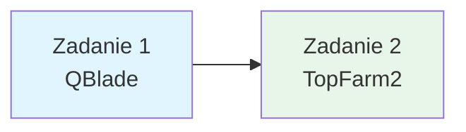

# Projekty - Energetyka wiatrowa (8 godzin)

Witaj w sekcji projektów dotyczących energetyki wiatrowej! Tutaj znajdziesz kompleksowe materiały do nauki projektowania turbin wiatrowych i farm wiatrowych z wykorzystaniem **QBlade** oraz **TopFarm2**.

---

## 📚 Dostępne materiały

### 1. [Zadanie 1 - Projektowanie turbiny wiatrowej w QBlade](./pr-1-task-qblade.md)

**Zadanie wprowadzające** do oprogramowania QBlade dla studentów rozpoczynających pracę z projektowaniem turbin wiatrowych.

**Co znajdziesz:**
- Projekt własnej turbiny wiatrowej zgodnie z tutorialem YouTube
- Dobór i analiza profili aerodynamicznych (NACA)
- Konfiguracja parametrów turbiny (średnica, moc, prędkość obrotowa)
- Symulacja aerodynamiczna i analiza wyników
- FAQ z najczęstszymi problemami

**Czas realizacji:** 4 godziny (2 zajęcia)

**Wymagania:** QBlade Community Edition (CE) - darmowe oprogramowanie

---

### 2. [Zadanie 2 - Optymalizacja farmy wiatrowej w TopFarm2](./pr-2-task-topfarm.md)

**Zadanie z narzędziem webowym** do projektowania i optymalizacji farm wiatrowych z wykorzystaniem platformy TopFarm2 DTU.

**Co znajdziesz:**
- Przewodnik po platformie TopFarm2 (darmowe narzędzie online)
- Projekt farmy wiatrowej z optymalizacją rozmieszczenia turbin
- Analiza wpływu wzajemnego oddziaływania turbin (wake effects)
- Optymalizacja produkcji energii i kosztów
- Analiza ekonomiczna (LCOE, koszty, przychody)
- Wizualizacja wyników i dokumentacja

**Czas realizacji:** 4 godziny (2 zajęcia)

**Wymagania:** Dostęp do internetu, darmowe konto na platformie TopFarm2

---

## 🎓 Ścieżka nauczania

Zalecana kolejność pracy z materiałami:

1. **Rozpocznij od Zadania 1** - naucz się obsługi QBlade (projektowanie pojedynczej turbiny, analiza aerodynamiczna)
2. **Wykonaj Zadanie 2** - poznaj TopFarm2 (optymalizacja farmy wiatrowej, analiza wake effects)

---

## 🔗 Dodatkowe zasoby

### Oprogramowanie do projektowania wiatrowego
- [**QBlade Documentation:**](https://docs.qblade.org/)
- [**QBlade Quick Start Guide:**](https://qblade.org/qblade-quick-start-guide/)
- [**TopFarm2 (DTU):**](https://topfarm.pages.windenergy.dtu.dk/TopFarm2/)

### Bazy danych i narzędzia
- [**Airfoil Tools (NACA 4 digit):**](http://www.airfoiltools.com/search/index?MAirfoilSearchForm%5BtextSearch%5D=&MAirfoilSearchForm%5BmaxThickness%5D=&MAirfoilSearchForm%5BminThickness%5D=&MAirfoilSearchForm%5BmaxCamber%5D=&MAirfoilSearchForm%5BminCamber%5D=&MAirfoilSearchForm%5Bgrp%5D=naca4d&MAirfoilSearchForm%5Bsort%5D=1&yt0=Search)
- [**QBlade YouTube Tutorial:**](https://www.youtube.com/playlist?list=PLcu34l7xaPqbP_DZcQosaaXqmGWIk0Gux)

### Dane wiatrowe i narzędzia online
- [**Global Wind Atlas:**](https://globalwindatlas.info/)

---

*Ostatnia aktualizacja: Październik 2025*
