import Tabs from '@theme/Tabs';
import TabItem from '@theme/TabItem';

# Mermaid Visualization Types for OZE Lecture Slides

## Overview
This document lists all available Mermaid diagram types that can be used in your OZE lecture slides to replace text lists with visual diagrams.

## 1. Flowcharts and Process Diagrams

### Basic Flowchart
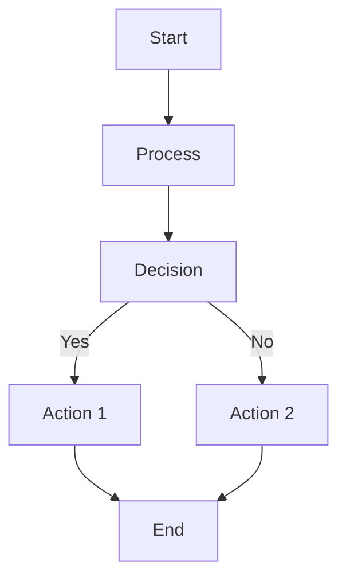

### Left-Right Flowchart
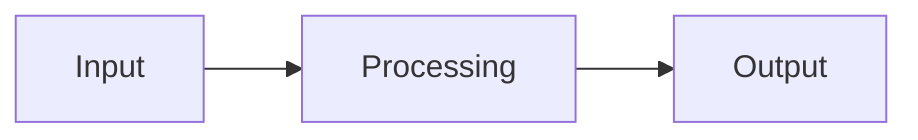

### Top-Down Flowchart
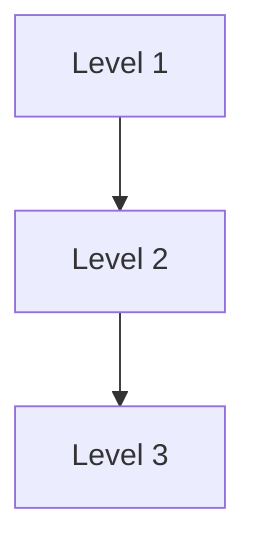

## 2. Mind Maps
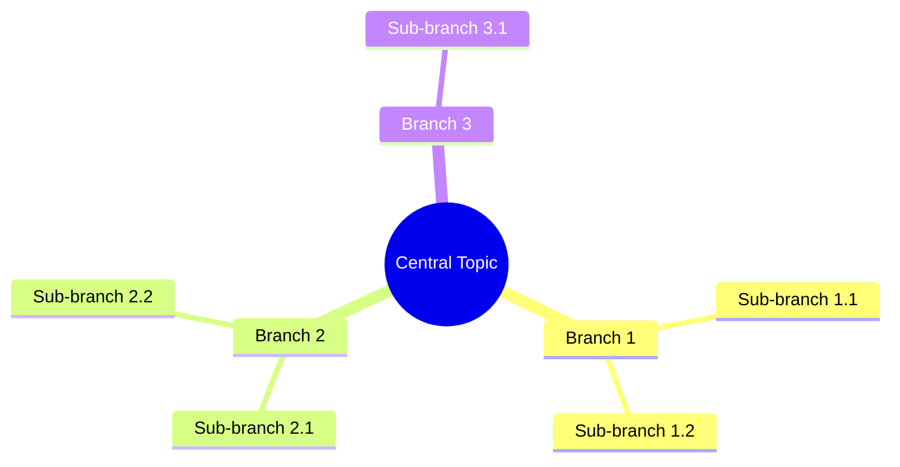

## 3. Gantt Charts
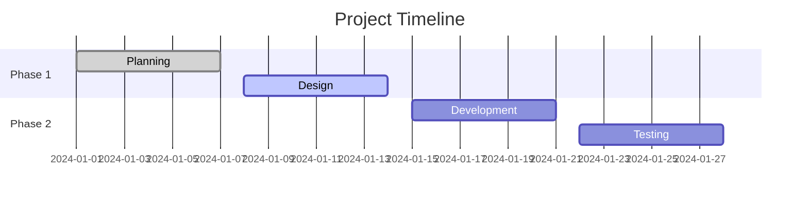

## 4. Sequence Diagrams
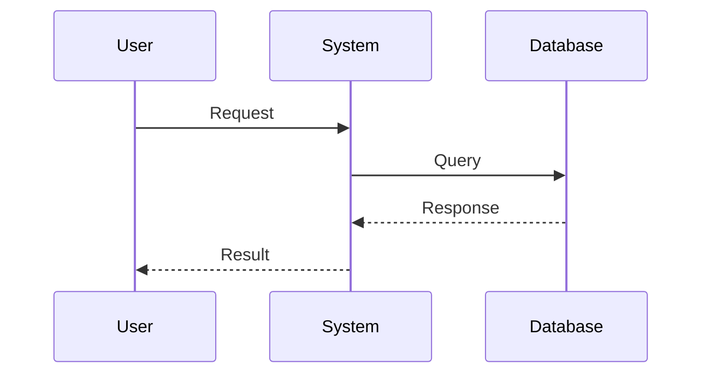

## 5. Class Diagrams
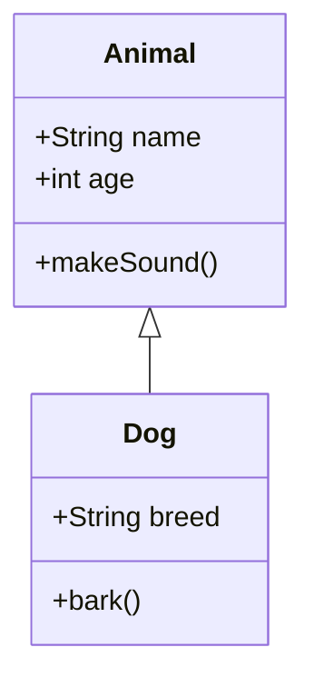

## 6. State Diagrams
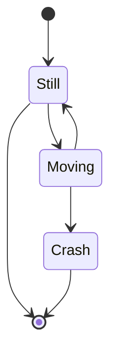

## 7. Entity Relationship Diagrams
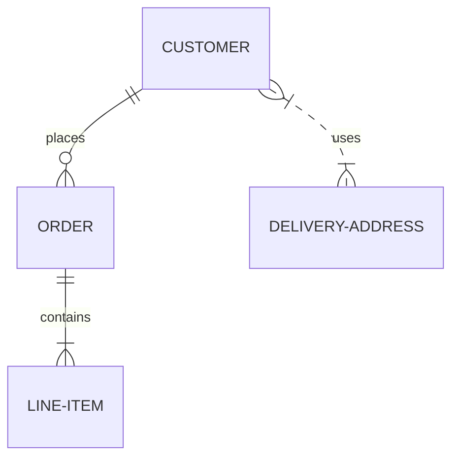

## 8. User Journey Diagrams
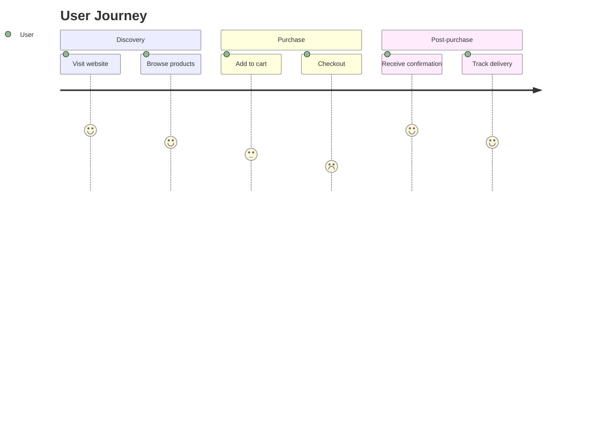

## 9. Git Graphs
```mermaid
gitgraph
    commit
    branch develop
    checkout develop
    commit
    commit
    checkout main
    merge develop
    commit
```

## 10. Pie Charts
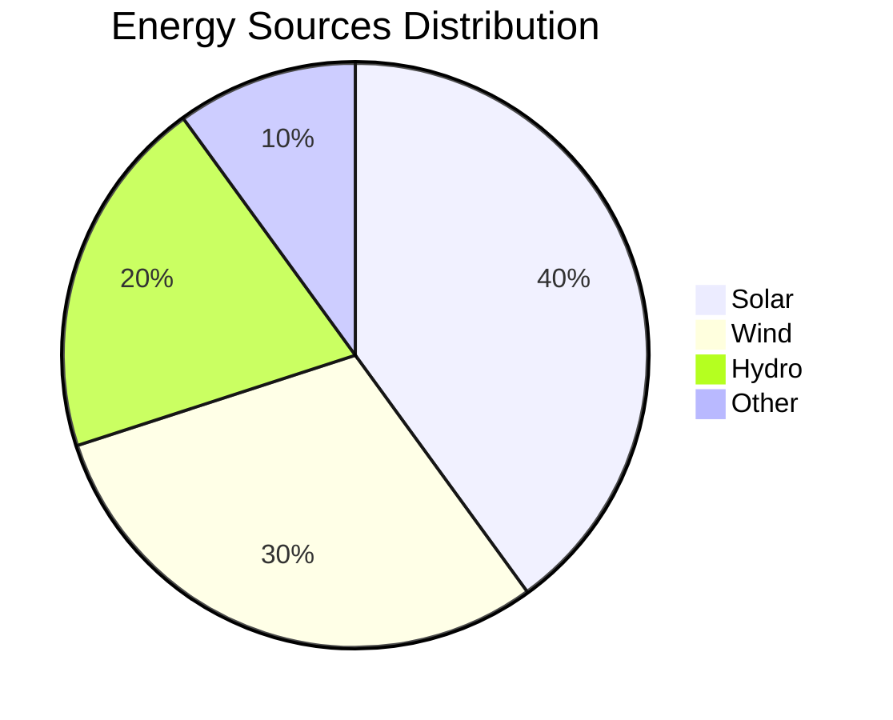

## 11. Quadrant Charts
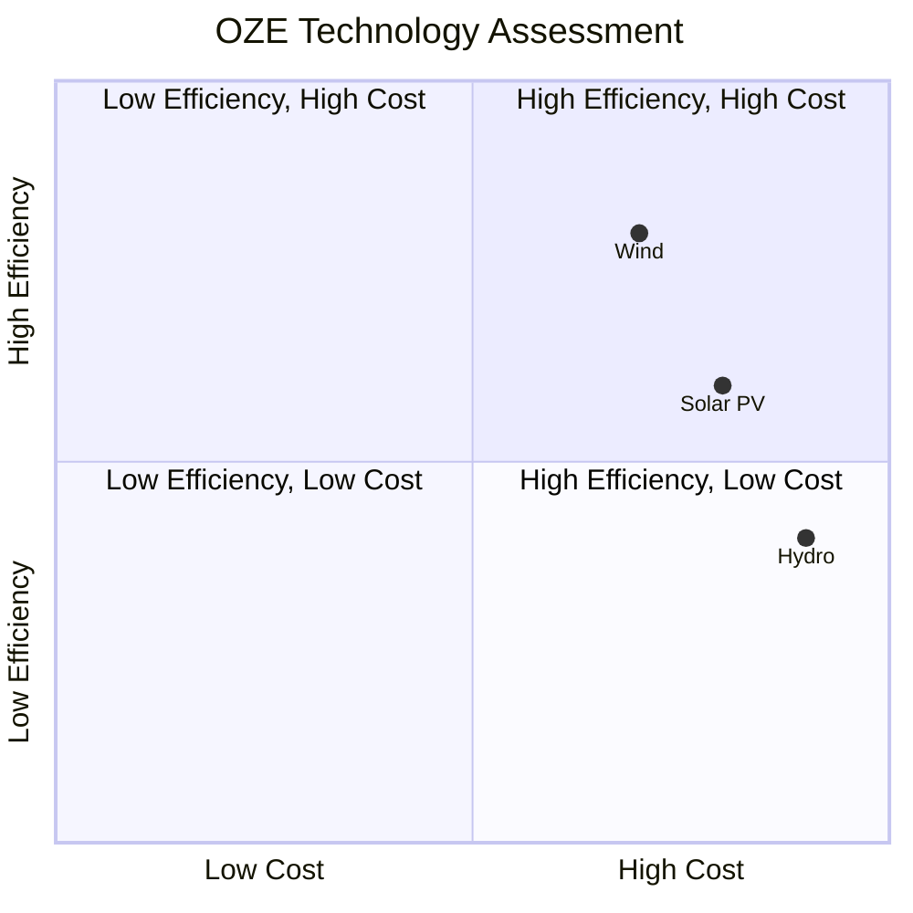

## 12. Timeline Diagrams
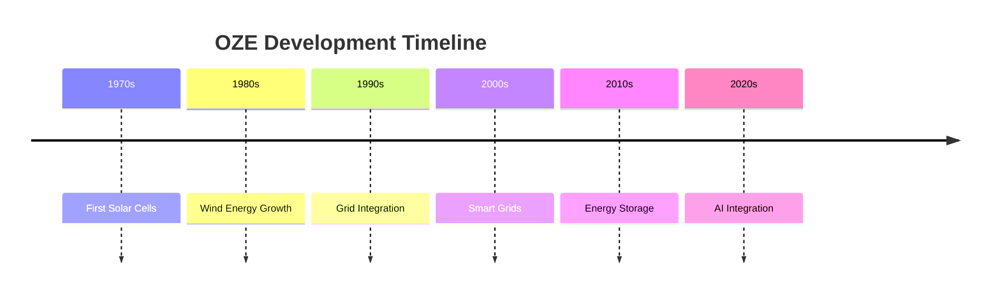

## 13. Sankey Diagrams
```mermaid
sankey-beta
    Energy Sources --> Solar
    Energy Sources --> Wind
    Energy Sources --> Hydro
    Solar --> Grid
    Wind --> Grid
    Hydro --> Grid
    Grid --> Consumption
```

## 14. XY Charts
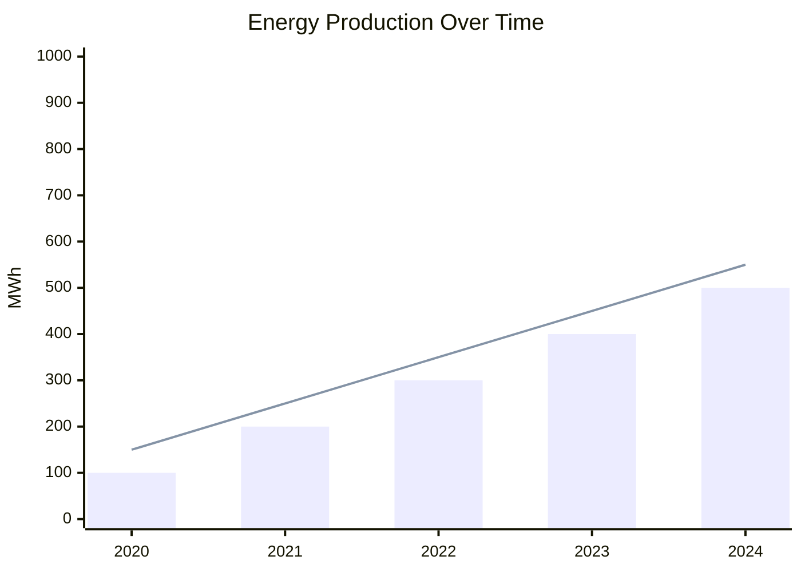

## 15. Block Diagrams
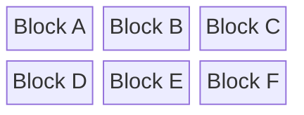

## Best Practices for OZE Lectures

<Tabs>
  <TabItem value="process" label="Process Flows" default>
    <div style={{backgroundColor: '#e3f2fd', padding: '1rem', borderRadius: '8px', marginBottom: '1rem'}}>
      <strong>Use for:</strong> System workflows, data flow, process steps
    </div>
    <p><strong>Example:</strong> PV system design process, energy conversion chain</p>
    <p><strong>Diagram Type:</strong> graph TD/LR</p>
  </TabItem>
  
  <TabItem value="hierarchy" label="Hierarchical Structures">
    <div style={{backgroundColor: '#e3f2fd', padding: '1rem', borderRadius: '8px', marginBottom: '1rem'}}>
      <strong>Use for:</strong> Tool classifications, technology categories, learning outcomes
    </div>
    <p><strong>Example:</strong> OZE tool categories, course structure</p>
    <p><strong>Diagram Type:</strong> mindmap</p>
  </TabItem>
  
  <TabItem value="timeline" label="Timelines">
    <div style={{backgroundColor: '#e3f2fd', padding: '1rem', borderRadius: '8px', marginBottom: '1rem'}}>
      <strong>Use for:</strong> Historical development, project phases, technology evolution
    </div>
    <p><strong>Example:</strong> OZE technology development, project milestones</p>
    <p><strong>Diagram Type:</strong> timeline</p>
  </TabItem>
  
  <TabItem value="comparison" label="Comparisons">
    <div style={{backgroundColor: '#e3f2fd', padding: '1rem', borderRadius: '8px', marginBottom: '1rem'}}>
      <strong>Use for:</strong> Technology comparisons, performance analysis
    </div>
    <p><strong>Example:</strong> Efficiency vs cost analysis, technology maturity</p>
    <p><strong>Diagram Type:</strong> quadrantChart, xychart-beta</p>
  </TabItem>
  
  <TabItem value="architecture" label="System Architecture">
    <div style={{backgroundColor: '#e3f2fd', padding: '1rem', borderRadius: '8px', marginBottom: '1rem'}}>
      <strong>Use for:</strong> System components, data flow, architecture layers
    </div>
    <p><strong>Example:</strong> Application architecture, data processing pipeline</p>
    <p><strong>Diagram Type:</strong> block-beta, graph TD</p>
  </TabItem>
  
  <TabItem value="interactions" label="User Interactions">
    <div style={{backgroundColor: '#e3f2fd', padding: '1rem', borderRadius: '8px', marginBottom: '1rem'}}>
      <strong>Use for:</strong> System interactions, user workflows
    </div>
    <p><strong>Example:</strong> User-system interactions, API calls</p>
    <p><strong>Diagram Type:</strong> sequenceDiagram</p>
  </TabItem>
  
  <TabItem value="planning" label="Project Planning">
    <div style={{backgroundColor: '#e3f2fd', padding: '1rem', borderRadius: '8px', marginBottom: '1rem'}}>
      <strong>Use for:</strong> Project timelines, phase planning
    </div>
    <p><strong>Example:</strong> Course schedule, project phases</p>
    <p><strong>Diagram Type:</strong> gantt</p>
  </TabItem>
</Tabs>

## Styling Options

### Colors
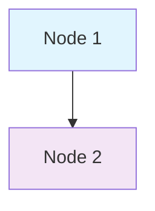

### Node Shapes
- `[Rectangle]` - Default
- `(Round)` - Rounded
- `{Diamond}` - Decision
- `((Circle))` - Start/End
- `>Flag]` - Flag

### Arrow Types
- `-->` - Solid arrow
- `-.->` - Dotted arrow
- `==>` - Thick arrow
- `--x` - Crossed arrow

## Implementation in Slides

:::note **Implementation in Slides**
Replace text lists with appropriate Mermaid diagrams to make your OZE lectures more visually engaging and help students understand complex relationships and processes more effectively.
:::

### Before (Text List):
- Point 1
- Point 2
- Point 3

### After (Mermaid Diagram):
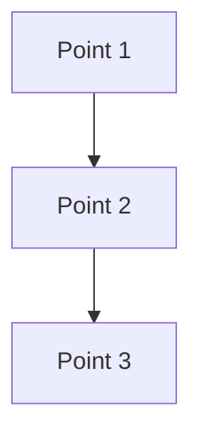

## Quick Reference

:::tip **Pro Tip**
**Pro Tip:** Start with simple flowcharts (graph TD/LR) for most OZE content, then explore more complex diagrams like mindmaps and timelines as you become comfortable with Mermaid syntax.
:::

### Most Common for OZE Lectures:
1. **Flowcharts** - Process flows, system workflows
2. **Mind Maps** - Tool classifications, learning outcomes
3. **Timelines** - Technology development, project phases
4. **Block Diagrams** - System architecture, components

### Advanced Visualizations:
1. **Quadrant Charts** - Technology comparisons
2. **Sankey Diagrams** - Energy flow analysis
3. **XY Charts** - Performance data
4. **Gantt Charts** - Project planning

:::warning **Remember**
**Remember:** Keep diagrams simple and focused. Complex diagrams can overwhelm students. Start with basic shapes and gradually add complexity as needed.
:::

This approach makes your OZE lectures more visually engaging and helps students understand complex relationships and processes more effectively.
