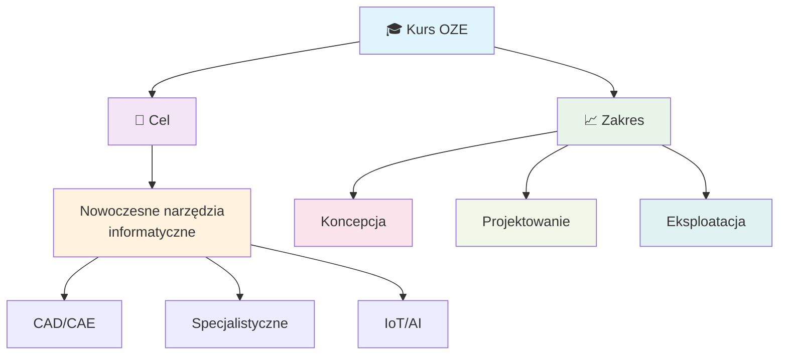
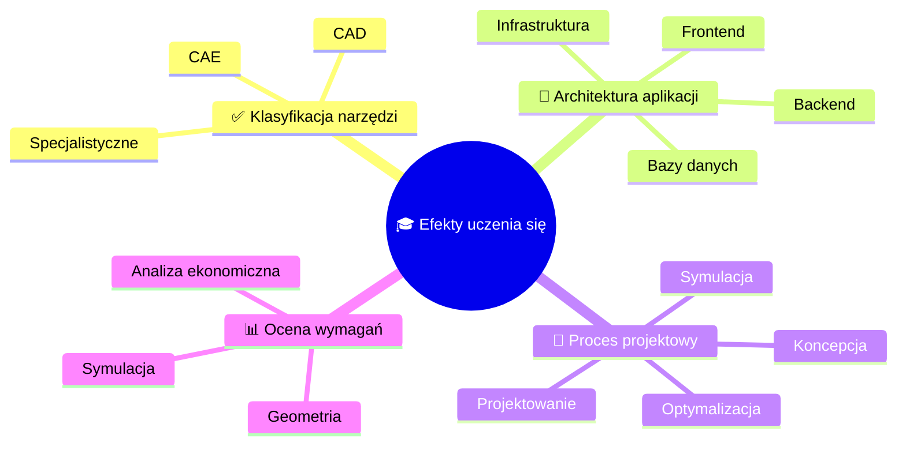
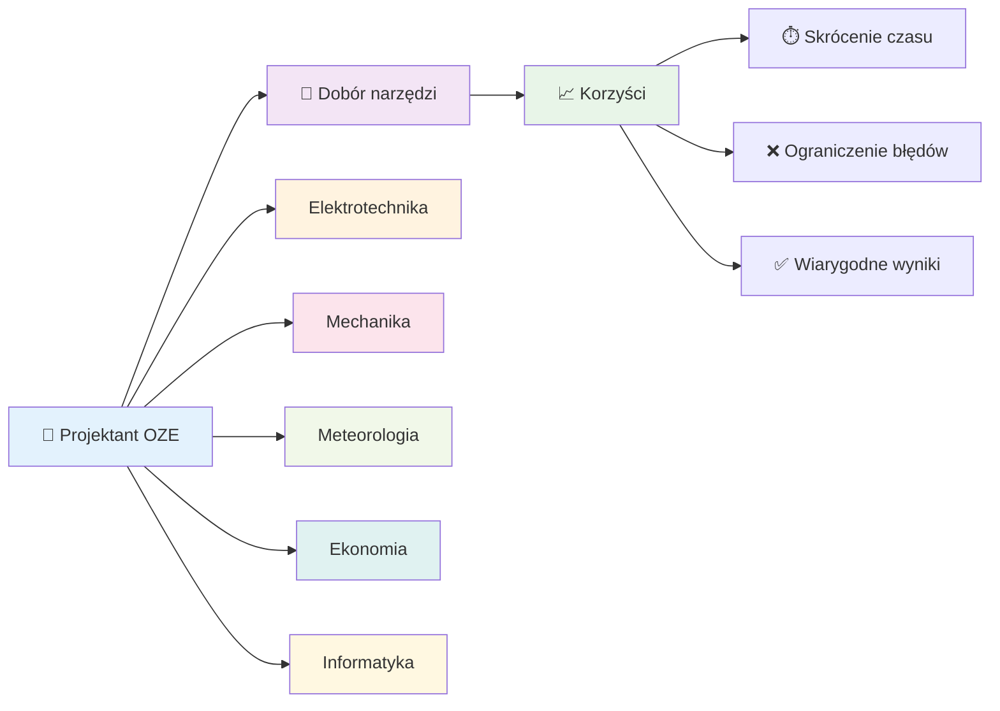

import { 
  SlideContainer, 
  Slide, 
  KeyPoints, 
  SupportingDetails, 
  InfoBox,
  InstructorNotes,
  VisualSeparator 
} from '@site/src/components/SlideComponents';

<SlideContainer>

<Slide title="🎓 Wprowadzenie do tematyki" type="info">

<KeyPoints title="🌱 Witamy na wykładzie!">

</KeyPoints>

<InstructorNotes>
**Szanowni Państwo, witam na pierwszym wykładzie kursu „Programy komputerowe w projektowaniu instalacji OZE". Ten cykl zajęć pokaże, jak nowoczesne narzędzia informatyczne wspierają każdy etap projektowania – od koncepcji po eksploatację.**

**🎯 Kontekst wykładu:**
- Jesteśmy w erze cyfryzacji energetyki, gdzie tradycyjne metody projektowania są zastępowane przez zaawansowane narzędzia komputerowe
- Projektant OZE musi dziś być nie tylko inżynierem, ale także specjalistą od narzędzi IT
- Współczesne projekty OZE wymagają integracji wielu systemów: od modelowania geometrycznego po analizy ekonomiczne

**🔧 Kluczowe wyzwania:**
- **Złożoność techniczna**: Nowoczesne instalacje OZE to systemy wielodyscyplinarne wymagające znajomości elektrotechniki, mechaniki, meteorologii i ekonomii
- **Dynamika rynku**: Szybki rozwój technologii wymaga ciągłego aktualizowania wiedzy o nowych narzędziach
- **Wymagania prawne**: Coraz bardziej restrykcyjne normy i standardy wymagają precyzyjnych analiz i dokumentacji

**📚 Struktura wykładu:**
W dzisiejszych czasach projektowanie instalacji OZE wymaga znajomości wielu klas narzędzi: systemów CAD i CAE, specjalistycznych środowisk branżowych (PV, wiatr, hybrydy), a także elementów architektury aplikacji: frontendu, backendu, baz danych i infrastruktury chmurowej/edge. W kolejnych sekcjach wprowadzimy te pojęcia i pokażemy ich praktyczne zastosowanie.

**💡 Praktyczne podejście:**
- Każde narzędzie omówimy w kontekście rzeczywistych projektów
- Pokażemy przykłady z branży i studia przypadków
- Zwrócimy uwagę na pułapki i dobre praktyki
</InstructorNotes>

</Slide>

<VisualSeparator type="default" />

<Slide title="🎯 Efekty uczenia się" type="tip">

<KeyPoints title="📚 Po wykładzie student potrafi:">

</KeyPoints>

<InstructorNotes>
**Efekty uczenia się (po wykładzie student potrafi):**

**🎯 Kluczowe kompetencje techniczne:**
- **Klasyfikacja narzędzi**: Student będzie potrafił wyjaśnić różnice między klasami narzędzi: CAD (geometria, dokumentacja), CAE (obliczenia, symulacje) i oprogramowaniem specjalistycznym (branżowe, zintegrowane)
- **Architektura systemów**: Będzie umiał wskazać, które warstwy architektury aplikacji odpowiadają za interfejs (frontend), logikę biznesową (backend), dane (bazy danych) i infrastrukturę (chmura, edge computing)

**🔧 Umiejętności praktyczne:**
- **Dobór narzędzi**: Rozpozna, na którym etapie procesu projektowego użyć danego narzędzia (koncepcja → projekt → symulacja → optymalizacja → eksploatacja)
- **Analiza wymagań**: Oceni, czy dany problem wymaga modelowania geometrycznego, symulacji numerycznej, czy analizy techno-ekonomicznej

**💡 Kontekst zawodowy:**
- Te umiejętności są kluczowe dla przyszłych projektantów OZE, którzy będą pracować w firmach projektowych, instalacyjnych i konsultingowych
- Znajomość narzędzi IT w OZE to obecnie standard w branży, a nie opcjonalna umiejętność
- Absolwenci z tą wiedzą będą bardziej konkurencyjni na rynku pracy

**📊 Metody weryfikacji:**
- Pytania kontrolne po każdej sekcji
- Praktyczne zadania z doborem narzędzi
- Analiza studiów przypadków z branży
</InstructorNotes>

</Slide>

<VisualSeparator type="default" />

<Slide title="⚡ Dlaczego to ważne?" type="note">

<SupportingDetails title="🌐 Środowisko wielodyscyplinarne">

</SupportingDetails>

<InstructorNotes>
**Dlaczego to ważne?**

**🌐 Środowisko wielodyscyplinarne:**
Projektant OZE pracuje w środowisku wielodyscyplinarnym, gdzie musi łączyć wiedzę z:
- **Elektrotechniki** (układy elektryczne, falowniki, sieci)
- **Mechaniki** (konstrukcje nośne, wytrzymałość materiałów)
- **Meteorologii** (zasoby wiatrowe, słoneczne, warunki klimatyczne)
- **Ekonomii** (analizy finansowe, LCOE, ROI)
- **Informatyki** (narzędzia IT, bazy danych, wizualizacja)

**⚡ Korzyści z właściwego doboru narzędzi:**
- **Czas projektu**: Skrócenie czasu projektowania z miesięcy do tygodni
- **Jakość wyników**: Ograniczenie ryzyka błędów projektowych i kosztownych poprawek
- **Wiarygodność**: Uzyskanie wiarygodnych wyników (energetyczne, ekonomiczne i techniczne)
- **Konkurencyjność**: Szybsze i tańsze projekty = przewaga na rynku

**🎯 Praktyczne przykłady:**
- **Błędny dobór narzędzia CAD** → nieprawidłowe wymiary → problemy montażowe → dodatkowe koszty
- **Nieodpowiednia symulacja** → zawyżone prognozy produkcji → rozczarowanie inwestora
- **Brak analizy ekonomicznej** → nieoptymalne rozwiązania → niższa rentowność

**📚 Ten wykład porządkuje mapę narzędzi i pokazuje, jak myśleć o ich roli w procesie projektowym.**
</InstructorNotes>

</Slide>

</SlideContainer>
