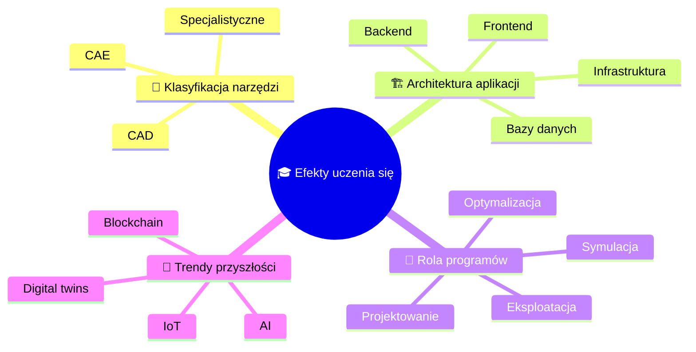

import { 
  SlideContainer, 
  Slide, 
  KeyPoints, 
  SupportingDetails, 
  InfoBox,
  InstructorNotes,
  VisualSeparator 
} from '@site/src/components/SlideComponents';

<SlideContainer>

<Slide title="🎓 Wprowadzenie do tematyki" type="info">

<KeyPoints title="🌱 Witamy na wykładzie!">

**🎯 Cyfryzacja energetyki:**
- Tradycyjne metody projektowania → zaawansowane narzędzia komputerowe
- Projektant OZE = inżynier + specjalista IT
- Integracja wielu systemów: geometria → analizy ekonomiczne

**🔧 Kluczowe wyzwania:**
- **Złożoność techniczna** - systemy wielodyscyplinarne
- **Dynamika rynku** - szybki rozwój technologii
- **Wymagania prawne** - restrykcyjne normy i standardy

**📚 Struktura wykładu:**
CAD/CAE → środowiska branżowe → architektura aplikacji → praktyczne zastosowania

</KeyPoints>

<InstructorNotes>
Witam na pierwszym wykładzie kursu „Programy komputerowe w projektowaniu instalacji OZE" - zajęcia, które pokażą, jak nowoczesne narzędzia informatyczne rewolucjonizują projektowanie systemów odnawialnych.

Jesteśmy świadkami cyfryzacji energetyki, gdzie tradycyjne metody projektowania ustępują miejsca zaawansowanym narzędziom komputerowym. **Projektant OZE musi dziś być jednocześnie inżynierem i specjalistą IT**, łącząc wiedzę techniczną z umiejętnościami cyfrowymi. Współczesne projekty wymagają integracji wielu systemów: od modelowania geometrycznego po analizy ekonomiczne.

**Złożoność techniczna** instalacji OZE wymaga znajomości elektrotechniki, mechaniki, meteorologii i ekonomii. **Dynamika rynku** technologicznego wymaga ciągłego aktualizowania wiedzy o nowych narzędziach. **Wymagania prawne** stają się coraz bardziej restrykcyjne, wymagając precyzyjnych analiz i dokumentacji.

Struktura wykładu obejmuje systemy CAD/CAE, specjalistyczne środowiska branżowe oraz elementy architektury aplikacji, przygotowując do praktycznego zastosowania w projektach OZE.
</InstructorNotes>

</Slide>

<VisualSeparator type="default" />

<Slide title="🔧 Narzędzia omawiane na wykładach" type="info">

<KeyPoints title="💻 Oprogramowanie specjalistyczne OZE">

**☀️ Systemy fotowoltaiczne:**
- **PV-SOL** (Valentine Soft) - kompleksowe projektowanie instalacji PV
- **T-SOL** (Valentine Soft) - projektowanie systemów solarnych termicznych
- **Sunny Design** - projektowanie systemów fotowoltaicznych

**🌍 Systemy geotermalne:**
- **GeoT-SOL** (Valentine Soft) - projektowanie pomp ciepła i systemów geotermalnych

**💨 Energia wiatrowa:**
- **QBlade** - symulacja turbin wiatrowych (web app)
- **Wind Atlases** - atlasy wiatrowe (web apps)
- **TOPFARM** - optymalizacja farm wiatrowych (Python package)

</KeyPoints>

<InstructorNotes>
W trakcie wykładów zapoznamy się z najważniejszymi narzędziami branżowymi stosowanymi w projektowaniu instalacji OZE.

**PV-SOL** to kompleksowe środowisko do projektowania instalacji fotowoltaicznych z bogatą bazą komponentów i zaawansowanymi analizami wydajności. **T-SOL** specjalizuje się w systemach solarnych termicznych, umożliwiając projektowanie kolektorów słonecznych i systemów grzewczych. **Sunny Design** oferuje integrację z falownikami, zapewniając kompleksowe rozwiązania PV.

**GeoT-SOL** wspiera projektowanie pomp ciepła i systemów geotermalnych, przeprowadzając szczegółowe analizy gruntowe. W zakresie energii wiatrowej **QBlade** umożliwia symulację turbin wiatrowych, **Wind Atlases** dostarcza dane zasobów wiatrowych, a **TOPFARM** oferuje algorytmy optymalizacji farm wiatrowych.

**Każde narzędzie omówimy w kontekście rzeczywistych projektów**, pokazując konkretne zastosowania z branży OZE.
</InstructorNotes>

</Slide>

<VisualSeparator type="default" />

<Slide title="🎯 Efekty uczenia się" type="tip">

<KeyPoints title="📚 Po wykładzie student potrafi:">

</KeyPoints>

<InstructorNotes>
Po wykładzie student będzie potrafił klasyfikować i stosować narzędzia komputerowe w projektowaniu instalacji OZE.

**CAD (Computer-Aided Design)** obejmuje modelowanie geometryczne i dokumentację techniczną, podczas gdy **CAE (Computer-Aided Engineering)** to obliczenia wytrzymałościowe i symulacje fizyczne. **Specjalistyczne narzędzia OZE** jak PV-SOL czy WindPRO oferują dedykowane funkcje branżowe.

**Architektura aplikacji** składa się z frontendu (interfejsy użytkownika), backendu (logika obliczeniowa), baz danych (przechowywanie metadanych) i infrastruktury (chmura, IoT). Programy pełnią kluczowe role w całym cyklu życia projektu: **projektowanie, symulację, optymalizację i eksploatację**.

**Trendy przyszłości** obejmują AI (optymalizacja produkcji), IoT (monitoring w czasie rzeczywistym), blockchain (handel energią P2P) i digital twins (wirtualne repliki instalacji). Znajomość tych narzędzi to obecnie standard w branży OZE i kluczowa kompetencja zawodowa.
</InstructorNotes>

</Slide>

<VisualSeparator type="default" />

<Slide title="⚡ Dlaczego to ważne?" type="note">

<SupportingDetails title="🌐 Środowisko wielodyscyplinarne">

**🔧 Środowisko wielodyscyplinarne:**
- **Elektrotechnika** - układy elektryczne, falowniki
- **Mechanika** - konstrukcje nośne, wytrzymałość
- **Meteorologia** - zasoby wiatrowe i słoneczne
- **Ekonomia** - analizy finansowe, LCOE
- **Informatyka** - narzędzia IT, bazy danych

**📈 Korzyści z właściwego doboru narzędzi:**
- ⏱️ **Skrócenie czasu** projektowania
- ❌ **Ograniczenie błędów** projektowych
- ✅ **Wiarygodne wyniki** analiz

</SupportingDetails>

<InstructorNotes>
Projektant OZE pracuje w środowisku wielodyscyplinarnym, łącząc wiedzę z elektrotechniki, mechaniki, meteorologii, ekonomii i informatyki.

**Właściwy dobór narzędzi komputerowych** przynosi wymierne korzyści: skrócenie czasu projektowania z miesięcy do tygodni, ograniczenie błędów projektowych i uzyskanie wiarygodnych wyników analiz. **Błędny wybór narzędzi** prowadzi do problemów montażowych, zawyżonych prognoz produkcji czy nieoptymalnych rozwiązań ekonomicznych.

**Współczesne projekty OZE** wymagają integracji wielu systemów informatycznych, od modelowania geometrycznego po zaawansowane analizy ekonomiczne. **Znajomość narzędzi IT** to nie tylko przewaga konkurencyjna, ale wręcz konieczność w dzisiejszej branży energetycznej.

Ten wykład porządkuje mapę narzędzi i pokazuje ich kluczową rolę w procesie projektowym instalacji OZE.
</InstructorNotes>

</Slide>

</SlideContainer>
