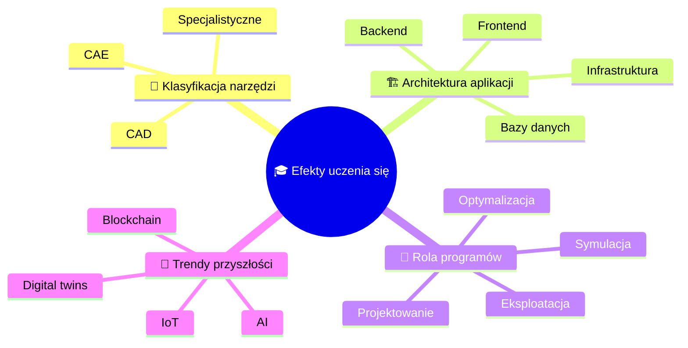

import { 
  SlideContainer, 
  Slide, 
  KeyPoints, 
  SupportingDetails, 
  InfoBox,
  InstructorNotes,
  VisualSeparator 
} from '@site/src/components/SlideComponents';

<SlideContainer>

<Slide title="🎓 Wprowadzenie do tematyki" type="info">

<KeyPoints title="🌱 Witamy na wykładzie!">

**🎯 Cel kursu:**
- Nowoczesne narzędzia informatyczne w OZE
- CAD/CAE i oprogramowanie specjalistyczne
- Technologie IoT i AI

**📈 Zakres tematyczny:**
- **Koncepcja** - planowanie i analiza wstępna
- **Projektowanie** - narzędzia CAD i symulacyjne
- **Eksploatacja** - monitoring i optymalizacja

</KeyPoints>

<InstructorNotes>
**Szanowni Państwo, witam na pierwszym wykładzie kursu „Programy komputerowe w projektowaniu instalacji OZE". Ten cykl zajęć pokaże, jak nowoczesne narzędzia informatyczne wspierają każdy etap projektowania – od koncepcji po eksploatację.**

**🎯 Kontekst wykładu:**
- Jesteśmy w erze cyfryzacji energetyki, gdzie tradycyjne metody projektowania są zastępowane przez zaawansowane narzędzia komputerowe
- Projektant OZE musi dziś być nie tylko inżynierem, ale także specjalistą od narzędzi IT
- Współczesne projekty OZE wymagają integracji wielu systemów: od modelowania geometrycznego po analizy ekonomiczne

**🔧 Kluczowe wyzwania:**
- **Złożoność techniczna**: Nowoczesne instalacje OZE to systemy wielodyscyplinarne wymagające znajomości elektrotechniki, mechaniki, meteorologii i ekonomii
- **Dynamika rynku**: Szybki rozwój technologii wymaga ciągłego aktualizowania wiedzy o nowych narzędziach
- **Wymagania prawne**: Coraz bardziej restrykcyjne normy i standardy wymagają precyzyjnych analiz i dokumentacji

**📚 Struktura wykładu:**
W dzisiejszych czasach projektowanie instalacji OZE wymaga znajomości wielu klas narzędzi: systemów CAD i CAE, specjalistycznych środowisk branżowych (PV, wiatr, hybrydy), a także elementów architektury aplikacji: frontendu, backendu, baz danych i infrastruktury chmurowej/edge. W kolejnych sekcjach wprowadzimy te pojęcia i pokażemy ich praktyczne zastosowanie.

**💡 Praktyczne podejście:**
- Każde narzędzie specyjalistyczne omówimy w kontekście rzeczywistych projektów. 
- Pokażemy przykłady z branży i studia przypadków
</InstructorNotes>

</Slide>

<VisualSeparator type="default" />

<Slide title="🔧 Narzędzia omawiane na wykładach" type="info">

<KeyPoints title="💻 Oprogramowanie specjalistyczne OZE">

**☀️ Systemy fotowoltaiczne:**
- **PV-SOL** (Valentine Soft) - kompleksowe projektowanie instalacji PV
- **T-SOL** (Valentine Soft) - projektowanie systemów solarnych termicznych
- **Sunny Design** - projektowanie systemów fotowoltaicznych

**🌍 Systemy geotermalne:**
- **GeoT-SOL** (Valentine Soft) - projektowanie pomp ciepła i systemów geotermalnych

**💨 Energia wiatrowa:**
- **QBlade** - symulacja turbin wiatrowych (web app)
- **Wind Atlases** - atlasy wiatrowe (web apps)
- **TOPFARM** - optymalizacja farm wiatrowych (Python package)

</KeyPoints>

<InstructorNotes>
**Narzędzia omawiane na wykładach**

**💻 Oprogramowanie specjalistyczne OZE:**
W trakcie wykładów omówimy najważniejsze narzędzia branżowe:

**☀️ Systemy fotowoltaiczne:**
- **PV-SOL** (Valentine Soft) - kompleksowe środowisko do projektowania instalacji PV z bogatą bazą komponentów
- **T-SOL** (Valentine Soft) - projektowanie systemów solarnych termicznych, kolektory słoneczne
- **Sunny Design** - narzędzie do projektowania systemów fotowoltaicznych z integracją falowników

**🌍 Systemy geotermalne:**
- **GeoT-SOL** (Valentine Soft) - projektowanie pomp ciepła i systemów geotermalnych, analizy gruntowe

**💨 Energia wiatrowa:**
- **QBlade** - web application do symulacji turbin wiatrowych, analizy aerodynamiczne
- **Wind Atlases** - web applications z atlasami wiatrowymi, dane zasobów wiatrowych
- **TOPFARM** - Python package do optymalizacji farm wiatrowych, algorytmy optymalizacyjne

**💡 Praktyczne podejście:**
Każde narzędzie omówimy w kontekście rzeczywistych projektów, pokazując konkretne zastosowania i studia przypadków z branży OZE.
</InstructorNotes>

</Slide>

<VisualSeparator type="default" />

<Slide title="🎯 Efekty uczenia się" type="tip">

<KeyPoints title="📚 Po wykładzie student potrafi:">

</KeyPoints>

<InstructorNotes>
**Efekty uczenia się (po wykładzie student potrafi):**

**🔧 Klasyfikacja narzędzi:**
- **CAD** - modelowanie geometryczne, dokumentacja techniczna, wizualizacja projektów
- **CAE** - obliczenia wytrzymałościowe, symulacje fizyczne, analizy numeryczne
- **Specjalistyczne** - branżowe oprogramowanie dedykowane dla OZE (PV*SOL, PVsyst, SAM, WindPRO)

**🏗️ Architektura aplikacji:**
- **Frontend** - interfejsy użytkownika, dashboardy, wizualizacja danych
- **Backend** - logika biznesowa, silniki obliczeniowe, API
- **Bazy danych** - przechowywanie danych czasowych, metadanych, konfiguracji
- **Infrastruktura** - chmura obliczeniowa, edge computing, IoT

**🎯 Rola programów w procesie:**
- **Projektowanie** - od koncepcji do dokumentacji wykonawczej
- **Symulacja** - modelowanie wydajności, prognozy produkcji
- **Optymalizacja** - algorytmy optymalizacyjne, analizy ekonomiczne
- **Eksploatacja** - monitoring, utrzymanie predykcyjne, analizy

**🚀 Trendy przyszłości:**
- **AI** - machine learning, computer vision, NLP
- **IoT** - inteligentne czujniki, edge computing
- **Blockchain** - handel P2P energią, smart contracts
- **Digital twins** - wirtualne repliki instalacji, symulacje w czasie rzeczywistym

**💡 Kontekst zawodowy:**
- Znajomość narzędzi IT w OZE to obecnie standard w branży
- Absolwenci z tą wiedzą będą bardziej konkurencyjni na rynku pracy
- Umiejętności kluczowe dla projektantów, instalatorów i konsultantów OZE

**📊 Metody weryfikacji:**
- Pytania kontrolne po każdej sekcji
- Praktyczne zadania z doborem narzędzi
- Analiza studiów przypadków z branży
</InstructorNotes>

</Slide>

<VisualSeparator type="default" />

<Slide title="⚡ Dlaczego to ważne?" type="note">

<SupportingDetails title="🌐 Środowisko wielodyscyplinarne">

**🔧 Środowisko wielodyscyplinarne:**
- **Elektrotechnika** - układy elektryczne, falowniki
- **Mechanika** - konstrukcje nośne, wytrzymałość
- **Meteorologia** - zasoby wiatrowe i słoneczne
- **Ekonomia** - analizy finansowe, LCOE
- **Informatyka** - narzędzia IT, bazy danych

**📈 Korzyści z właściwego doboru narzędzi:**
- ⏱️ **Skrócenie czasu** projektowania
- ❌ **Ograniczenie błędów** projektowych
- ✅ **Wiarygodne wyniki** analiz

</SupportingDetails>

<InstructorNotes>
**Dlaczego to ważne?**

**🌐 Środowisko wielodyscyplinarne:**
Projektant OZE pracuje w środowisku wielodyscyplinarnym, gdzie musi łączyć wiedzę z:
- **Elektrotechniki** (układy elektryczne, falowniki, sieci)
- **Mechaniki** (konstrukcje nośne, wytrzymałość materiałów)
- **Meteorologii** (zasoby wiatrowe, słoneczne, warunki klimatyczne)
- **Ekonomii** (analizy finansowe, LCOE, ROI)
- **Informatyki** (narzędzia IT, bazy danych, wizualizacja)

**⚡ Korzyści z właściwego doboru narzędzi:**
- **Czas projektu**: Skrócenie czasu projektowania z miesięcy do tygodni
- **Jakość wyników**: Ograniczenie ryzyka błędów projektowych i kosztownych poprawek
- **Wiarygodność**: Uzyskanie wiarygodnych wyników (energetyczne, ekonomiczne i techniczne)
- **Konkurencyjność**: Szybsze i tańsze projekty = przewaga na rynku

**🎯 Praktyczne przykłady:**
- **Błędny dobór narzędzia CAD** → nieprawidłowe wymiary → problemy montażowe → dodatkowe koszty
- **Nieodpowiednia symulacja** → zawyżone prognozy produkcji → rozczarowanie inwestora
- **Brak analizy ekonomicznej** → nieoptymalne rozwiązania → niższa rentowność

**📚 Ten wykład porządkuje mapę narzędzi i pokazuje, jak myśleć o ich roli w procesie projektowym.**
</InstructorNotes>

</Slide>

</SlideContainer>
