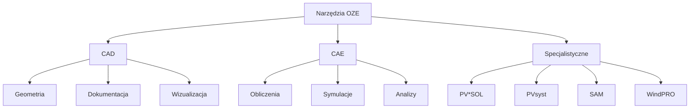
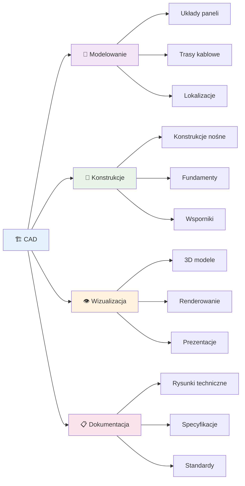
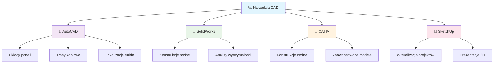
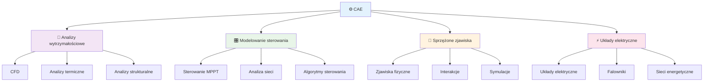
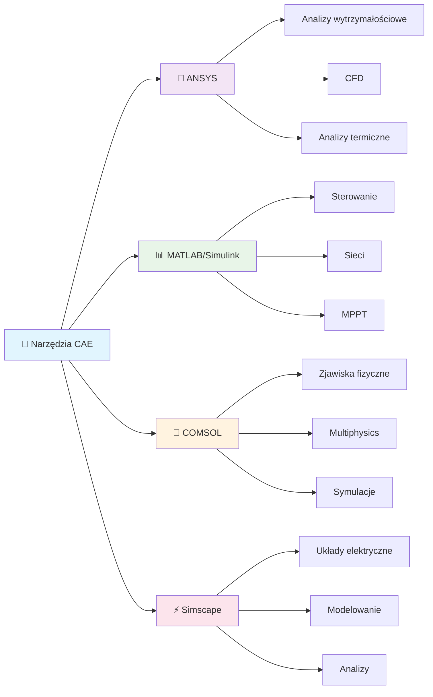

import { 
  SlideContainer, 
  Slide, 
  KeyPoints, 
  SupportingDetails, 
  InfoBox,
  WarningBox,
  SuccessBox,
  InstructorNotes,
  VisualSeparator 
} from '@site/src/components/SlideComponents';

<SlideContainer>

<Slide title="🔧 Klasyfikacja narzędzi programowych OZE" type="info">

<KeyPoints title="🎯 Trzy główne kategorie narzędzi">

</KeyPoints>

<InstructorNotes>
**Narzędzia wykorzystywane w projektowaniu instalacji OZE można podzielić na trzy główne kategorie.**

**🎯 Dlaczego klasyfikacja jest ważna?**
- **Orientacja w rynku**: Na rynku dostępnych jest setki narzędzi OZE - klasyfikacja pomaga w nawigacji
- **Dobór narzędzi**: Każda kategoria ma swoje specyficzne zastosowania i ograniczenia
- **Planowanie kariery**: Znajomość kategorii pomaga w wyborze specjalizacji zawodowej

**📊 Kryteria klasyfikacji:**
- **Cel zastosowania**: Co chcemy osiągnąć (geometria, obliczenia, symulacja)
- **Poziom złożoności**: Od prostych narzędzi do zaawansowanych platform
- **Specjalizacja branżowa**: Uniwersalne vs. dedykowane dla OZE
- **Koszty i dostępność**: Od darmowych narzędzi open-source po drogie platformy komercyjne

**🔧 Praktyczne podejście:**
- Każda kategoria będzie omówiona z przykładami konkretnych narzędzi
- Pokażemy, kiedy używać której kategorii
- Zwrócimy uwagę na pułapki i ograniczenia
</InstructorNotes>

</Slide>

<VisualSeparator type="technical" />

<Slide title="🏗️ Narzędzia CAD (Computer-Aided Design)" type="tip">

<KeyPoints title="🎨 Zastosowania w OZE">

</KeyPoints>

<SupportingDetails title="💻 Przykłady narzędzi">

</SupportingDetails>

<InstructorNotes>
**Narzędzia CAD (Computer-Aided Design)**

**🎨 Główne zastosowania w OZE:**
- **Modelowanie geometryczne instalacji**: AutoCAD – układy paneli, trasy kablowe, lokalizacje turbin
- **Projektowanie konstrukcji nośnych**: SolidWorks, CATIA – konstrukcje wsporcze, fundamenty
- **Wizualizacja projektów**: SketchUp – prezentacje dla inwestorów, analizy zacienień

**✅ Kluczowe zalety:**
- **Precyzja geometryczna**: Dokładne wymiary i tolerancje
- **Dokumentacja techniczna**: Zgodność ze standardami branżowymi
- **Wizualizacja 3D**: Łatwiejsze zrozumienie projektu przez zespół
- **Integracja**: Możliwość eksportu do innych narzędzi

**⚠️ Ograniczenia:**
- **Brak obliczeń**: CAD nie wykonuje analiz energetycznych czy ekonomicznych
- **Koszty**: Licencje komercyjne mogą być drogie
- **Krzywa uczenia**: Wymagają czasu na opanowanie

**💡 Praktyczne wskazówki:**
- Używaj CAD na początku procesu projektowego
- Eksportuj modele do narzędzi specjalistycznych
- Zwróć uwagę na skalę i jednostki
- Pamiętaj o standardach rysunkowych
</InstructorNotes>

</Slide>

<VisualSeparator type="technical" />

<Slide title="⚙️ Narzędzia CAE (Computer-Aided Engineering)" type="note">

<KeyPoints title="🧮 Zaawansowane obliczenia">

</KeyPoints>

<SupportingDetails title="🔧 Przykłady narzędzi">

</SupportingDetails>

<InstructorNotes>
**Narzędzia CAE (Computer-Aided Engineering)**

**🧮 Główne zastosowania w OZE:**
- **ANSYS**: analizy wytrzymałościowe, CFD dla turbin, analizy termiczne
- **MATLAB/Simulink**: modelowanie sterowania, analiza sieci, algorytmy MPPT
- **COMSOL Multiphysics**: sprzężone zjawiska fizyczne (np. ogniwa PV)
- **Simscape Electrical**: modelowanie układów elektrycznych

**⚡ Kluczowe cechy:**
- **Zaawansowane obliczenia**: Metody numeryczne, elementy skończone, CFD
- **Modelowanie fizyczne**: Rzeczywiste zjawiska fizyczne w systemach OZE
- **Walidacja projektów**: Sprawdzenie poprawności rozwiązań technicznych
- **Optymalizacja**: Znajdowanie najlepszych parametrów systemu

**🎯 Kiedy używać CAE:**
- **Analizy wytrzymałościowe**: Konstrukcje nośne, fundamenty turbin
- **Modelowanie przepływów**: CFD dla turbin wiatrowych, chłodzenie paneli
- **Analizy termiczne**: Rozkład temperatur w modułach PV
- **Modelowanie sterowania**: Algorytmy MPPT, systemy zarządzania energią

**⚠️ Wyzwania:**
- **Złożoność**: Wymagają głębokiej wiedzy technicznej
- **Czas obliczeń**: Symulacje mogą trwać godziny lub dni
- **Koszty**: Licencje są bardzo drogie
- **Walidacja**: Wyniki wymagają weryfikacji z danymi rzeczywistymi

**💡 Praktyczne wskazówki:**
- Używaj CAE dla krytycznych analiz technicznych
- Zawsze waliduj wyniki z danymi eksperymentalnymi
- Rozpocznij od prostych modeli, stopniowo zwiększaj złożoność
- Pamiętaj o ograniczeniach modeli matematycznych
</InstructorNotes>

</Slide>

<VisualSeparator type="technical" />

<Slide title="💻 Oprogramowanie specjalistyczne" type="tip">

<KeyPoints title="☀️ Systemy fotowoltaiczne">
- 🎯 **PV*SOL** – kompleksowe projektowanie i symulacje
- 📊 **PVsyst** – modelowanie strat i zacienienia
- ☁️ **Helioscope** – analiza zacienień 3D w chmurze
</KeyPoints>

<SupportingDetails title="💨 Energia wiatrowa">
- 🌪️ **WindPRO** – projektowanie farm wiatrowych
- 🗺️ **WAsP** – atlas i modelowanie zasobów wiatrowych
</SupportingDetails>

<InfoBox title="🔄 Systemy hybrydowe">
- 🔧 **HOMER** – optymalizacja systemów z wieloma źródłami
- 📊 **SAM (NREL)** – analiza techno-ekonomiczna
- 📈 **RETScreen** – analiza projektów z modułem ryzyka
</InfoBox>

<InstructorNotes>
**Oprogramowanie specjalistyczne**

**☀️ Systemy fotowoltaiczne:**
- **PV*SOL**: kompleksowe projektowanie i symulacje, bogata baza komponentów
  - *Zalety*: Intuicyjny interfejs, bogata baza danych, integracja z CAD
  - *Zastosowania*: Projekty dachowe i gruntowe, analizy ekonomiczne
- **PVsyst**: modelowanie strat i wpływu zacienienia
  - *Zalety*: Precyzyjne modele fizyczne, walidacja z danymi rzeczywistymi
  - *Zastosowania*: Duże farmy PV, analizy zacienień
- **Helioscope**: analiza zacienień 3D w chmurze
  - *Zalety*: Dostęp przez przeglądarkę, szybkie prototypowanie
  - *Zastosowania*: Wstępne analizy, prezentacje dla klientów

**💨 Energia wiatrowa:**
- **WindPRO**: projektowanie farm wiatrowych
  - *Zalety*: Kompleksowe narzędzie, integracja z mapami
  - *Zastosowania*: Farmy wiatrowe, analizy wietrzności
- **WAsP**: atlas i modelowanie zasobów wiatrowych
  - *Zalety*: Precyzyjne modele wiatru, walidacja z pomiarami
  - *Zastosowania*: Ocena zasobów wiatrowych, mikro-lokalizacja

**🔄 Systemy hybrydowe:**
- **HOMER**: optymalizacja systemów z wieloma źródłami
  - *Zalety*: Optymalizacja techno-ekonomiczna, analiza wrażliwości
  - *Zastosowania*: Systemy off-grid, mikrosieci
- **SAM (NREL)**: analiza techno-ekonomiczna
  - *Zalety*: Darmowe, otwarte źródło, ciągły rozwój
  - *Zastosowania*: Analizy finansowe, porównania technologii
- **RETScreen**: analiza projektów z modułem ryzyka
  - *Zalety*: Standardowe podejście, walidacja bankowa
  - *Zastosowania*: Studia wykonalności, analizy ryzyka

**💡 Kluczowe zalety oprogramowania specjalistycznego:**
- **Dedykowane funkcje**: Zaprojektowane specjalnie dla OZE
- **Bogate bazy danych**: Komponenty, warunki klimatyczne, ceny
- **Integracja**: Łączenie różnych etapów projektowania
- **Walidacja**: Sprawdzone modele i algorytmy
</InstructorNotes>

</Slide>

<VisualSeparator type="default" />

<Slide title="🎯 Kryteria wyboru narzędzia" type="warning">

<KeyPoints title="⚖️ Kluczowe czynniki decyzyjne">
- 🎯 **Cel analizy**: geometria/dokumentacja vs. zjawiska fizyczne vs. symulacja systemu
- 📊 **Poziom dokładności** i dostępność danych wejściowych
- ✅ **Zgodność ze standardami** branżowymi
- 📚 **Biblioteki komponentów** i modele strat
- ⏱️ **Czas obliczeń** i możliwość walidacji
</KeyPoints>

<InstructorNotes>
**Jak wybierać narzędzie? Kryteria decyzyjne**

**🎯 Cel analizy - najważniejsze kryterium:**
- **Geometria/dokumentacja** → CAD (AutoCAD, SolidWorks)
- **Zjawiska fizyczne** → CAE (ANSYS, COMSOL)
- **Symulacja systemu i ekonomia** → Oprogramowanie specjalistyczne (PV*SOL, SAM)

**📊 Poziom dokładności vs. dostępność danych:**
- **Wysoka dokładność** wymaga dobrych danych wejściowych (pomiary, certyfikaty)
- **Szybkie prototypowanie** może używać danych przybliżonych
- **Analiza wrażliwości** pokazuje wpływ niepewności danych

**✅ Zgodność ze standardami:**
- **Standardy branżowe**: IEC, EN, normy krajowe
- **Oczekiwania inwestora**: Format raportów, wskaźniki finansowe
- **Wymagania bankowe**: Walidacja projektów, analizy ryzyka

**📚 Dostępność bibliotek:**
- **Komponenty**: Moduły PV, falowniki, turbiny wiatrowe
- **Modele strat**: Zacienienia, temperatury, degradacja
- **Dane klimatyczne**: TMY, pomiary lokalne, prognozy

**⏱️ Czas obliczeń vs. walidacja:**
- **Szybkie obliczenia**: Prototypowanie, wstępne analizy
- **Długie symulacje**: Precyzyjne analizy, optymalizacja
- **Walidacja**: Porównanie z danymi SCADA, pomiarami rzeczywistymi

**💡 Praktyczne wskazówki:**
- **Zacznij od prostych narzędzi**, stopniowo zwiększaj złożoność
- **Sprawdź dostępność danych** przed wyborem narzędzia
- **Uwzględnij koszty licencji** w budżecie projektu
- **Zawsze waliduj wyniki** z danymi rzeczywistymi
</InstructorNotes>

</Slide>

</SlideContainer>
