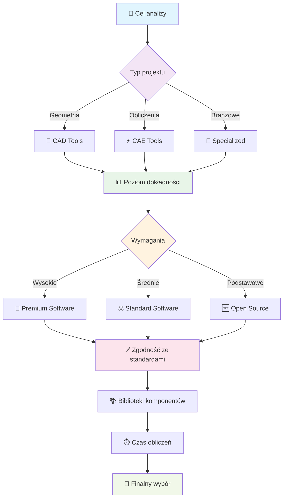

import { 
  SlideContainer, 
  Slide, 
  KeyPoints, 
  SupportingDetails, 
  InfoBox,
  WarningBox,
  SuccessBox,
  InstructorNotes,
  VisualSeparator 
} from '@site/src/components/SlideComponents';

<SlideContainer>

<Slide title="🔧 Klasyfikacja narzędzi programowych OZE" type="info">

<KeyPoints title="🎯 Hierarchia narzędzi projektowych OZE">

**📐 Poziom 1: Narzędzia CAD (Computer-Aided Design)**
- **Geometria** - modelowanie 3D instalacji i konstrukcji
- **Dokumentacja** - rysunki techniczne zgodne ze standardami
- **Wizualizacja** - prezentacje projektów dla inwestorów

**⚙️ Poziom 2: Narzędzia CAE (Computer-Aided Engineering)**
- **Obliczenia** - analizy wytrzymałościowe i termiczne
- **Symulacje** - modelowanie zjawisk fizycznych
- **Walidacja** - sprawdzanie poprawności rozwiązań

**🔧 Poziom 3: Oprogramowanie specjalistyczne OZE**
- **Branżowe** - dedykowane dla konkretnych technologii
- **Zintegrowane** - łączące projektowanie z analizą ekonomiczną
- **Walidowane** - sprawdzone modele i algorytmy

</KeyPoints>

<InstructorNotes>
Na dzisiejszym wykładzie przedstawię systematyczną klasyfikację narzędzi programowych wykorzystywanych w projektowaniu instalacji OZE - wiedzę fundamentalną dla każdego projektanta.

**Hierarchia narzędzi** obejmuje trzy poziomy: **CAD** do modelowania geometrycznego (AutoCAD, SolidWorks), **CAE** do zaawansowanych analiz inżynierskich (ANSYS, COMSOL), oraz **specjalistyczne narzędzia OZE** z gotowymi modelami branżowymi (PV-SOL, WindPRO).

**Ta klasyfikacja jest kluczowa** dla orientacji w rynku oprogramowania, strategicznego planowania projektów i planowania kariery zawodowej. Na rynku dostępnych jest ponad 200 narzędzi OZE o różnych poziomach zaawansowania.

**Kryteria wyboru narzędzi** obejmują funkcjonalność (zakres analiz, dokładność), użyteczność (interfejs, dokumentacja) i ekonomiczność (koszty licencji, ROI). Proces wyboru wymaga definicji celu, oceny wymagań i testowania narzędzi.

W kolejnych sekcjach szczegółowo omówimy każdą kategorię, pokazując konkretne zastosowania w projektach OZE.
</InstructorNotes>

</Slide>

<VisualSeparator type="technical" />

<Slide title="🏗️ Narzędzia CAD (Computer-Aided Design)" type="tip">

  

    <h3>📐 Modelowanie</h3>
    
<strong>Zastosowanie:</strong> Geometria instalacji OZE

    <ul>
      <li>Układy paneli PV</li>
      <li>Trasy kablowe</li>
    </ul>
  

  
  

    <h3>🔧 Konstrukcje</h3>
    
<strong>Zastosowanie:</strong> Elementy nośne i mocowania

    <ul>
      <li>Konstrukcje nośne</li>
      <li>Fundamenty</li>
      <li>Wsporniki i mocowania</li>
    </ul>
  

  
  

    <h3>👁️ Wizualizacja</h3>
    
<strong>Zastosowanie:</strong> Prezentacja projektów

    <ul>
      <li>Modele 3D</li>
      <li>Renderowanie</li>
      <li>Prezentacje dla inwestorów</li>
    </ul>
  

  
  

    <h3>📋 Dokumentacja</h3>
    
<strong>Zastosowanie:</strong> Dokumentacja techniczna

    <ul>
      <li>Rysunki techniczne</li>
      <li>Specyfikacje</li>
      <li>Standardy branżowe</li>
    </ul>
  

<SupportingDetails title="💻 Przykłady narzędzi">

| Narzędzie | Zastosowanie | Specjalizacja |
|-----------|--------------|---------------|
| **🎯 AutoCAD** | Układy paneli, trasy kablowe | Geometria 2D/3D - precyzyjne rysunki techniczne, standardy branżowe, integracja z systemami GIS |
| **🔧 SolidWorks** | Konstrukcje nośne, analizy | Modelowanie 3D parametryczne - symulacje wytrzymałościowe, analizy termiczne, dokumentacja techniczna |
| **🔧 CATIA** | Zaawansowane modele | Przemysł lotniczy i motoryzacyjny - zaawansowane powierzchnie, analizy aerodynamiczne, systemy PLM |
| **🎨 SketchUp** | Wizualizacja, prezentacje | Architektura i budownictwo - szybkie prototypowanie, renderowanie, integracja z Google Earth |

</SupportingDetails>

<InstructorNotes>
Narzędzia CAD to fundament projektowania OZE, umożliwiające precyzyjne modelowanie geometryczne i dokumentację techniczną.

**AutoCAD** specjalizuje się w układach paneli i trasach kablowych, **SolidWorks** w konstrukcjach nośnych i analizach wytrzymałościowych, a **SketchUp** w wizualizacji projektów dla inwestorów. **CATIA** oferuje zaawansowane modele dla przemysłu lotniczego i motoryzacyjnego.

**Kluczowe zalety CAD** to precyzja geometryczna, zgodność ze standardami branżowymi i możliwość integracji z innymi narzędziami. **Ograniczenia** obejmują brak obliczeń energetycznych, wysokie koszty licencji i wymagany czas na opanowanie.

**Używaj CAD na początku procesu projektowego**, eksportuj modele do narzędzi specjalistycznych i pamiętaj o standardach rysunkowych.
</InstructorNotes>

</Slide>

<VisualSeparator type="technical" />

<Slide title="⚙️ Narzędzia CAE (Computer-Aided Engineering)" type="note">

  

    <h3>💪 Analizy wytrzymałościowe</h3>
    
<strong>Zastosowanie:</strong> Analizy strukturalne i termiczne

    <ul>
      <li>CFD - przepływy ciepła</li>
      <li>Analizy termiczne</li>
      <li>Analizy wytrzymałościowe konstrukcji</li>
    </ul>
  

  
  

    <h3>🎛️ Modelowanie sterowania</h3>
    
<strong>Zastosowanie:</strong> Systemy sterowania i regulacji

    <ul>
      <li>Sterowanie MPPT</li>
      <li>Analiza sieci</li>
      <li>Algorytmy sterowania</li>
    </ul>
  

  
  

    <h3>🔗 Sprzężone zjawiska</h3>
    
<strong>Zastosowanie:</strong> Symulacje multiphysics

    <ul>
      <li>Zjawiska fizyczne</li>
      <li>Interakcje komponentów</li>
      <li>Symulacje multiphysics</li>
    </ul>
  

  
  

    <h3>⚡ Układy elektryczne</h3>
    
<strong>Zastosowanie:</strong> Analizy systemów elektrycznych

    <ul>
      <li>Modele falowników</li>
      <li>Analizy sieci energetycznych</li>
      <li>Optymalizacja układów</li>
    </ul>
  

<SupportingDetails title="🔧 Przykłady narzędzi">

| Narzędzie | Zastosowanie | Specjalizacja |
|-----------|--------------|---------------|
| **🎯 ANSYS** | Analizy wytrzymałościowe, CFD | Symulacje numeryczne - elementy skończone, CFD, analizy termiczne, optymalizacja konstrukcji, walidacja projektów |
| **📊 MATLAB/Simulink** | Sterowanie, sieci, MPPT | Modelowanie systemów - algorytmy sterowania, analiza sieci energetycznych, symulacje w czasie rzeczywistym, prototypowanie |
| **🔬 COMSOL** | Zjawiska fizyczne, multiphysics | Symulacje sprzężone - elektromagnetyzm, termodynamika, mechanika płynów, akustyka, optyka w jednym środowisku |
| **⚡ Simscape** | Układy elektryczne | Modelowanie elektryczne - komponenty elektryczne, systemy sterowania, analizy harmoniczne, symulacje układów mocy |

</SupportingDetails>

<InstructorNotes>
Narzędzia CAE oferują zaawansowane analizy inżynierskie i symulacje fizyczne, niezbędne dla krytycznych aspektów projektów OZE.

**ANSYS** wykonuje analizy wytrzymałościowe i CFD dla turbin, **MATLAB/Simulink** modeluje sterowanie i algorytmy MPPT, **COMSOL Multiphysics** analizuje sprzężone zjawiska fizyczne, a **Simscape Electrical** modeluje układy elektryczne.

**MPPT** to algorytm śledzenia punktu maksymalnej mocy w panelach PV, kluczowy dla efektywności systemów. **CFD** to metoda numeryczna analizy przepływów, używana do modelowania wiatru wokół turbin i chłodzenia paneli.

**Kluczowe cechy CAE** to zaawansowane obliczenia numeryczne, modelowanie fizyczne i walidacja projektów. **Wyzwania** obejmują złożoność, czas obliczeń i wysokie koszty licencji.

**Używaj CAE dla krytycznych analiz technicznych**, zawsze waliduj wyniki z danymi rzeczywistymi i pamiętaj o ograniczeniach modeli matematycznych.
</InstructorNotes>

</Slide>

<VisualSeparator type="technical" />

<Slide title="💻 Oprogramowanie specjalistyczne" type="tip">

<KeyPoints title="☀️ Systemy fotowoltaiczne">
- 🎯 **PV*SOL** – kompleksowe projektowanie i symulacje
- 📊 **T-SOL** – projektowanie systemów solarnych termicznych
- ☀️ **Sunny Design** – projektowanie systemów fotowoltaicznych
</KeyPoints>

<SupportingDetails title="🌍 Systemy geotermalne">
- 🌍 **GeoT-SOL** – projektowanie pomp ciepła i systemów geotermalnych
</SupportingDetails>

<InfoBox title="💨 Energia wiatrowa">
- 💨 **QBlade** – symulacja turbin wiatrowych (web app)
- 🗺️ **Wind Atlases** – atlasy wiatrowe (web apps)
- 🔧 **TOPFARM** – optymalizacja farm wiatrowych (Python package)
</InfoBox>

<InstructorNotes>
Oprogramowanie specjalistyczne OZE oferuje dedykowane funkcje branżowe z gotowymi modelami i algorytmami, niezbędne dla kompleksowych analiz systemów odnawialnych.

**PV-SOL** zapewnia kompleksowe projektowanie instalacji PV z bogatą bazą komponentów, **T-SOL** specjalizuje się w systemach solarnych termicznych, a **Sunny Design** oferuje integrację z falownikami SMA. **GeoT-SOL** wspiera projektowanie pomp ciepła i analizy gruntowe.

**QBlade** umożliwia symulację turbin wiatrowych przez przeglądarkę, **Wind Atlases** dostarcza dane wiatrowe w czasie rzeczywistym, a **TOPFARM** oferuje algorytmy optymalizacji farm wiatrowych.

**Kluczowe zalety** to dedykowane funkcje dla OZE, bogate bazy danych komponentów i warunków klimatycznych, integracja różnych etapów projektowania oraz sprawdzone modele i algorytmy.

**Każde narzędzie omówimy w kontekście rzeczywistych projektów**, pokazując konkretne zastosowania z branży OZE.
</InstructorNotes>

</Slide>

<VisualSeparator type="default" />

<Slide title="🎯 Kryteria wyboru narzędzi" type="warning">

<KeyPoints title="⚖️ Proces decyzyjny - przepływ wyboru narzędzi">

</KeyPoints>

<InstructorNotes>
Wybór narzędzi OZE wymaga systematycznego podejścia uwzględniającego cel analizy, poziom dokładności, zgodność ze standardami i dostępność komponentów.

**Proces decyzyjny** zaczyna się od definicji celu: **CAD** dla geometrii i dokumentacji, **CAE** dla zjawisk fizycznych, **specjalistyczne** dla symulacji systemów. **Poziom dokładności** waha się od podstawowego (70-85%, darmowe) przez standardowy (85-95%, 1-5k EUR/rok) do premium (>95%, 10-50k EUR/rok).

**Zgodność ze standardami** obejmuje normy IEC (61724, 61850, 61400), wymagania prawne (RED II) i certyfikacje (TÜV, UL, CE). **Biblioteki komponentów** zapewniają dostęp do modeli producentów i danych klimatycznych z globalnych źródeł.

**Czas obliczeń** wymaga balansu między wydajnością systemu a dokładnością wyników, uwzględniając koszty licencji i wymagania sprzętowe.

**Definiuj cel, oceń wymagania, sprawdź standardy i przetestuj narzędzia** przed finalnym wyborem.
</InstructorNotes>

</Slide>

</SlideContainer>
