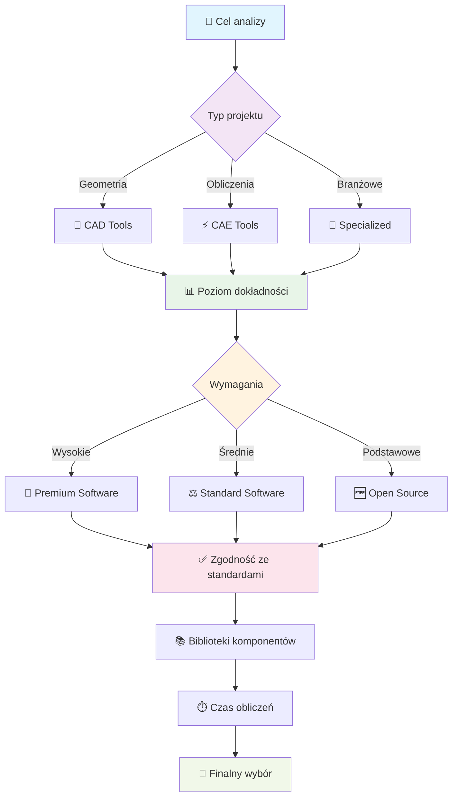

import { 
  SlideContainer, 
  Slide, 
  KeyPoints, 
  SupportingDetails, 
  InfoBox,
  WarningBox,
  SuccessBox,
  InstructorNotes,
  VisualSeparator 
} from '@site/src/components/SlideComponents';

<SlideContainer>

<Slide title="🔧 Klasyfikacja narzędzi programowych OZE" type="info">

<KeyPoints title="🎯 Hierarchia narzędzi projektowych OZE">

**📐 Poziom 1: Narzędzia CAD (Computer-Aided Design)**
- **Geometria** - modelowanie 3D instalacji i konstrukcji
- **Dokumentacja** - rysunki techniczne zgodne ze standardami
- **Wizualizacja** - prezentacje projektów dla inwestorów

**⚙️ Poziom 2: Narzędzia CAE (Computer-Aided Engineering)**
- **Obliczenia** - analizy wytrzymałościowe i termiczne
- **Symulacje** - modelowanie zjawisk fizycznych
- **Walidacja** - sprawdzanie poprawności rozwiązań

**🔧 Poziom 3: Oprogramowanie specjalistyczne OZE**
- **Branżowe** - dedykowane dla konkretnych technologii
- **Zintegrowane** - łączące projektowanie z analizą ekonomiczną
- **Walidowane** - sprawdzone modele i algorytmy

</KeyPoints>

<InstructorNotes>
**🎯 Wprowadzenie do klasyfikacji narzędzi OZE**

**Szanowni Państwo, na dzisiejszym wykładzie przedstawię systematyczną klasyfikację narzędzi programowych wykorzystywanych w projektowaniu instalacji OZE. Ta wiedza jest fundamentalna dla każdego projektanta OZE, ponieważ pomaga w świadomym wyborze odpowiednich narzędzi dla konkretnych zadań projektowych.**

**🏗️ Hierarchia narzędzi - od ogólnego do specjalistycznego:**

**Poziom 1: Narzędzia CAD (Computer-Aided Design)**
- **Rola**: Podstawowe narzędzia do modelowania geometrycznego i dokumentacji
- **Zastosowania**: Tworzenie rysunków technicznych, modeli 3D, dokumentacji projektowej
- **Przykłady**: AutoCAD, SolidWorks, SketchUp, Revit
- **Kiedy używać**: Na początku procesu projektowego, gdy potrzebujemy precyzyjnej geometrii

**Poziom 2: Narzędzia CAE (Computer-Aided Engineering)**
- **Rola**: Zaawansowane analizy inżynierskie i symulacje fizyczne
- **Zastosowania**: Analizy wytrzymałościowe, termiczne, aerodynamiczne, elektromagnetyczne
- **Przykłady**: ANSYS, COMSOL, MATLAB/Simulink, OpenFOAM
- **Kiedy używać**: Gdy potrzebujemy głębokiej analizy technicznej i walidacji projektów

**Poziom 3: Oprogramowanie specjalistyczne OZE**
- **Rola**: Dedykowane narzędzia branżowe z gotowymi modelami i algorytmami
- **Zastosowania**: Symulacje systemów OZE, analizy ekonomiczne, optymalizacja
- **Przykłady**: PV*SOL, PVsyst, SAM, WindPRO, HOMER
- **Kiedy używać**: Gdy potrzebujemy kompleksowej analizy systemów OZE

**🎯 Dlaczego ta klasyfikacja jest kluczowa?**

**Orientacja w rynku oprogramowania:**
- **Setki narzędzi**: Na rynku dostępnych jest ponad 200 narzędzi OZE
- **Różne poziomy**: Od prostych kalkulatorów po zaawansowane platformy
- **Specjalizacje**: Każde narzędzie ma swoje mocne i słabe strony
- **Ewolucja**: Nowe narzędzia pojawiają się regularnie

**Strategiczne planowanie projektów:**
- **Workflow**: Narzędzia CAD → CAE → Specjalistyczne
- **Integracja**: Ważne jest, jak narzędzia współpracują ze sobą
- **Dane**: Transfer danych między różnymi narzędziami
- **Standardy**: Zgodność z normami branżowymi

**Planowanie kariery zawodowej:**
- **Specjalizacje**: Każda kategoria wymaga różnych umiejętności
- **Certyfikacje**: Wiele narzędzi oferuje certyfikacje użytkownika
- **Rynek pracy**: Zapotrzebowanie na specjalistów od konkretnych narzędzi
- **Rozwój**: Ścieżki kariery w zależności od wybranej specjalizacji

**📊 Kryteria oceny narzędzi:**

**Funkcjonalność:**
- **Zakres analiz**: Jakie typy obliczeń oferuje narzędzie
- **Dokładność**: Jak precyzyjne są wyniki
- **Walidacja**: Czy modele są sprawdzone eksperymentalnie
- **Aktualizacje**: Regularność aktualizacji i rozwoju

**Użyteczność:**
- **Interfejs**: Intuicyjność i łatwość nauki
- **Dokumentacja**: Jakość przewodników i pomocy
- **Wsparcie**: Dostępność wsparcia technicznego
- **Społeczność**: Aktywność użytkowników i forów

**Ekonomiczność:**
- **Koszty licencji**: Ceny i modele licencjonowania
- **ROI**: Zwrot z inwestycji w narzędzie
- **Alternatywy**: Dostępność darmowych alternatyw
- **Skalowalność**: Możliwość rozszerzania funkcjonalności

**🔧 Praktyczne wskazówki dla studentów:**

**Proces wyboru narzędzi:**
1. **Zdefiniuj cel**: Jaki problem chcesz rozwiązać?
2. **Oceń wymagania**: Jaka dokładność jest potrzebna?
3. **Sprawdź dostępność**: Jakie narzędzia masz do dyspozycji?
4. **Przetestuj**: Wykorzystaj wersje próbne i demo
5. **Porównaj**: Benchmarking z innymi narzędziami

**Typowe pułapki:**
- **Over-engineering**: Używanie zbyt zaawansowanych narzędzi dla prostych zadań
- **Under-engineering**: Używanie zbyt prostych narzędzi dla złożonych problemów
- **Brak walidacji**: Ufanie wynikom bez sprawdzenia założeń
- **Izolacja**: Używanie narzędzi bez integracji z resztą procesu

**💡 Następne kroki:**
W kolejnych sekcjach szczegółowo omówimy każdą kategorię narzędzi, pokazując konkretne przykłady zastosowań w projektach OZE. Skupimy się na praktycznych aspektach użycia, pułapkach i najlepszych praktykach.
</InstructorNotes>

</Slide>

<VisualSeparator type="technical" />

<Slide title="🏗️ Narzędzia CAD (Computer-Aided Design)" type="tip">

  

    <h3>📐 Modelowanie</h3>
    
<strong>Zastosowanie:</strong> Geometria instalacji OZE

    <ul>
      <li>Układy paneli PV</li>
      <li>Trasy kablowe</li>
      <li>Lokalizacje turbin</li>
    </ul>
  

  
  

    <h3>🔧 Konstrukcje</h3>
    
<strong>Zastosowanie:</strong> Elementy nośne i mocowania

    <ul>
      <li>Konstrukcje nośne</li>
      <li>Fundamenty</li>
      <li>Wsporniki i mocowania</li>
    </ul>
  

  
  

    <h3>👁️ Wizualizacja</h3>
    
<strong>Zastosowanie:</strong> Prezentacja projektów

    <ul>
      <li>Modele 3D</li>
      <li>Renderowanie</li>
      <li>Prezentacje dla inwestorów</li>
    </ul>
  

  
  

    <h3>📋 Dokumentacja</h3>
    
<strong>Zastosowanie:</strong> Dokumentacja techniczna

    <ul>
      <li>Rysunki techniczne</li>
      <li>Specyfikacje</li>
      <li>Standardy branżowe</li>
    </ul>
  

<SupportingDetails title="💻 Przykłady narzędzi">

| Narzędzie | Zastosowanie | Specjalizacja |
|-----------|--------------|---------------|
| **🎯 AutoCAD** | Układy paneli, trasy kablowe | Geometria 2D/3D - precyzyjne rysunki techniczne, standardy branżowe, integracja z systemami GIS |
| **🔧 SolidWorks** | Konstrukcje nośne, analizy | Modelowanie 3D parametryczne - symulacje wytrzymałościowe, analizy termiczne, dokumentacja techniczna |
| **🔧 CATIA** | Zaawansowane modele | Przemysł lotniczy i motoryzacyjny - zaawansowane powierzchnie, analizy aerodynamiczne, systemy PLM |
| **🎨 SketchUp** | Wizualizacja, prezentacje | Architektura i budownictwo - szybkie prototypowanie, renderowanie, integracja z Google Earth |

</SupportingDetails>

<InstructorNotes>
**Narzędzia CAD (Computer-Aided Design)**

**🎨 Główne zastosowania w OZE:**
- **Modelowanie geometryczne instalacji**: AutoCAD – układy paneli, trasy kablowe, lokalizacje turbin
- **Projektowanie konstrukcji nośnych**: SolidWorks, CATIA – konstrukcje wsporcze, fundamenty
- **Wizualizacja projektów**: SketchUp – prezentacje dla inwestorów, analizy zacienień

**✅ Kluczowe zalety:**
- **Precyzja geometryczna**: Dokładne wymiary i tolerancje
- **Dokumentacja techniczna**: Zgodność ze standardami branżowymi
- **Wizualizacja 3D**: Łatwiejsze zrozumienie projektu przez zespół
- **Integracja**: Możliwość eksportu do innych narzędzi

**⚠️ Ograniczenia:**
- **Brak obliczeń**: CAD nie wykonuje analiz energetycznych czy ekonomicznych
- **Koszty**: Licencje komercyjne mogą być drogie
- **Krzywa uczenia**: Wymagają czasu na opanowanie

**💡 Praktyczne wskazówki:**
- Używaj CAD na początku procesu projektowego
- Eksportuj modele do narzędzi specjalistycznych
- Zwróć uwagę na skalę i jednostki
- Pamiętaj o standardach rysunkowych
</InstructorNotes>

</Slide>

<VisualSeparator type="technical" />

<Slide title="⚙️ Narzędzia CAE (Computer-Aided Engineering)" type="note">

  

    <h3>💪 Analizy wytrzymałościowe</h3>
    
<strong>Zastosowanie:</strong> Analizy strukturalne i termiczne

    <ul>
      <li>CFD - przepływy ciepła</li>
      <li>Analizy termiczne</li>
      <li>Analizy strukturalne</li>
    </ul>
  

  
  

    <h3>🎛️ Modelowanie sterowania</h3>
    
<strong>Zastosowanie:</strong> Systemy sterowania i regulacji

    <ul>
      <li>Sterowanie MPPT</li>
      <li>Analiza sieci</li>
      <li>Algorytmy sterowania</li>
    </ul>
  

  
  

    <h3>🔗 Sprzężone zjawiska</h3>
    
<strong>Zastosowanie:</strong> Symulacje multiphysics

    <ul>
      <li>Zjawiska fizyczne</li>
      <li>Interakcje komponentów</li>
      <li>Symulacje multiphysics</li>
    </ul>
  

  
  

    <h3>⚡ Układy elektryczne</h3>
    
<strong>Zastosowanie:</strong> Analizy systemów elektrycznych

    <ul>
      <li>Modele falowników</li>
      <li>Analizy sieci energetycznych</li>
      <li>Optymalizacja układów</li>
    </ul>
  

<SupportingDetails title="🔧 Przykłady narzędzi">

| Narzędzie | Zastosowanie | Specjalizacja |
|-----------|--------------|---------------|
| **🎯 ANSYS** | Analizy wytrzymałościowe, CFD | Symulacje numeryczne - elementy skończone, CFD, analizy termiczne, optymalizacja konstrukcji, walidacja projektów |
| **📊 MATLAB/Simulink** | Sterowanie, sieci, MPPT | Modelowanie systemów - algorytmy sterowania, analiza sieci energetycznych, symulacje w czasie rzeczywistym, prototypowanie |
| **🔬 COMSOL** | Zjawiska fizyczne, multiphysics | Symulacje sprzężone - elektromagnetyzm, termodynamika, mechanika płynów, akustyka, optyka w jednym środowisku |
| **⚡ Simscape** | Układy elektryczne | Modelowanie elektryczne - komponenty elektryczne, systemy sterowania, analizy harmoniczne, symulacje układów mocy |

</SupportingDetails>

<InstructorNotes>
**Narzędzia CAE (Computer-Aided Engineering)**

**🧮 Główne zastosowania w OZE:**
- **ANSYS**: analizy wytrzymałościowe, CFD dla turbin, analizy termiczne
- **MATLAB/Simulink**: modelowanie sterowania, analiza sieci, algorytmy MPPT
- **COMSOL Multiphysics**: sprzężone zjawiska fizyczne (np. ogniwa PV)
- **Simscape Electrical**: modelowanie układów elektrycznych

**💡 Wyjaśnienie MPPT dla wykładowcy:**
MPPT (Maximum Power Point Tracking) to algorytm śledzenia punktu maksymalnej mocy w panelach fotowoltaicznych. Falownik ciągle monitoruje napięcie i prąd paneli, aby znaleźć optymalny punkt pracy, w którym panel generuje maksymalną moc. To kluczowe dla efektywności systemów PV, szczególnie przy zmiennych warunkach nasłonecznienia.

**💡 Wyjaśnienie CFD dla wykładowcy:**
CFD (Computational Fluid Dynamics) to metoda numeryczna do analizy przepływów cieczy i gazów. W OZE używana do modelowania przepływów wiatrowych wokół turbin, chłodzenia paneli PV, analizy aerodynamicznej konstrukcji. Pozwala na wizualizację i optymalizację przepływów bez kosztownych testów w tunelach aerodynamicznych.

**⚡ Kluczowe cechy:**
- **Zaawansowane obliczenia**: Metody numeryczne, elementy skończone, CFD
- **Modelowanie fizyczne**: Rzeczywiste zjawiska fizyczne w systemach OZE
- **Walidacja projektów**: Sprawdzenie poprawności rozwiązań technicznych
- **Optymalizacja**: Znajdowanie najlepszych parametrów systemu

**🎯 Kiedy używać CAE:**
- **Analizy wytrzymałościowe**: Konstrukcje nośne, fundamenty turbin
- **Modelowanie przepływów**: CFD dla turbin wiatrowych, chłodzenie paneli
- **Analizy termiczne**: Rozkład temperatur w modułach PV
- **Modelowanie sterowania**: Algorytmy MPPT, systemy zarządzania energią

**⚠️ Wyzwania:**
- **Złożoność**: Wymagają głębokiej wiedzy technicznej
- **Czas obliczeń**: Symulacje mogą trwać godziny lub dni
- **Koszty**: Licencje są bardzo drogie
- **Walidacja**: Wyniki wymagają weryfikacji z danymi rzeczywistymi

**💡 Praktyczne wskazówki:**
- Używaj CAE dla krytycznych analiz technicznych
- Zawsze waliduj wyniki z danymi eksperymentalnymi
- Rozpocznij od prostych modeli, stopniowo zwiększaj złożoność
- Pamiętaj o ograniczeniach modeli matematycznych
</InstructorNotes>

</Slide>

<VisualSeparator type="technical" />

<Slide title="💻 Oprogramowanie specjalistyczne" type="tip">

<KeyPoints title="☀️ Systemy fotowoltaiczne">
- 🎯 **PV*SOL** – kompleksowe projektowanie i symulacje
- 📊 **T-SOL** – projektowanie systemów solarnych termicznych
- ☀️ **Sunny Design** – projektowanie systemów fotowoltaicznych
</KeyPoints>

<SupportingDetails title="🌍 Systemy geotermalne">
- 🌍 **GeoT-SOL** – projektowanie pomp ciepła i systemów geotermalnych
</SupportingDetails>

<InfoBox title="💨 Energia wiatrowa">
- 💨 **QBlade** – symulacja turbin wiatrowych (web app)
- 🗺️ **Wind Atlases** – atlasy wiatrowe (web apps)
- 🔧 **TOPFARM** – optymalizacja farm wiatrowych (Python package)
</InfoBox>

<InstructorNotes>
**Oprogramowanie specjalistyczne**

**☀️ Systemy fotowoltaiczne:**
- **PV*SOL**: kompleksowe projektowanie i symulacje, bogata baza komponentów
  - *Zalety*: Intuicyjny interfejs, bogata baza danych, integracja z CAD
  - *Zastosowania*: Projekty dachowe i gruntowe, analizy ekonomiczne
- **T-SOL**: projektowanie systemów solarnych termicznych
  - *Zalety*: Specjalizacja w kolektorach słonecznych, analizy termiczne
  - *Zastosowania*: Systemy grzewcze, podgrzew wody, ogrzewanie basenów
- **Sunny Design**: projektowanie systemów fotowoltaicznych
  - *Zalety*: Integracja z falownikami SMA, szybkie prototypowanie
  - *Zastosowania*: Projekty dachowe, analizy zacienień, optymalizacja

**🌍 Systemy geotermalne:**
- **GeoT-SOL**: projektowanie pomp ciepła i systemów geotermalnych
  - *Zalety*: Specjalizacja w pompach ciepła, analizy gruntowe
  - *Zastosowania*: Systemy grzewcze, chłodnicze, hybrydowe

**💨 Energia wiatrowa:**
- **QBlade**: symulacja turbin wiatrowych (web app)
  - *Zalety*: Dostęp przez przeglądarkę, analizy aerodynamiczne
  - *Zastosowania*: Projektowanie turbin, analizy wydajności
- **Wind Atlases**: atlasy wiatrowe (web apps)
  - *Zalety*: Dane wiatrowe w czasie rzeczywistym, globalne pokrycie
  - *Zastosowania*: Ocena zasobów wiatrowych, lokalizacja farm
- **TOPFARM**: optymalizacja farm wiatrowych (Python package)
  - *Zalety*: Algorytmy optymalizacyjne, analizy ekonomiczne
  - *Zastosowania*: Optymalizacja układów turbin, analizy finansowe

**💡 Kluczowe zalety oprogramowania specjalistycznego:**
- **Dedykowane funkcje**: Zaprojektowane specjalnie dla OZE
- **Bogate bazy danych**: Komponenty, warunki klimatyczne, ceny
- **Integracja**: Łączenie różnych etapów projektowania
- **Walidacja**: Sprawdzone modele i algorytmy
</InstructorNotes>

</Slide>

<VisualSeparator type="default" />

<Slide title="🎯 Kryteria wyboru narzędzi" type="warning">

<KeyPoints title="⚖️ Proces decyzyjny - przepływ wyboru narzędzi">

</KeyPoints>

<InstructorNotes>
**Kryteria wyboru narzędzi OZE - szczegółowy przewodnik decyzyjny**

**🎯 Cel analizy - pierwszy krok w procesie decyzyjnym:**

**Geometria i dokumentacja (CAD):**
- **Zastosowania**: Projektowanie layoutów instalacji PV, rysunki techniczne, dokumentacja projektowa
- **Narzędzia**: AutoCAD, SolidWorks, SketchUp, Revit
- **Kryteria wyboru**: Funkcje 2D/3D, biblioteki symboli OZE, integracja z systemami BIM
- **Przykłady**: Projektowanie rozmieszczenia modułów PV, schematy połączeń elektrycznych

**Zjawiska fizyczne (CAE):**
- **Zastosowania**: Analiza strukturalna, termiczna, aerodynamiczna, elektromagnetyczna
- **Narzędzia**: ANSYS, COMSOL, Abaqus, OpenFOAM
- **Kryteria wyboru**: Typy analiz, dokładność solverów, możliwości meshingu
- **Przykłady**: Analiza obciążeń wiatrowych na turbinach, rozkład temperatur w modułach PV

**Symulacja systemów (Specialized):**
- **Zastosowania**: Symulacja produkcji energii, analiza ekonomiczna, optymalizacja systemów
- **Narzędzia**: PV*SOL, PVsyst, SAM, HOMER, RETScreen
- **Kryteria wyboru**: Modele komponentów, bazy danych klimatycznych, algorytmy obliczeniowe
- **Przykłady**: Prognoza produkcji energii, analiza LCOE, optymalizacja rozmiaru systemu

**📊 Poziom dokładności - balans między wymaganiami a możliwościami:**

**Wysokie wymagania (Premium Software):**
- **Charakterystyka**: Dokładność >95%, zaawansowane modele, pełna walidacja
- **Narzędzia**: PVsyst Professional, ANSYS Fluent, COMSOL Multiphysics
- **Koszty**: 10,000-50,000 EUR/rok
- **Zastosowania**: Projekty komercyjne, badania naukowe, certyfikacje

**Średnie wymagania (Standard Software):**
- **Charakterystyka**: Dokładność 85-95%, standardowe modele, podstawowa walidacja
- **Narzędzia**: PV*SOL Premium, SAM, WindPRO
- **Koszty**: 1,000-5,000 EUR/rok
- **Zastosowania**: Projekty średniej skali, konsulting, edukacja

**Podstawowe wymagania (Open Source):**
- **Charakterystyka**: Dokładność 70-85%, uproszczone modele, ograniczona walidacja
- **Narzędzia**: PVLib, OpenWind, RETScreen
- **Koszty**: Darmowe
- **Zastosowania**: Prototypy, studia wykonalności, edukacja

**✅ Zgodność ze standardami - wymagania prawne i branżowe:**

**Standardy branżowe:**
- **IEC 61724**: Monitoring systemów PV - wymagania dotyczące zbierania i analizy danych
- **IEC 61850**: Komunikacja w systemach elektroenergetycznych - protokoły i formaty danych
- **IEC 61400**: Turbiny wiatrowe - wymagania projektowe i testowe
- **ISO 14001**: Systemy zarządzania środowiskowego

**Wymagania prawne:**
- **Dyrektywa RED II**: Wymagania dotyczące certyfikacji instalacji OZE
- **Rozporządzenia krajowe**: Wymagania techniczne dla instalacji PV/wiatrowych
- **Certyfikaty**: Wymagania dotyczące certyfikacji komponentów i systemów

**Certyfikacja systemów:**
- **TÜV**: Certyfikacja bezpieczeństwa i jakości
- **UL**: Certyfikacja bezpieczeństwa elektrycznego
- **CE**: Zgodność z wymaganiami UE

**📚 Biblioteki komponentów - dostępność modeli i danych:**

**Dostępność modeli:**
- **Moduły PV**: Katalogi producentów (Jinko, Trina, Canadian Solar)
- **Falowniki**: Charakterystyki sprawności, zakresy MPPT
- **Turbiny wiatrowe**: Krzywe mocy, charakterystyki aerodynamiczne
- **Systemy magazynowania**: Modele baterii, charakterystyki ładowania

**Komponenty OZE:**
- **Biblioteki standardowe**: Podstawowe komponenty z parametrami typowymi
- **Biblioteki producentów**: Szczegółowe modele konkretnych produktów
- **Biblioteki custom**: Własne modele opracowane przez użytkowników

**Dane klimatyczne:**
- **Źródła globalne**: NASA, ECMWF, NOAA
- **Źródła regionalne**: IMGW, DWD, MeteoSwiss
- **Formaty danych**: TMY, EPW, CSV, NetCDF
- **Jakość danych**: Rozdzielczość czasowa, przestrzenna, dokładność

**⏱️ Czas obliczeń - balans między wydajnością a dokładnością:**

**Wydajność systemu:**
- **Hardware requirements**: CPU, RAM, GPU, storage
- **Parallel processing**: Wykorzystanie wielu rdzeni procesora
- **Cloud computing**: Przetwarzanie w chmurze (AWS, Azure, Google Cloud)
- **Edge computing**: Przetwarzanie na urządzeniach brzegowych

**Dokładność wyników:**
- **Convergence criteria**: Kryteria zbieżności algorytmów
- **Mesh quality**: Jakość siatki obliczeniowej
- **Time step**: Krok czasowy w symulacjach dynamicznych
- **Validation**: Porównanie z danymi eksperymentalnymi

**Koszty licencji:**
- **Perpetual licenses**: Jednorazowa opłata za dożywotnią licencję
- **Subscription models**: Opłaty roczne/miesięczne
- **Concurrent users**: Licencje na określoną liczbę użytkowników
- **Feature tiers**: Różne poziomy funkcjonalności

**💡 Praktyczne wskazówki dla studentów:**

**Proces decyzyjny - krok po kroku:**
1. **Zdefiniuj cel**: Jaki problem chcesz rozwiązać?
2. **Oceń wymagania**: Jaka dokładność jest potrzebna?
3. **Sprawdź standardy**: Jakie wymagania prawne/branżowe?
4. **Przeanalizuj dane**: Jakie dane wejściowe są dostępne?
5. **Oszacuj koszty**: Jaki budżet masz do dyspozycji?
6. **Przetestuj narzędzia**: Wersje próbne, demo, tutoriale

**Walidacja wyboru:**
- **Benchmarking**: Porównanie z innymi narzędziami
- **Case studies**: Analiza podobnych projektów
- **Expert opinions**: Konsultacje z ekspertami branżowymi
- **Training**: Szkolenia i certyfikacje

**📚 Polecane źródła do dalszego studiowania:**
- **NREL SAM**: Dokumentacja i tutoriale
- **IEC Standards**: Oficjalne standardy branżowe
- **Software documentation**: Przewodniki użytkownika
- **Professional forums**: Społeczności użytkowników
- **Conferences**: Konferencje branżowe (IEEE, IEA)
</InstructorNotes>

</Slide>

</SlideContainer>
