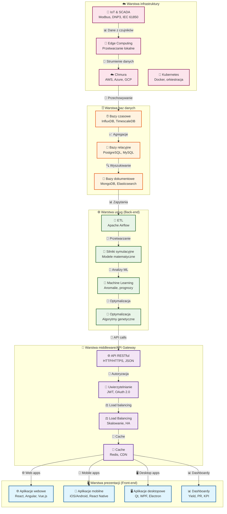

import { 
  SlideContainer, 
  Slide, 
  KeyPoints, 
  SupportingDetails, 
  InfoBox,
  WarningBox,
  SuccessBox,
  InstructorNotes,
  VisualSeparator 
} from '@site/src/components/SlideComponents';

<SlideContainer>

<Slide title="🏗️ Przegląd architektury systemów OZE" type="info">

<KeyPoints title="📊 Wielowarstwowa architektura systemów OZE">

  

    

      

        <h3>🖥️ Warstwa prezentacji (Front-end)</h3>
      

      

        <ul>
          <li><strong>🌐 Aplikacje webowe:</strong> React, Angular, Vue.js</li>
          <li><strong>📱 Aplikacje mobilne:</strong> iOS/Android, React Native</li>
          <li><strong>🖥️ Aplikacje desktopowe:</strong> Qt, WPF, Electron</li>
          <li><strong>📊 Dashboardy:</strong> Yield, PR, KPI, wizualizacja</li>
        </ul>
      

    

  

  
  

    

      

        <h3>🔗 Warstwa middleware/API Gateway</h3>
      

      

        <ul>
          <li><strong>🌐 API RESTful:</strong> HTTP/HTTPS, JSON</li>
          <li><strong>🔐 Uwierzytelnianie:</strong> JWT, OAuth 2.0</li>
          <li><strong>⚖️ Load Balancing:</strong> Skalowanie, HA</li>
          <li><strong>💾 Cache:</strong> Redis, CDN</li>
        </ul>
      

    

  

  

    

      

        <h3>⚙️ Warstwa usług (Back-end)</h3>
      

      

        <ul>
          <li><strong>🧮 Silniki symulacyjne:</strong> Modele matematyczne</li>
          <li><strong>🔄 ETL:</strong> Apache Airflow, przetwarzanie</li>
          <li><strong>🤖 Machine Learning:</strong> Anomalie, prognozy</li>
          <li><strong>🎯 Optymalizacja:</strong> Algorytmy genetyczne</li>
        </ul>
      

    

  

  
  

    

      

        <h3>🗄️ Warstwa baz danych</h3>
      

      

        <ul>
          <li><strong>⏰ Bazy czasowe:</strong> InfluxDB, TimescaleDB</li>
          <li><strong>🔗 Bazy relacyjne:</strong> PostgreSQL, MySQL</li>
          <li><strong>📄 Bazy dokumentowe:</strong> MongoDB, Elasticsearch</li>
          <li><strong>📊 Analiza:</strong> Wyszukiwanie, agregacje</li>
        </ul>
      

    

  

  

    

      

        <h3>☁️ Warstwa infrastruktury</h3>
      

      

        

          

            <ul>
              <li><strong>☁️ Chmura:</strong> AWS, Azure, GCP</li>
              <li><strong>🐳 Kubernetes:</strong> Docker, orkiestracja</li>
            </ul>
          

          

            <ul>
              <li><strong>🔧 Edge Computing:</strong> Przetwarzanie lokalne</li>
              <li><strong>📡 IoT & SCADA:</strong> Modbus, DNP3, IEC 61850</li>
            </ul>
          

        

      

    

  

</KeyPoints>

<InstructorNotes>
**Przegląd architektury systemów OZE**

**🏗️ Cel tego slajdu:**
Ten slajd przedstawia kompleksowy przegląd wielowarstwowej architektury systemów OZE, pokazując jak wszystkie warstwy współpracują ze sobą.

**📊 Struktura warstw:**
- **Warstwa prezentacji**: Interfejsy użytkownika, dashboardy, aplikacje
- **Warstwa middleware**: API, uwierzytelnianie, integracja
- **Warstwa usług**: Logika biznesowa, symulacje, optymalizacja
- **Warstwa baz danych**: Przechowywanie, analiza, wyszukiwanie
- **Warstwa infrastruktury**: Chmura, IoT, monitoring

**🔄 Przepływ danych:**
Dane przepływają od warstwy infrastruktury (czujniki, IoT) przez warstwy baz danych i usług, aż do warstwy prezentacji (dashboardy, raporty).

**💡 Kluczowe zalety takiej architektury:**
- **Skalowalność**: Każda warstwa może być skalowana niezależnie
- **Elastyczność**: Łatwe dodawanie nowych funkcji
- **Bezpieczeństwo**: Kontrola dostępu na każdym poziomie
- **Wydajność**: Optymalizacja każdej warstwy osobno
- **Łatwość utrzymania**: Separacja odpowiedzialności

**🎯 Praktyczne zastosowania:**
- **Monitoring farm PV**: Od czujników do dashboardów
- **Optymalizacja produkcji**: Od danych do algorytmów
- **Handel energią**: Od transakcji do raportów
- **Utrzymanie predykcyjne**: Od danych do prognoz
</InstructorNotes>

</Slide>

<VisualSeparator type="technical" />

<Slide title="🏗️ Architektura aplikacji w systemach OZE" type="info">

<KeyPoints title="🎯 Wielowarstwowa architektura">

**📈 Skalowalność:**
- Dostosowanie do potrzeb
- Elastyczność systemu
- Rozszerzalność funkcji

**🔒 Bezpieczeństwo:**
- Ochrona danych
- Uwierzytelnianie
- Szyfrowanie komunikacji

**⚡ Efektywność:**
- Optymalizacja zasobów
- Wysoka wydajność
- Kontrola kosztów

</KeyPoints>

<InstructorNotes>
**Współczesne aplikacje OZE opierają się na wielowarstwowej architekturze zapewniającej skalowalność, bezpieczeństwo i efektywność.**

**🏗️ Dlaczego architektura jest ważna w OZE?**
- **Skalowalność**: Systemy muszą obsługiwać od pojedynczych instalacji do farm o mocy setek MW
- **Bezpieczeństwo**: Dane energetyczne są wrażliwe, wymagają ochrony przed cyberatakami
- **Efektywność**: Optymalne wykorzystanie zasobów obliczeniowych i sieciowych
- **Integracja**: Łączenie różnych systemów (SCADA, ERP, CRM, IoT)

**🔄 Ewolucja architektury OZE:**
- **Era 1.0**: Proste aplikacje desktopowe (PV*SOL, PVsyst)
- **Era 2.0**: Aplikacje webowe z bazami danych (Helioscope, SolarEdge)
- **Era 3.0**: Chmura, IoT, AI (Tesla Energy, Enphase)
- **Era 4.0**: Edge computing, blockchain, digital twins

**💡 Kluczowe wyzwania:**
- **Dane czasowe**: Miliony punktów pomiarowych z czujników
- **Różnorodność protokołów**: Modbus, DNP3, IEC 61850, MQTT
- **Wymagania prawne**: GDPR, cyberbezpieczeństwo, audyty
- **Koszty**: Optymalizacja kosztów chmury i transferu danych

**🎯 Praktyczne zastosowania:**
- **Monitoring w czasie rzeczywistym**: Dashboardy dla operatorów
- **Analizy predykcyjne**: AI/ML dla utrzymania predykcyjnego
- **Handel energią**: Blockchain dla transakcji P2P
- **Optymalizacja**: Algorytmy optymalizacji produkcji i zużycia
</InstructorNotes>

</Slide>

<VisualSeparator type="technical" />

<Slide title="🖥️ Warstwa prezentacji (Front-end)" type="tip">

<InfoBox title="🎯 Cel">
Zapewnienie intuicyjnego dostępu do danych OZE poprzez różne typy aplikacji (web, mobile, desktop) z możliwością wizualizacji w czasie rzeczywistym i responsywnym interfejsem.
</InfoBox>

<KeyPoints title="💻 Typy aplikacji">

  

    

      

        <h4>🌐 Aplikacje webowe</h4>
      

      

        <ul>
          <li><strong>Technologie:</strong> React, Angular, Vue.js</li>
          <li><strong>Dostępność:</strong> Z każdego miejsca</li>
          <li><strong>Aktualizacje:</strong> Łatwe i automatyczne</li>
        </ul>
      

    

  

  
  

    

      

        <h4>📱 Aplikacje mobilne</h4>
      

      

        <ul>
          <li><strong>Platformy:</strong> iOS/Android, React Native, Flutter</li>
          <li><strong>Dostępność:</strong> W terenie</li>
          <li><strong>Funkcje:</strong> Powiadomienia push</li>
        </ul>
      

    

  

  
  

    

      

        <h4>🖥️ Aplikacje desktopowe</h4>
      

      

        <ul>
          <li><strong>Technologie:</strong> Qt, WPF, Electron</li>
          <li><strong>Wydajność:</strong> Wysoka</li>
          <li><strong>Dostęp:</strong> Offline</li>
        </ul>
      

    

  

</KeyPoints>

<SupportingDetails title="🎨 Kluczowe cechy">

  

    

      

        <h4>📊 Dashboardy</h4>
      

      

        <ul>
          <li><strong>Metryki:</strong> Yield, PR, dostępność</li>
          <li><strong>KPI:</strong> W czasie rzeczywistym</li>
          <li><strong>Monitoring:</strong> Wydajności</li>
        </ul>
      

    

  

  
  

    

      

        <h4>⚡ Wizualizacja</h4>
      

      

        <ul>
          <li><strong>Dane:</strong> W czasie rzeczywistym</li>
          <li><strong>Wykresy:</strong> I trendy</li>
          <li><strong>Mapy:</strong> Instalacji</li>
        </ul>
      

    

  

  
  

    

      

        <h4>🚨 Alerty</h4>
      

      

        <ul>
          <li><strong>Powiadomienia:</strong> O problemach</li>
          <li><strong>Raporty:</strong> Okresowe</li>
          <li><strong>Monitoring:</strong> KPI</li>
        </ul>
      

    

  

  
  

    

      

        <h4>📱 Responsywność</h4>
      

      

        <ul>
          <li><strong>Urządzenia:</strong> Mobile, tablet, desktop</li>
          <li><strong>Dostosowanie:</strong> Do urządzeń</li>
          <li><strong>Interfejsy:</strong> Intuicyjne</li>
        </ul>
      

    

  

</SupportingDetails>

<InstructorNotes>
**Warstwa prezentacji (Front-end)**

**💻 Typy aplikacji w OZE:**
- **Aplikacje webowe**: React, Angular, Vue.js
  - *Zalety*: Dostęp z każdego miejsca, łatwe aktualizacje, skalowalność
  - *Zastosowania*: Dashboardy operatorów, raporty dla inwestorów
- **Aplikacje mobilne**: iOS/Android, React Native, Flutter
  - *Zalety*: Dostępność w terenie, powiadomienia push, geolokalizacja
  - *Zastosowania*: Monitoring instalacji, inspekcje techniczne
- **Aplikacje desktopowe**: Qt, WPF
  - *Zalety*: Wysoka wydajność, dostęp offline, integracja z systemami lokalnymi
  - *Zastosowania*: Narzędzia projektowe, analizy offline

**🎨 Kluczowe cechy interfejsów OZE:**
- **Intuicyjne dashboardy**: Yield, PR, dostępność, KPI
- **Wizualizacja danych**: Wykresy czasowe, mapy cieplne, diagramy Sankey
- **Alerty i raporty**: Automatyczne powiadomienia, raporty okresowe
- **Responsywność**: Dostosowanie do różnych urządzeń (desktop, tablet, mobile)

**🔧 Specjalne wymagania OZE:**
- **Dane czasowe**: Wyświetlanie trendów produkcji, zużycia, wydajności
- **Geolokalizacja**: Mapy instalacji, analizy zacienień, routing
- **Integracja z IoT**: Dane z czujników, sterowanie urządzeniami
- **Bezpieczeństwo**: Uwierzytelnianie, szyfrowanie, audyty dostępu

**💡 Praktyczne wskazówki:**
- **UX/UI**: Interfejs musi być intuicyjny dla operatorów bez wykształcenia IT
- **Performance**: Optymalizacja dla dużych ilości danych czasowych
- **Offline**: Możliwość pracy bez połączenia internetowego
- **Accessibility**: Dostępność dla osób z niepełnosprawnościami
</InstructorNotes>

</Slide>

<VisualSeparator type="technical" />

<Slide title="🔗 Warstwa middleware/API Gateway" type="note">

<InfoBox title="🎯 Cel">
Zapewnienie bezpiecznej komunikacji między warstwami, uwierzytelnianie użytkowników, optymalizacja wydajności poprzez cache i load balancing, oraz kontrola dostępu do systemów OZE.
</InfoBox>

<KeyPoints title="⚙️ Funkcjonalności">

  

    

      

        <h4>🌐 API RESTful</h4>
      

      

        <ul>
          <li><strong>Protokoły:</strong> HTTP/HTTPS, JSON</li>
          <li><strong>Dokumentacja:</strong> OpenAPI</li>
          <li><strong>Komunikacja:</strong> Standardowa</li>
        </ul>
      

    

  

  
  

    

      

        <h4>🔐 Uwierzytelnianie</h4>
      

      

        <ul>
          <li><strong>Tokeny:</strong> JWT, OAuth 2.0</li>
          <li><strong>Kontrola:</strong> RBAC dostępu</li>
          <li><strong>Bezpieczeństwo:</strong> MFA wieloczynnikowe</li>
        </ul>
      

    

  

  
  

    

      

        <h4>⚖️ Load Balancing</h4>
      

      

        <ul>
          <li><strong>Rozkład:</strong> Obciążenia</li>
          <li><strong>Skalowanie:</strong> Automatyczne</li>
          <li><strong>Dostępność:</strong> Wysoka</li>
        </ul>
      

    

  

  

    

      

        <h4>🚦 Rate Limiting</h4>
      

      

        <ul>
          <li><strong>Ograniczenia:</strong> Przepustowości</li>
          <li><strong>Polityka:</strong> Fair usage</li>
          <li><strong>Ochrona:</strong> Przed nadużyciami</li>
        </ul>
      

    

  

  
  

    

      

        <h4>💾 Cache</h4>
      

      

        <ul>
          <li><strong>Technologie:</strong> Redis, Memcached</li>
          <li><strong>CDN:</strong> Dystrybucja treści</li>
          <li><strong>Efekt:</strong> Przyspieszenie odpowiedzi</li>
        </ul>
      

    

  

</KeyPoints>

<InstructorNotes>
**Warstwa middleware/API Gateway**

**🌐 API RESTful w systemach OZE:**
- **Standardowa komunikacja**: HTTP/HTTPS, JSON, OpenAPI
- **Integracja systemów**: SCADA, ERP, CRM, IoT
- **Wersjonowanie API**: Backward compatibility, deprecation policies
- **Dokumentacja**: Swagger/OpenAPI, przykłady użycia

**🔐 Uwierzytelnianie i autoryzacja:**
- **JWT (JSON Web Tokens)**: Stateless authentication, skalowalność
- **OAuth 2.0**: Delegacja uprawnień, integracja z zewnętrznymi systemami
- **RBAC (Role-Based Access Control)**: Różne poziomy dostępu (operator, inżynier, manager)
- **MFA (Multi-Factor Authentication)**: Dodatkowe zabezpieczenia dla krytycznych systemów

**⚖️ Load balancing i optymalizacja:**
- **Load balancing**: Rozkład obciążenia między serwerami
- **Rate limiting**: Ochrona przed nadużyciami, fair usage
- **Cache**: Redis, Memcached - przyspieszenie odpowiedzi
- **CDN**: Globalna dystrybucja treści statycznych

**🔧 Specjalne wymagania OZE:**
- **Dane czasowe**: Optymalizacja dla strumieni danych z czujników
- **Geolokalizacja**: Routing do najbliższych serwerów
- **Compliance**: Zgodność z normami branżowymi (IEC 61850, Modbus)
- **Monitoring**: Szybkie wykrywanie problemów, alerty

**💡 Praktyczne wskazówki:**
- **API Design**: RESTful principles, intuitive endpoints
- **Security**: HTTPS everywhere, input validation, SQL injection protection
- **Performance**: Caching strategies, database optimization
- **Monitoring**: Logging, metrics, alerting, health checks
</InstructorNotes>

</Slide>

<VisualSeparator type="technical" />

<Slide title="⚙️ Warstwa usług (Back-end)" type="tip">

<InfoBox title="🎯 Cel">
Wykonywanie zaawansowanych obliczeń, symulacji i analiz danych OZE, implementacja algorytmów optymalizacji, oraz przetwarzanie danych w czasie rzeczywistym dla systemów energetycznych.
</InfoBox>

<KeyPoints title="🧮 Silniki symulacyjne">
- 📊 **Modele matematyczne**
- 📈 **Prognozy produkcji**
- 🎯 **Optymalizacja systemów**
</KeyPoints>

<SupportingDetails title="🔄 Przetwarzanie danych">
- 🔄 **ETL** - Extract, Transform, Load
- ⚡ **Strumieniowanie** - przetwarzanie w czasie rzeczywistym
- 🤖 **Detekcja anomalii ML** - uczenie maszynowe
</SupportingDetails>

<InfoBox title="💻 Języki programowania">
- 🐍 **Python** (NumPy, Pandas, SciPy; Django/Flask)
- 📊 **MATLAB/Simulink**
- 🔧 **Julia, C++**
</InfoBox>

<InstructorNotes>
**Warstwa usług (Back-end)**

**🧮 Silniki symulacyjne w OZE:**
- **Modele matematyczne**: Równania różniczkowe, modele fizyczne
- **Prognozy produkcji**: Machine learning, modele statystyczne, ensemble methods
- **Optymalizacja**: Algorytmy genetyczne, PSO, programowanie liniowe
- **Walidacja**: Porównanie z danymi rzeczywistymi, backtesting

**🔄 Przetwarzanie danych:**
- **ETL (Extract, Transform, Load)**: Apache Airflow, Luigi, Prefect
- **Strumieniowanie**: Apache Kafka, Apache Pulsar, AWS Kinesis
- **Detekcja anomalii ML**: Isolation Forest, LSTM, Autoencoders
- **Real-time processing**: Apache Storm, Apache Flink, Spark Streaming

**💻 Języki programowania:**
- **Python**: NumPy, Pandas, SciPy, Django/Flask, FastAPI
  - *Zalety*: Bogate biblioteki ML, łatwość prototypowania
  - *Zastosowania*: Analizy danych, modele ML, API
- **MATLAB/Simulink**: Toolboxy energetyczne, modelowanie systemów
  - *Zalety*: Gotowe modele, wizualizacja, integracja z hardware
  - *Zastosowania*: Symulacje systemów, prototypowanie algorytmów
- **Julia**: Wysoka wydajność, łatwość programowania
  - *Zalety*: Szybkość C++, składnia Python
  - *Zastosowania*: Obliczenia numeryczne, optymalizacja
- **C++**: Maksymalna wydajność, integracja z hardware
  - *Zalety*: Kontrola nad pamięcią, szybkość wykonania
  - *Zastosowania*: Systemy czasu rzeczywistego, embedded

**🔧 Specjalne wymagania OZE:**
- **Dane czasowe**: Optymalizacja dla szeregów czasowych
- **Geolokalizacja**: Przetwarzanie danych przestrzennych
- **IoT**: Integracja z protokołami przemysłowymi
- **Compliance**: Zgodność z normami branżowymi

**💡 Praktyczne wskazówki:**
- **Microservices**: Podział na niezależne usługi
- **Containerization**: Docker, Kubernetes
- **Monitoring**: Prometheus, Grafana, ELK Stack
- **Testing**: Unit tests, integration tests, load testing
</InstructorNotes>

</Slide>

<VisualSeparator type="technical" />

<Slide title="🗄️ Warstwa baz danych" type="info">

<InfoBox title="🎯 Cel">
Efektywne przechowywanie, indeksowanie i szybki dostęp do danych czasowych z systemów OZE, zapewnienie integralności danych oraz optymalizacja zapytań dla analiz i raportowania.
</InfoBox>

<KeyPoints title="📊 Typy baz danych">
- ⏰ **Bazy czasowe**: InfluxDB, TimescaleDB, Prometheus
- 🔗 **Bazy relacyjne**: PostgreSQL, MySQL
- 📄 **Bazy dokumentowe**: MongoDB, Elasticsearch
</KeyPoints>

<SupportingDetails title="🌱 Zastosowania w OZE">
- 📊 **Dane pomiarowe** (SCADA)
- 📈 **Dane historyczne**
- 🔍 **Wyszukiwanie i analiza**
</SupportingDetails>

<InstructorNotes>
**Warstwa baz danych**

**⏰ Bazy czasowe - kluczowe dla OZE:**
- **InfluxDB**: Optymalizacja dla danych czasowych, automatyczna kompresja
  - *Zalety*: Wysoka wydajność, łatwe agregacje, retencja danych
  - *Zastosowania*: Dane z czujników, pomiary SCADA, KPI
- **TimescaleDB**: PostgreSQL + rozszerzenia czasowe
  - *Zalety*: SQL, ACID, skalowalność, integracja z ekosystemem PostgreSQL
  - *Zastosowania*: Złożone zapytania, analizy biznesowe
- **Prometheus**: Monitoring, alerting, time series
  - *Zalety*: Pull model, service discovery, alerting rules
  - *Zastosowania*: Monitoring systemów, metryki aplikacji

**🔗 Bazy relacyjne:**
- **PostgreSQL**: Open source, rozszerzenia, JSON support
  - *Zalety*: ACID, transakcje, zaawansowane indeksy
  - *Zastosowania*: Dane strukturalne, użytkownicy, konfiguracje
- **MySQL**: Popularność, łatwość użycia, performance
  - *Zalety*: Szerokie wsparcie, optymalizacja, replikacja
  - *Zastosowania*: Aplikacje webowe, CMS, logi

**📄 Bazy dokumentowe i wyszukiwarki:**
- **MongoDB**: Dokumenty JSON, skalowalność, elastyczność
  - *Zalety*: Schemaless, agregacje, geospatial queries
  - *Zastosowania*: Dane nieustrukturyzowane, konfiguracje, logi
- **Elasticsearch**: Wyszukiwanie pełnotekstowe, analizy, agregacje
  - *Zalety*: Real-time search, analizy, wizualizacje
  - *Zastosowania*: Logi, metryki, wyszukiwanie, analizy

**🔧 Specjalne wymagania OZE:**
- **Dane czasowe**: Optymalizacja dla szeregów czasowych
- **Geolokalizacja**: Indeksy przestrzenne, geospatial queries
- **IoT**: Integracja z protokołami przemysłowymi
- **Compliance**: Audyty, backup, recovery

**💡 Praktyczne wskazówki:**
- **Hybrid approach**: Różne bazy dla różnych typów danych
- **Data modeling**: Optymalizacja schematów dla zapytań
- **Indexing**: Indeksy dla wydajności zapytań
- **Backup**: Strategie backupu i recovery
</InstructorNotes>

</Slide>

<VisualSeparator type="technical" />

<Slide title="☁️ Warstwa infrastruktury" type="note">

<InfoBox title="🎯 Cel">
Zapewnienie skalowalnego, bezpiecznego i niezawodnego środowiska wykonawczego dla aplikacji OZE, integracja z systemami IoT/SCADA oraz optymalizacja kosztów i wydajności.
</InfoBox>

<KeyPoints title="🌐 Chmura i konteneryzacja">
- ☁️ **Chmura**: AWS/Azure/GCP
- 🐳 **Orkiestracja**: Kubernetes, Docker
- 🔧 **Edge computing**: przetwarzanie lokalne
</KeyPoints>

<SupportingDetails title="🌐 IoT i akwizycja danych">
- 📡 **Protokoły**: Modbus, DNP3, IEC 61850
- 🖥️ **SCADA** - systemy nadzoru
- 📊 **Smart sensors** - inteligentne czujniki
</SupportingDetails>

<InstructorNotes>
**Warstwa infrastruktury**

**☁️ Chmura obliczeniowa:**
- **AWS**: EC2, S3, Lambda, IoT Core, Greengrass
  - *Zalety*: Szeroka gama usług, globalna infrastruktura, pay-as-you-go
  - *Zastosowania*: Skalowalne aplikacje, IoT, machine learning
- **Azure**: Virtual Machines, Blob Storage, Functions, IoT Hub
  - *Zalety*: Integracja z Microsoft ecosystem, enterprise features
  - *Zastosowania*: Aplikacje korporacyjne, hybrid cloud
- **GCP**: Compute Engine, Cloud Storage, Cloud Functions, IoT Core
  - *Zalety*: Machine learning, data analytics, globalna sieć
  - *Zastosowania*: AI/ML, big data, globalne aplikacje

**🐳 Orkiestracja i konteneryzacja:**
- **Kubernetes**: Orkiestracja kontenerów, skalowanie, load balancing
  - *Zalety*: Automatyzacja, wysoką dostępność, portability
  - *Zastosowania*: Microservices, CI/CD, hybrid cloud
- **Docker**: Konteneryzacja aplikacji, izolacja, portability
  - *Zalety*: Konsystencja środowisk, łatwość deploymentu
  - *Zastosowania*: Development, testing, production

**🔧 Edge computing:**
- **Przetwarzanie lokalne**: Redukcja opóźnień, praca offline
- **Edge gateways**: Przetwarzanie na brzegu sieci, filtracja danych
- **Fog computing**: Warstwa między edge a chmurą
- **5G**: Szybka komunikacja, niskie opóźnienia

**📡 IoT i akwizycja danych:**
- **Protokoły przemysłowe**: Modbus, DNP3, IEC 61850
- **SCADA**: Systemy nadzoru i kontroli
- **Smart sensors**: Inteligentne czujniki z przetwarzaniem
- **LoRaWAN**: Sieci IoT o niskim poborze mocy

**🔧 Specjalne wymagania OZE:**
- **Dane czasowe**: Optymalizacja dla szeregów czasowych
- **Geolokalizacja**: Edge computing w lokalizacjach zdalnych
- **Compliance**: Zgodność z normami branżowymi
- **Security**: Cyberbezpieczeństwo, szyfrowanie

**💡 Praktyczne wskazówki:**
- **Hybrid approach**: Kombinacja chmury i edge computing
- **Monitoring**: Szybkie wykrywanie problemów, alerty
- **Security**: Szyfrowanie, uwierzytelnianie, audyty
- **Cost optimization**: Optymalizacja kosztów chmury
</InstructorNotes>

</Slide>

<VisualSeparator type="data" />

<Slide title="📊 Przepływ danych - od czujnika do wykresu" type="tip">

<KeyPoints title="🔄 Przykład praktyczny">
1. 📡 **Czujnik irradiancji** → gateway edge (filtracja medianowa, uśrednianie minutowe)
2. 🌊 **Strumień do brokera** (Kafka/MQTT) → walidacja, wzbogacanie metadanymi
3. 🔄 **ETL do bazy czasowej** (InfluxDB/TimescaleDB) + archiwizacja w obiekcie (S3)
4. 🔗 **Backend wystawia API** (agregacje, KPI PR/yield) → Frontend wizualizuje
</KeyPoints>

<InstructorNotes>
**Przepływ danych – od czujnika do wykresu (przykład)**

**📡 Etap 1: Akwizycja danych**
- **Czujnik irradiancji** → gateway edge (filtracja medianowa, uśrednianie minutowe)
- **Filtracja**: Usuwanie wartości odstających, uśrednianie
- **Agregacja**: Redukcja objętości danych, zachowanie informacji

**🌊 Etap 2: Transport i walidacja**
- **Strumień do brokera** (Kafka/MQTT) → walidacja, wzbogacanie metadanymi
- **Walidacja**: Sprawdzenie zakresów, spójności czasowej
- **Wzbogacanie**: Dodanie metadanych (lokalizacja, typ czujnika, kalibracja)

**💾 Etap 3: Przechowywanie i archiwizacja**
- **ETL do bazy czasowej** (InfluxDB/TimescaleDB) + archiwizacja w obiekcie (S3)
- **Baza czasowa**: Szybki dostęp do danych, agregacje
- **Archiwizacja**: Długoterminowe przechowywanie, compliance

**🖥️ Etap 4: Przetwarzanie i wizualizacja**
- **Backend wystawia API** (agregacje, KPI PR/yield) → Frontend wizualizuje
- **Agregacje**: KPI, statystyki, trendy
- **Wizualizacja**: Dashboardy, wykresy, alerty

**🔧 Specjalne wymagania OZE:**
- **Dane czasowe**: Optymalizacja dla szeregów czasowych
- **Geolokalizacja**: Routing do najbliższych serwerów
- **Compliance**: Audyty, backup, recovery
- **Security**: Szyfrowanie, uwierzytelnianie

**💡 Praktyczne wskazówki:**
- **Data quality**: Walidacja, oczyszczanie, imputacja
- **Performance**: Optymalizacja zapytań, indeksy, cache
- **Monitoring**: Szybkie wykrywanie problemów, alerty
- **Cost optimization**: Optymalizacja kosztów chmury
</InstructorNotes>

</Slide>

<VisualSeparator type="default" />

<Slide title="✅ Dobre praktyki architektoniczne" type="success">

<KeyPoints title="🎯 Kluczowe zasady">
- 🔧 **Separacja odpowiedzialności** i kontrakty API (OpenAPI)
- 🔄 **Idempotentne przetwarzanie** strumieni (obsługa duplikatów/lagów)
- 📊 **Strategia braków danych** (imputacja vs. oznaczanie luk)
- 📈 **Monitoring i alerty** (Prometheus + Grafana), SLO dla opóźnień i dostępności
</KeyPoints>

<InstructorNotes>
**Dobre praktyki architektoniczne (na projektach OZE)**

**🔧 Separacja odpowiedzialności:**
- **Kontrakty API** (OpenAPI): Dokumentacja, wersjonowanie, walidacja
- **Microservices**: Niezależne usługi, skalowanie, deployment
- **Domain boundaries**: Podział według domen biznesowych
- **Data ownership**: Jasne granice danych między usługami

**🔄 Idempotentne przetwarzanie:**
- **Obsługa duplikatów**: Idempotentne operacje, deduplikacja
- **Lag handling**: Obsługa opóźnień w strumieniach danych
- **Retry mechanisms**: Automatyczne ponowne próby, circuit breakers
- **Event sourcing**: Pełna historia zdarzeń, replay

**📊 Strategia braków danych:**
- **Imputacja**: Uzupełnianie brakujących wartości (interpolacja, ML)
- **Oznaczanie luk**: Explicit handling, flagi jakości danych
- **Data quality**: Walidacja, oczyszczanie, monitoring
- **Fallback strategies**: Alternatywne źródła danych

**📈 Monitoring i alerty:**
- **Prometheus + Grafana**: Metryki, dashboardy, alerty
- **SLO (Service Level Objectives)**: Opóźnienia, dostępność, throughput
- **Logging**: Strukturalne logi, correlation IDs, tracing
- **Health checks**: Liveness, readiness, dependency checks

**🔧 Specjalne wymagania OZE:**
- **Dane czasowe**: Optymalizacja dla szeregów czasowych
- **Geolokalizacja**: Routing do najbliższych serwerów
- **Compliance**: Audyty, backup, recovery
- **Security**: Szyfrowanie, uwierzytelnianie

**💡 Praktyczne wskazówki:**
- **Design for failure**: Graceful degradation, circuit breakers
- **Performance**: Optymalizacja zapytań, indeksy, cache
- **Security**: Defense in depth, zero trust, encryption
- **Cost optimization**: Right-sizing, auto-scaling, spot instances
</InstructorNotes>

</Slide>

</SlideContainer>
