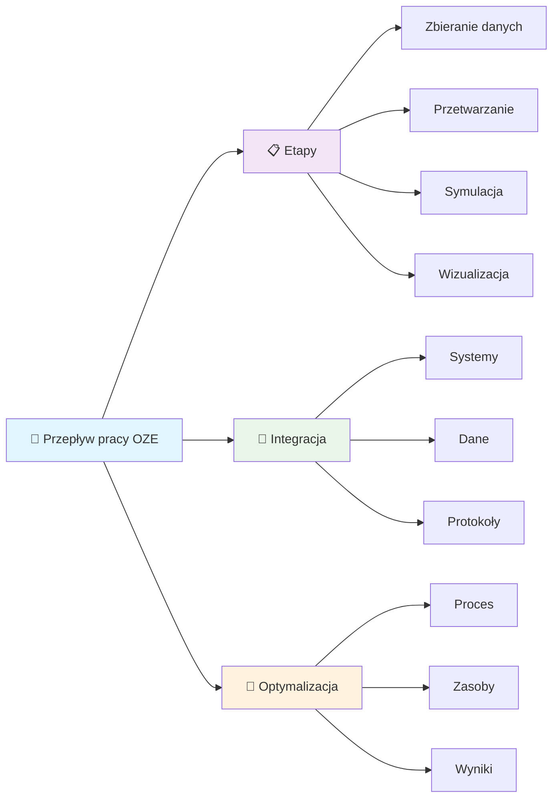
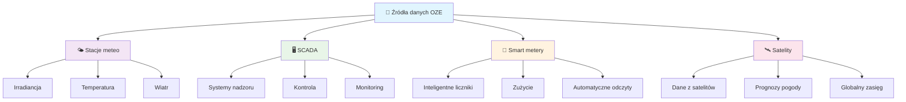
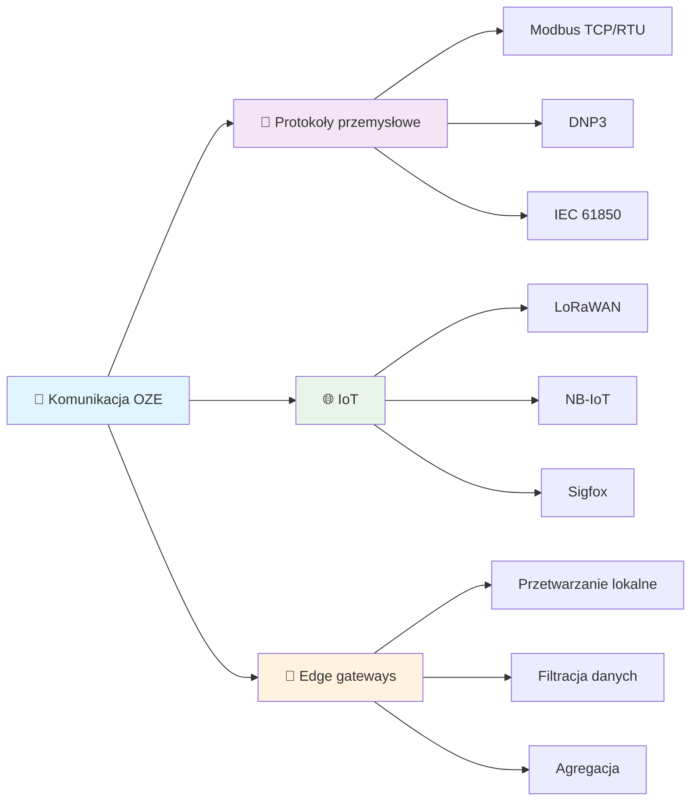

import { 
  SlideContainer, 
  Slide, 
  KeyPoints, 
  SupportingDetails, 
  InfoBox,
  WarningBox,
  SuccessBox,
  InstructorNotes,
  VisualSeparator 
} from '@site/src/components/SlideComponents';

<SlideContainer>

<Slide title="🔧 Rola i typy programów w energetyce odnawialnej" type="info">

<KeyPoints title="🔄 Przepływ pracy w projektach OZE">



</KeyPoints>

<InstructorNotes>
**Przepływ pracy w projektach OZE obejmuje szereg etapów i narzędzi.**

**🔄 Dlaczego przepływ pracy jest ważny?**
- **Sekwencja etapów**: Każdy etap ma swoje specyficzne wymagania i narzędzia
- **Integracja**: Dane z jednego etapu są wykorzystywane w następnym
- **Jakość**: Błędy na wczesnych etapach wpływają na cały projekt
- **Efektywność**: Optymalizacja przepływu skraca czas i koszty

**📊 Kluczowe etapy w projektach OZE:**
1. **Zbieranie danych** - fundament całego projektu
2. **Przetwarzanie** - przygotowanie danych do analiz
3. **Symulacja** - modelowanie i prognozy
4. **Optymalizacja** - znajdowanie najlepszych rozwiązań
5. **Wizualizacja** - prezentacja wyników
6. **Wspomaganie decyzji** - analizy ekonomiczne i techniczne

**🔧 Specjalne wymagania OZE:**
- **Dane czasowe**: Miliony punktów pomiarowych z czujników
- **Geolokalizacja**: Dane przestrzenne, mapy, analizy zacienień
- **Integracja**: Różne systemy i protokoły komunikacyjne
- **Compliance**: Zgodność z normami branżowymi i prawnymi

**💡 Praktyczne wskazówki:**
- **Planowanie**: Zdefiniuj wymagania na początku projektu
- **Narzędzia**: Wybierz odpowiednie narzędzia dla każdego etapu
- **Dane**: Zadbaj o jakość i dostępność danych
- **Walidacja**: Sprawdź wyniki na każdym etapie
</InstructorNotes>

</Slide>

<VisualSeparator type="data" />

<Slide title="📊 Zbieranie i akwizycja danych" type="tip">

<KeyPoints title="📡 Źródła danych">



</KeyPoints>

<SupportingDetails title="🔗 Narzędzia komunikacji">



</SupportingDetails>

<InstructorNotes>
**Zbieranie i akwizycja danych**

**📡 Źródła danych w OZE:**
- **Stacje meteo**: Irradiancja, temperatura, wiatr, wilgotność, ciśnienie
  - *Zalety*: Dane lokalne, wysoką rozdzielczość czasową
  - *Wyzwania*: Kalibracja, konserwacja, koszty
- **SCADA**: Systemy nadzoru i kontroli, dane z falowników
  - *Zalety*: Integracja z systemami, dane w czasie rzeczywistym
  - *Wyzwania*: Protokoły przemysłowe, bezpieczeństwo
- **Smart metery**: Inteligentne liczniki, dane zużycia
  - *Zalety*: Automatyczne odczyty, integracja z systemami
  - *Wyzwania*: Protokoły komunikacyjne, prywatność
- **Bazy satelitarne**: Dane z satelitów, prognozy pogody
  - *Zalety*: Globalny zasięg, dane historyczne
  - *Wyzwania*: Rozdzielczość, opóźnienia, koszty

**🔗 Narzędzia komunikacji:**
- **Protokoły przemysłowe**: Modbus TCP/RTU, DNP3, IEC 61850
  - *Zalety*: Standardowe, niezawodne, bezpieczne
  - *Zastosowania*: SCADA, systemy przemysłowe
- **IoT**: LoRaWAN, NB-IoT, Sigfox
  - *Zalety*: Niski pobór mocy, długi zasięg, niskie koszty
  - *Zastosowania*: Czujniki zdalne, monitoring
- **Edge gateways**: Przetwarzanie lokalne, filtracja danych
  - *Zalety*: Redukcja transferu, przetwarzanie w czasie rzeczywistym
  - *Zastosowania*: Filtracja, agregacja, walidacja

**🔧 Specjalne wymagania OZE:**
- **Dane czasowe**: Optymalizacja dla szeregów czasowych
- **Geolokalizacja**: Dane przestrzenne, mapy, analizy zacienień
- **Integracja**: Różne systemy i protokoły komunikacyjne
- **Compliance**: Zgodność z normami branżowymi i prawnymi

**💡 Praktyczne wskazówki:**
- **Data quality**: Walidacja, oczyszczanie, imputacja
- **Performance**: Optymalizacja zapytań, indeksy, cache
- **Security**: Szyfrowanie, uwierzytelnianie, audyty
- **Cost optimization**: Optymalizacja kosztów transferu
</InstructorNotes>

</Slide>

<VisualSeparator type="data" />

<Slide title="🔄 Przetwarzanie i walidacja danych" type="note">

<KeyPoints title="🧹 Procesy oczyszczania">
- 🗑️ **Usuwanie wartości odstających**
- 📈 **Interpolacja braków**
- ✅ **Walidacja jakości danych**
</KeyPoints>

<SupportingDetails title="💻 Narzędzia">
- 🐍 **Python** (Pandas, NumPy)
- 🌊 **Apache Kafka** (streaming)
- ⚡ **Apache Spark** (big data)
</SupportingDetails>

<InstructorNotes>
**Przetwarzanie i walidacja danych**

**🧹 Procesy oczyszczania:**
- **Usuwanie wartości odstających**: Statystyczne metody (3-sigma, IQR), ML (Isolation Forest)
- **Interpolacja braków**: Linear, spline, ML-based imputation
- **Walidacja jakości**: Range checks, consistency checks, temporal validation
- **Normalizacja**: Scaling, standardization, outlier treatment

**💻 Narzędzia do przetwarzania:**
- **Python**: Pandas, NumPy, SciPy - elastyczność, bogate biblioteki
- **Apache Kafka**: Streaming, real-time processing, scalability
- **Apache Spark**: Big data, distributed computing, ML integration
- **MATLAB**: Toolboxy energetyczne, wizualizacja, prototypowanie

**🔧 Przykład w Python/Pandas:**
```python
import pandas as pd
import numpy as np

# Usuwanie wartości odstających (3 sigma)
df = df[np.abs(df['irradiance'] - df['irradiance'].mean()) <= (3*df['irradiance'].std())]

# Interpolacja brakujących danych
df['temperature'] = df['temperature'].interpolate(method='linear')

# Walidacja zakresów
df = df[(df['irradiance'] >= 0) & (df['irradiance'] <= 1500)]
df = df[(df['temperature'] >= -50) & (df['temperature'] <= 100)]

# Agregacja czasowa
df_hourly = df.resample('H').mean()
```

**🔧 Specjalne wymagania OZE:**
- **Dane czasowe**: Optymalizacja dla szeregów czasowych
- **Geolokalizacja**: Dane przestrzenne, mapy, analizy zacienień
- **Integracja**: Różne systemy i protokoły komunikacyjne
- **Compliance**: Zgodność z normami branżowymi i prawnymi

**💡 Praktyczne wskazówki:**
- **Data quality**: Walidacja, oczyszczanie, imputacja
- **Performance**: Optymalizacja zapytań, indeksy, cache
- **Security**: Szyfrowanie, uwierzytelnianie, audyty
- **Cost optimization**: Optymalizacja kosztów transferu
</InstructorNotes>

</Slide>

<VisualSeparator type="technical" />

<Slide title="⚡ Symulacja i analiza" type="tip">

<KeyPoints title="☀️ Systemy fotowoltaiczne">
- 🎯 **PV*SOL** (model jedno-/dwudiodowy, straty DC/AC)
- 📊 **PVsyst** - modelowanie strat i zacienienia
- 📈 **SAM (NREL)** - analiza techno-ekonomiczna
</KeyPoints>

<SupportingDetails title="💨 Energia wiatrowa">
- 🌪️ **WindPRO** (wake effects)
- 🗺️ **WAsP** (mapy wiatru)
</SupportingDetails>

<InfoBox title="🧮 Modelowanie systemów">
- 📊 **MATLAB/Simulink** - modelowanie systemów
</InfoBox>

<InstructorNotes>
**Symulacja i analiza**

**☀️ Systemy fotowoltaiczne:**
- **PV*SOL**: Kompleksowe projektowanie, bogata baza komponentów
  - *Zalety*: Intuicyjny interfejs, integracja z CAD, analizy ekonomiczne
  - *Zastosowania*: Projekty dachowe i gruntowe, optymalizacja
- **PVsyst**: Modelowanie strat i zacienienia
  - *Zalety*: Precyzyjne modele fizyczne, walidacja z danymi rzeczywistymi
  - *Zastosowania*: Duże farmy PV, analizy zacienień
- **SAM (NREL)**: Analiza techno-ekonomiczna
  - *Zalety*: Darmowe, otwarte źródło, ciągły rozwój
  - *Zastosowania*: Analizy finansowe, porównania technologii

**💨 Energia wiatrowa:**
- **WindPRO**: Projektowanie farm wiatrowych
  - *Zalety*: Kompleksowe narzędzie, integracja z mapami
  - *Zastosowania*: Farmy wiatrowe, analizy wietrzności
- **WAsP**: Atlas i modelowanie zasobów wiatrowych
  - *Zalety*: Precyzyjne modele wiatru, walidacja z pomiarami
  - *Zastosowania*: Ocena zasobów wiatrowych, mikro-lokalizacja

**🧮 Modelowanie systemów:**
- **MATLAB/Simulink**: Modelowanie systemów, prototypowanie algorytmów
  - *Zalety*: Gotowe modele, wizualizacja, integracja z hardware
  - *Zastosowania*: Symulacje systemów, algorytmy sterowania

**🔧 Przykład (ideowy) równania diody:**
```matlab
Iph = 8.2; Io = 2.3e-8; Rs = 0.221; Rsh = 415; n = 1.3;
I = Iph - Io*(exp((V + I*Rs)/(n*Vt)) - 1) - (V + I*Rs)/Rsh;
```

**🔧 Specjalne wymagania OZE:**
- **Dane czasowe**: Optymalizacja dla szeregów czasowych
- **Geolokalizacja**: Dane przestrzenne, mapy, analizy zacienień
- **Integracja**: Różne systemy i protokoły komunikacyjne
- **Compliance**: Zgodność z normami branżowymi i prawnymi

**💡 Praktyczne wskazówki:**
- **Model validation**: Porównanie z danymi rzeczywistymi
- **Sensitivity analysis**: Analiza wrażliwości parametrów
- **Uncertainty quantification**: Ocena niepewności wyników
- **Best practices**: Dokumentacja, wersjonowanie, testy
</InstructorNotes>

</Slide>

<VisualSeparator type="technical" />

<Slide title="🎯 Optymalizacja systemów" type="warning">

<KeyPoints title="🤖 Algorytmy optymalizacji">
- 🧬 **Algorytmy genetyczne**
- 🐝 **PSO** (Particle Swarm Optimization)
- 📊 **Programowanie liniowe**
- 🧠 **Sieci neuronowe**
</KeyPoints>

<SupportingDetails title="🔧 Narzędzia">
- 📊 **MATLAB Optimization Toolbox**
- 🐍 **Python** (SciPy, CVXPY, scikit-learn)
- ⚙️ **Gurobi/CPLEX** - solvery optymalizacyjne
</SupportingDetails>

<InstructorNotes>
**Optymalizacja systemów**

**🤖 Algorytmy optymalizacji:**
- **Algorytmy genetyczne**: Ewolucyjne, globalne optimum, wieloobiektowe
  - *Zalety*: Globalne optimum, wieloobiektowe, elastyczność
  - *Zastosowania*: Optymalizacja układów, wielokryterialna
- **PSO (Particle Swarm Optimization)**: Stado cząstek, szybka zbieżność
  - *Zalety*: Szybka zbieżność, łatwość implementacji
  - *Zastosowania*: Optymalizacja parametrów, tuning
- **Programowanie liniowe**: Optymalizacja liniowa, globalne optimum
  - *Zalety*: Globalne optimum, szybkość, gwarancje
  - *Zastosowania*: Optymalizacja zasobów, planowanie
- **Sieci neuronowe**: Uczenie maszynowe, nieliniowe modele
  - *Zalety*: Nieliniowe modele, uczenie z danych
  - *Zastosowania*: Predykcja, klasyfikacja, regresja

**💻 Narzędzia optymalizacji:**
- **MATLAB Optimization Toolbox**: Comprehensive, user-friendly
  - *Zalety*: Gotowe algorytmy, wizualizacja, dokumentacja
  - *Zastosowania*: Prototypowanie, badania, edukacja
- **Python**: SciPy, CVXPY, scikit-learn - elastyczność, open source
  - *Zalety*: Bogate biblioteki, elastyczność, społeczność
  - *Zastosowania*: Produkcja, integracja, automatyzacja
- **Gurobi/CPLEX**: Commercial solvers, high performance
  - *Zalety*: Wysoka wydajność, zaawansowane algorytmy
  - *Zastosowania*: Duże problemy, produkcja, enterprise

**🔧 Specjalne wymagania OZE:**
- **Dane czasowe**: Optymalizacja dla szeregów czasowych
- **Geolokalizacja**: Dane przestrzenne, mapy, analizy zacienień
- **Integracja**: Różne systemy i protokoły komunikacyjne
- **Compliance**: Zgodność z normami branżowymi i prawnymi

**💡 Praktyczne wskazówki:**
- **Problem formulation**: Jasne sformułowanie problemu
- **Algorithm selection**: Wybór odpowiedniego algorytmu
- **Parameter tuning**: Dostrojenie parametrów algorytmu
- **Validation**: Walidacja wyników optymalizacji
</InstructorNotes>

</Slide>

<VisualSeparator type="data" />

<Slide title="📊 Wizualizacja i raportowanie" type="info">

<KeyPoints title="🎨 Narzędzia wizualizacji">
- 📈 **Power BI, Grafana, Tableau** - platformy analityczne
- 🖥️ **Custom dashboards** (React/Angular + D3.js)
- 🥽 **3D i AR/VR**: Unity 3D, AR do informacji eksploatacyjnych
</KeyPoints>

<InstructorNotes>
**Wizualizacja i raportowanie**

**🎨 Narzędzia wizualizacji:**
- **Power BI**: Microsoft ecosystem, enterprise features
  - *Zalety*: Integracja z Microsoft, łatwość użycia, skalowalność
  - *Zastosowania*: Raporty biznesowe, dashboardy korporacyjne
- **Grafana**: Open source, monitoring, alerting
  - *Zalety*: Elastyczność, bogate pluginy, społeczność
  - *Zastosowania*: Monitoring systemów, metryki, alerty
- **Tableau**: Advanced analytics, data storytelling
  - *Zalety*: Zaawansowane analizy, wizualizacje, storytelling
  - *Zastosowania*: Analizy biznesowe, prezentacje, raporty
- **Custom dashboards**: React/Angular + D3.js
  - *Zalety*: Pełna kontrola, integracja, customizacja
  - *Zastosowania*: Aplikacje specjalistyczne, integracja

**🥽 3D i AR/VR:**
- **Unity 3D**: Game engine, 3D wizualizacje
  - *Zalety*: Real-time rendering, interaktywność, VR/AR
  - *Zastosowania*: Wizualizacje 3D, symulacje, VR
- **AR (Augmented Reality)**: Informacje eksploatacyjne
  - *Zalety*: Kontekstowe informacje, hands-free, mobile
  - *Zastosowania*: Inspekcje, szkolenia, maintenance

**🔧 Specjalne wymagania OZE:**
- **Dane czasowe**: Wykresy czasowe, trendy, anomalie
- **Geolokalizacja**: Mapy, analizy zacienień, routing
- **Integracja**: Różne systemy i protokoły komunikacyjne
- **Compliance**: Raporty regulacyjne, audyty

**💡 Praktyczne wskazówki:**
- **User experience**: Intuicyjne interfejsy, responsywność
- **Performance**: Optymalizacja dla dużych ilości danych
- **Accessibility**: Dostępność dla osób z niepełnosprawnościami
- **Security**: Ochrona danych, uwierzytelnianie
</InstructorNotes>

</Slide>

<VisualSeparator type="default" />

<Slide title="🎯 Wspomaganie decyzji" type="note">

<KeyPoints title="💰 Analizy ekonomiczne">
- 📊 **NPV, IRR, LCOE** - wskaźniki finansowe
- 🎲 **Monte Carlo** - analiza ryzyka
- 📈 **Sensitivity analysis** - analiza wrażliwości
</KeyPoints>

<SupportingDetails title="🔧 Utrzymanie predykcyjne">
- 📅 **Optymalizacja harmonogramów**
- 📦 **Zapasy części**
- 🔮 **Predykcyjne utrzymanie**
</SupportingDetails>

<InstructorNotes>
**Wspomaganie decyzji**

**💰 Analizy ekonomiczne:**
- **NPV (Net Present Value)**: Wartość bieżąca netto, ocena rentowności
  - *Zalety*: Uwzględnia czas, porównywalność projektów
  - *Zastosowania*: Ocena inwestycji, ranking projektów
- **IRR (Internal Rate of Return)**: Wewnętrzna stopa zwrotu
  - *Zalety*: Procentowa miara rentowności, łatwość interpretacji
  - *Zastosowania*: Porównanie projektów, decyzje inwestycyjne
- **LCOE (Levelized Cost of Energy)**: Uśredniony koszt energii
  - *Zalety*: Porównywalność technologii, ocena konkurencyjności
  - *Zastosowania*: Analizy techno-ekonomiczne, benchmarking
- **Monte Carlo**: Analiza ryzyka, symulacje stochastyczne
  - *Zalety*: Uwzględnia niepewność, analiza ryzyka
  - *Zastosowania*: Ocena ryzyka, planowanie scenariuszy
- **Sensitivity analysis**: Analiza wrażliwości parametrów
  - *Zalety*: Identyfikacja kluczowych czynników, optymalizacja
  - *Zastosowania*: Optymalizacja projektów, zarządzanie ryzykiem

**🔧 Utrzymanie predykcyjne:**
- **Predykcyjne utrzymanie**: ML, AI, predykcja awarii
  - *Zalety*: Redukcja kosztów, zwiększenie dostępności
  - *Zastosowania*: Planowanie utrzymania, optymalizacja zasobów
- **Optymalizacja harmonogramów**: Algorytmy optymalizacyjne
  - *Zalety*: Minimalizacja kosztów, maksymalizacja efektywności
  - *Zastosowania*: Planowanie utrzymania, zarządzanie zasobami
- **Zarządzanie zapasami**: Optymalizacja zapasów części
  - *Zalety*: Redukcja kosztów, dostępność części
  - *Zastosowania*: Zarządzanie magazynem, planowanie zakupów

**🔧 Specjalne wymagania OZE:**
- **Dane czasowe**: Optymalizacja dla szeregów czasowych
- **Geolokalizacja**: Dane przestrzenne, mapy, analizy zacienień
- **Integracja**: Różne systemy i protokoły komunikacyjne
- **Compliance**: Zgodność z normami branżowymi i prawnymi

**💡 Praktyczne wskazówki:**
- **Data quality**: Jakość danych, walidacja, imputacja
- **Model validation**: Walidacja modeli, backtesting
- **Uncertainty**: Ocena niepewności, analiza ryzyka
- **Best practices**: Dokumentacja, wersjonowanie, testy
</InstructorNotes>

</Slide>

<VisualSeparator type="default" />

<Slide title="🏠 Studium przypadku - Dach 50 kWp" type="tip">

<KeyPoints title="🎯 Założenia projektu">
- 🏙️ **Zabudowa miejska** z częściowymi zacienieniami
- ⏰ **Profil odbioru** 8:00–18:00
- 💰 **Rozliczenie prosumenckie** net-billing
</KeyPoints>

<SupportingDetails title="📊 Dane i narzędzia">
- 📈 **Dane**: irradiancja TMY + pomiary lokalne, zdjęcia drona
- 🔧 **Narzędzia**: SketchUp (geometria), PV*SOL (symulacja), Python (analiza), Excel/Power BI (raport)
</SupportingDetails>

<InstructorNotes>
**Studium przypadku (mini)**

**🎯 Założenia projektu:**
- **Lokalizacja**: Dach 50 kWp w zabudowie miejskiej
- **Zacienienia**: Częściowe zacienienia od attyk i masztów
- **Profil odbioru**: 8:00–18:00 (biuro, handel)
- **Rozliczenie**: Prosumenckie net-billing

**📊 Dane i narzędzia:**
- **Dane**: Irradiancja TMY + pomiary lokalne temperatury, zdjęcia drona
- **Narzędzia**: 
  - SketchUp (geometria, modelowanie 3D)
  - PV*SOL (symulacja i optymalizacja łańcuchów)
  - Python (analiza profilu odbioru, optymalizacja)
  - Excel/Power BI (raport ekonomiczny, wizualizacja)

**🔧 Decyzje projektowe:**
- **Konfiguracja stringów**: Optymalizacja pod kątem zacienień
- **Dobór falownika**: MPPT, sprawność, koszty
- **Autokonsumpcja vs. magazyn**: Analiza ekonomiczna, ROI

**⚠️ Ryzyka modelowania:**
1. **Błędna charakterystyka modułu**: Różnice między specyfikacją a rzeczywistością
2. **Niepewność zacienień sezonowych**: Zmiany w otoczeniu, sezonowość
3. **Degradacja systemu**: Spadek wydajności w czasie

**💡 Jak ograniczyć ryzyka:**
- **Walidacja modeli**: Porównanie z danymi rzeczywistymi
- **Monitoring**: Ciągłe monitorowanie wydajności
- **Analiza wrażliwości**: Ocena wpływu niepewności
- **Planowanie utrzymania**: Regularne przeglądy, kalibracja
</InstructorNotes>

</Slide>

<VisualSeparator type="default" />

<Slide title="💡 Zadanie praktyczne" type="warning">

<KeyPoints title="⚠️ Wskaż trzy ryzyka modelowania">
**Przykłady ryzyk:**
- 🔧 Błędna charakterystyka modułu
- 🌤️ Niepewność zacienień sezonowych  
- 📉 Degradacja systemu

**✍️ Zadanie**: Jak je ograniczyć?
</KeyPoints>

<InstructorNotes>
**Zadanie praktyczne**

**⚠️ Wskaż trzy ryzyka modelowania:**

**1. Błędna charakterystyka modułu:**
- **Problem**: Różnice między specyfikacją a rzeczywistością
- **Rozwiązanie**: Walidacja z danymi rzeczywistymi, kalibracja modeli
- **Narzędzia**: Pomiary in-situ, analiza wydajności, backtesting

**2. Niepewność zacienień sezonowych:**
- **Problem**: Zmiany w otoczeniu, sezonowość, wzrost roślin
- **Rozwiązanie**: Regularne aktualizacje modeli, monitoring otoczenia
- **Narzędzia**: Zdjęcia satelitarne, drony, analizy sezonowe

**3. Degradacja systemu:**
- **Problem**: Spadek wydajności w czasie, starzenie komponentów
- **Rozwiązanie**: Modele degradacji, planowanie utrzymania
- **Narzędzia**: Monitoring wydajności, analizy trendów, predykcyjne utrzymanie

**💡 Dodatkowe ryzyka do rozważenia:**
- **Niepewność danych klimatycznych**: TMY vs. rzeczywiste warunki
- **Błędy w modelowaniu zacienień**: Uproszczenia geometryczne
- **Niepewność ekonomiczna**: Zmiany cen energii, taryfy

**🔧 Praktyczne wskazówki:**
- **Walidacja**: Zawsze waliduj modele z danymi rzeczywistymi
- **Monitoring**: Ciągłe monitorowanie wydajności systemu
- **Aktualizacja**: Regularne aktualizacje modeli i danych
- **Dokumentacja**: Dokumentuj założenia i ograniczenia modeli
</InstructorNotes>

</Slide>

</SlideContainer>
