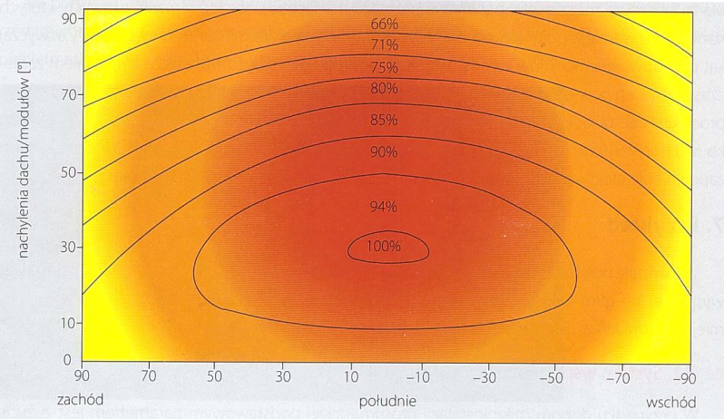

# 7. Przykład doboru instalacji fotowoltaicznej

:::info Cel prezentacji
Pokazanie przykładu doboru instalacji współpracującej z siecią (on-grid) oraz instalacji wyspowej (off-grid). Oprócz doboru samych komponentów, należy przeprowadzić wizję lokalną na miejscu montażu w celu zweryfikowania możliwości zamontowania zamierzonej liczby modułów.
:::

---

## 7.1. System współpracujący z siecią (on-grid)

### Podstawowe założenia projektowe

**Główny parametr:** Zużycie energii przez dany budynek

**Ograniczenia prawne:** Instalacje mogą produkować energię tylko na potrzeby własne

**Współczynniki net-meteringu:**
- 80% dla instalacji do 10 kW
- 70% dla instalacji powyżej 10 kW (max 50 kW)

<details>
<summary>Szczegółowe informacje o doborze parametrów</summary>

W przypadku doboru mikroinstalacji prosumenckiej podstawowym parametrem jest zużycie energii przez dany budynek. Zgodnie z obowiązującym prawem takie instalacje mogą produkować energię tylko na potrzeby własne. Dlatego podczas projektowania systemu należy dobrać ją tak, aby w skali roku wytworzona przez nią energia była w całości skonsumowana przez użytkowników domu.

Dane dotyczące energii konsumowanej przez inwestora można uzyskać z rachunku. Taką możliwość dają również portale internetowe zakładów energetycznych, gdzie Inwestor po zalogowaniu na swoje konto ma wgląd do najważniejszych odczytów. Warto wziąć pod uwagę ostatnie 2-3 lata i przeanalizować, czy zużycie energii będzie podobne. Jeśli nie, to należy jak najdokładniej oszacować planowane zużycie energii i uwzględnić je w projekcie. Trzeba także przemyśleć, czy w najbliższym czasie liczba mieszkańców będzie taka sama, czy planujemy zakup dodatkowych urządzeń elektrycznych lub zamianę systemu grzewczego na pompę ciepła albo rozbudowę firmy.

W przypadku nowo powstałych domów lub braku danych dotyczących zużycia energii, można skorzystać z analiz lub kalkulatorów, które oszacują zużycie w danym obiekcie.

</details>

---

### Obliczenie mocy instalacji

**Założenia dla przykładu:**
- Zużycie energii: **4000 kWh/rok**
- Uzysk z 1 kWp w Polsce: **~1000 kWh/rok**

**Wzór podstawowy:**
```
P = zużycie_energii / (uzysk_roczny × współczynnik_korekcyjny)
```

<details>
<summary>Szczegółowe obliczenia mocy instalacji</summary>

Po określeniu wartości zużycia można przejść do wyliczenia mocy instalacji fotowoltaicznej. W tym przykładzie przyjęto zużycie energii na poziomie 4000 kWh/rok. Uwzględniono, że w Polsce z 1 kWp można uzyskać około 1000 kWh/rok. Należy ułożyć proporcje i wyliczyć moc instalacji fotowoltaicznej. Trzeba pamiętać, że jeśli dach budynku nie jest skierowany na południe oraz ma kąt nachylenia inny niż 30°, należy odpowiednio zwiększyć liczbę modułów fotowoltaicznych. W tym celu można posłużyć się poniższym schematem lub wykorzystać jedną z aplikacji internetowych (na przykład wspomniana Global Solar Atlas).

</details>

---

### Wpływ kąta nachylenia i azymutu



*Rys. 5.1. Wpływ kąta nachylenia dachu i azymutu na wydajność systemu fotowoltaicznego (na podstawie materiałów Viessmann)*

**W przykładzie:**
- Dach nachylony pod kątem **30°**
- Odchylony od południa o **30° na zachód**
- Skutek: zmniejszenie uzysków do **94%** uzysków maksymalnych
- Uzysk: **940 kWh/rok z 1 kWp**

---

### Uwzględnienie strat net-meteringu

**Założenia:**
- Energia zużywana bezpośrednio: **30%**
- Energia oddawana do sieci: **70%**
- Współczynnik odbioru: **80%** (instalacja do 10 kW)

**Obliczenie strat:**
- Straty: 20% z 70% = **14%**
- Współczynnik korekcyjny: **0,86**

**Wzór końcowy:**
```
P = 4000/(940×0,86) = 4,948 kWp
```

<details>
<summary>Szczegółowe wyjaśnienie strat net-meteringu</summary>

Następnie należy założyć, ile energii z systemu fotowoltaicznego będzie zużywane bezpośrednio — najczęściej jest to około 30%. Oznacza to, że 70% energii wyprodukowanej z fotowoltaiki zostanie oddane do sieci, a zgodnie z obowiązującą ustawą o OZE, z tych 70% energii będzie można odebrać 80% (instalacja do 10 kW). Wynika z tego, że będzie konieczność zwiększenia instalacji o straty, jakie wiążą się z net-meteringiem. W omawianym przypadku wynoszą one 20% z 70% oddanej energii, co w skali całej instalacji daje 14%. Dlatego moc instalacji musi zostać zwiększona o 14%, czyli dzielimy przez współczynnik 0,86.

Dzięki tym obliczeniom otrzymuje się moc instalacji fotowoltaicznej, jaka jest w stanie pokryć całkowite zapotrzebowanie na energię elektryczną danego budynku.

</details>

---

## Dobór modułów fotowoltaicznych

**Wynik obliczeń:** **P = 4,948 kWp**

### Karta katalogowa modułu fotowoltaicznego

| Parametr | Wartość |
|----------|---------|
| **Nominalna moc P<sub>max</sub>** | 330 W |
| **Napięcie robocze U<sub>mp</sub>** | 33,98 V |
| **Natężenie robocze I<sub>mp</sub>** | 9,71 A |
| **Napięcie jałowe U<sub>oc</sub>** | 40,66 V |
| **Prąd zwarciowy I<sub>sc</sub>** | 10,20 A |
| **Sprawność** | 19,6% |
| **Wymiary** | 1685 mm × 1000 mm × 32 mm |
| **Waga** | 18,7 kg |

**Współczynniki temperaturowe:**
- Moc: -0,37%/K
- Napięcie: -0,163 V/K
- Prąd zwarcia: +0,04%/K

### Obliczenie liczby modułów

**Liczba modułów:**
```
n = 4948 Wp / 330 Wp = 14,99 → 15 modułów
```

**Moc instalacji:**
```
P_inst = P_mod × n = 330 Wp × 15 = 4950 Wp = 4,95 kWp
```

**Gdzie:**
- **P<sub>inst</sub>** — maksymalna moc instalacji (w warunkach STC)
- **P<sub>mod</sub>** — maksymalna moc pojedynczego modułu (w warunkach STC)
- **n** — liczba wszystkich modułów w instalacji

<details>
<summary>Szczegółowe obliczenia liczby modułów</summary>

Znając moc pojedynczego modułu, można obliczyć, ile sztuk modułów będzie potrzebne.

W omawianym przypadku wyniesie to:

**n = 4948 Wp / 330 Wp = 14,99**, czyli po zaokrągleniu przyjmujemy **15 modułów fotowoltaicznych o mocy 330 Wp**.

Moc instalacji wynika ze wzoru:

**P<sub>inst</sub> = P<sub>mod</sub> × n = 330 Wp × 15 = 4950 Wp = 4,95 kWp**

</details>

---

## Dobór falownika

### Założenia projektowe

**Zakres mocy falownika:** 85-100% mocy modułów fotowoltaicznych

**Wzór:**
```
P_inv = od 85% × P_inst do 100% × P_inst
P_inv = od 4207 W do 4950 W
```

<details>
<summary>Szczegółowe informacje o doborze falownika</summary>

Kolejnym krokiem jest dobranie falownika. Zwraca się przy tym uwagę na moc znamionową oraz moc maksymalną. Ze względu na to, że moc modułów fotowoltaicznych podawana jest w warunkach STC, które praktycznie nigdy nie są uzyskiwane w rzeczywistości, dobierając moc falownika do mocy generatora, można ją zmniejszyć. Najczęściej przyjmuje się moc falownika w zakresie 85-100% mocy modułów fotowoltaicznych. Wartość tę należy zweryfikować z kartą katalogową falownika.

Zatem w omawianym przypadku szukamy falownika o parametrach:

**P<sub>inv</sub> = od 85% × P<sub>inst</sub> do 100% × P<sub>inst</sub>**

**P<sub>inv</sub> = od 85% × 4950 W do 100% × 4950 W = od 4207 W do 4950 W**

gdzie:

- **P<sub>inv</sub>** — zakres mocy falownika
- **P<sub>inst</sub>** — moc instalacji

</details>

### Parametry techniczne falownika

#### Dane wejściowe po stronie DC

| Parametr | Wartość |
|----------|---------|
| Maksymalny prąd wejściowy [A] | 16,0 |
| Minimalne napięcie wejściowe [V] | 150 |
| Maksymalne napięcie wejściowe [V] | 1000 |
| Zakres napięcia MPPT [V] | 150-800 |
| Liczba trackerów | 2 |
| Liczba przylączy prądu stałego DC | 2 |

#### Dane wyjściowe po stronie AC

| Parametr | Wartość |
|----------|---------|
| Moc znamionowa AC [W] | 4500 |
| Prąd wyjściowy AC [A] | 6,5 |
| Częstotliwość [Hz] | 50/60 |
| Współczynnik zniekształceń [%] | &lt;3 |

#### Dane ogólne

| Parametr | Wartość |
|----------|---------|
| Wymiary: wysokość × szerokość × głębokość [mm] | 645 × 431 × 204 |
| Masa [kg] | 19,90 |
| Maksymalna sprawność [%] | 98 |

---

## Weryfikacja parametrów elektrycznych

### Cel weryfikacji
Sprawdzenie kompatybilności modułów fotowoltaicznych z falownikiem pod względem parametrów prądowo-napięciowych.

**Zakres MPPT falownika:** 150-800 V

<details>
<summary>Szczegółowe informacje o weryfikacji parametrów</summary>

Kolejnym krokiem jest sprawdzenie, czy moduły fotowoltaiczne połączone w szereg będą współdziałały z dobranym falownikiem pod względem parametrów prądowo-napięciowych.

W tym celu należy sprawdzić, czy parametry podłączonych modułów fotowoltaicznych odpowiadają parametrom falownika, opisanym jako MPPT (Maximum Power Point Tracker). Jeśli zostaną prawidłowo dobrane, instalacja będzie produkowała maksymalną ilość energii. W omawianym przypadku ten zakres, odczytany z karty katalogowej, wynosi 150-800V. W związku z tym, że napięcie i prąd modułu zmieniają się wraz z temperaturą, należy zweryfikować, jak zachowa się instalacja w skrajnych warunkach pogodowych, czyli zimą przy temperaturze ogniwa -25°C oraz latem przy 75°C. Zimą napięcie wzrasta, dlatego należy tutaj uwzględnić zarówno napięcie układu otwartego — czy nie przekroczy 1000 V podczas uruchamiania się systemu, a także napięcie MPP — ze względu na pracę systemu. Natomiast dla okresu letniego należy sprawdzić, czy napięcie MPP szeregu modułów nie spadnie poniżej napięcia MPPT falownika.

> **Uwaga!** Ze względu na to, że w obliczeniach występuje różnica temperatur, nie ma znaczenia czy wartości będą podane w stopniach Celsjusza czy w Kelwinach.

</details>

### Obliczenia dla warunków zimowych (-25°C)

**Napięcie obwodu otwartego:**
```
U_oc = n × (U_oc + ΔT × β) = 15 × (40,66 + (-50°C) × (-0,163 V/K)) = 732,15 V
```

**Napięcie MPP:**
```
U_mpp = n × (U_mpp + ΔT × β) = 15 × (33,98 + (-50°C) × (-0,163 V/K)) = 631,95 V
```

<details>
<summary>Szczegółowe obliczenia dla warunków zimowych</summary>

**U<sub>oc</sub> = n × (U<sub>oc</sub> + ΔT × β) = 15 × (40,66 + (-50°C) × (-0,163 V/K)) = 732,15 V**

gdzie:

- **U<sub>oc</sub>** — Napięcie obwodu otwartego łańcucha modułów dla -25°C
- **n** — liczba wszystkich modułów w instalacji
- **U<sub>oc</sub>** — napięcie obwodu otwartego dla STC
- **ΔT** — różnica temperatury względem STC (25°C), czyli -25°C - 25°C = -50°C
- **β** — współczynnik temperaturowy dla napięcia

**U<sub>mpp</sub> = n × (U<sub>mpp</sub> + ΔT × β) = 15 × (33,98 + (-50°C) × (-0,163 V/K)) = 631,95 V**

gdzie:

- **U<sub>mpp</sub>** — Napięcie MPP łańcucha modułów dla -25°C
- **U<sub>mpp</sub>** — Napięcie MPP modułu dla STC
- **ΔT** — różnica temperatury względem STC (25°C), czyli -25°C - 25°C = -50°C
- **β** — współczynnik temperaturowy napięcia

</details>

### Obliczenia dla warunków letnich (75°C)

**Napięcie MPP:**
```
U_mpp = n × (U_mpp + ΔT × β) = 15 × (33,98 + (50°C) × (-0,163 V/K)) = 387,45 V
```

<details>
<summary>Szczegółowe obliczenia dla warunków letnich</summary>

**U<sub>mpp</sub> = n × (U<sub>mpp</sub> + ΔT × β) = 15 × (33,98 + (50°C) × (-0,163 V/K)) = 387,45 V**

gdzie:

- **U<sub>mpp</sub>** — Napięcie MPP łańcucha modułów dla 75°C
- **U<sub>mpp</sub>** — Napięcie MPP modułu dla STC
- **ΔT** — różnica temperatury względem STC (25°C), czyli 75°C - 25°C = 50°C
- **β** — współczynnik temperaturowy dla napięcia

</details>

### Weryfikacja wyników

✅ **U<sub>oc</sub> = 732,15 V < 1000 V**  
✅ **U<sub>mpp</sub>(-25°C) = 631,95 V** mieści się w zakresie MPPT 150-800 V  
✅ **U<sub>mpp</sub>(75°C) = 387,45 V** mieści się w zakresie MPPT 150-800 V  

### Weryfikacja prądu

**Porównanie prądów:**
```
I_DCmax > I_sc
16 A > 10,20 A ✓
```

<details>
<summary>Szczegółowe informacje o weryfikacji</summary>

> **Uwaga!** Jeśli okaże się, że napięcia są za wysokie, należy wówczas rozdzielić instalowane moduły na dwa łańcuchy. Natomiast jeśli napięcia są za małe, należy dodać kolejny moduł fotowoltaiczny do łańcucha.

Trzeba również skontrolować, czy natężenie prądu modułów fotowoltaicznych nie przekracza możliwości falownika. W tym celu wystarczy porównać prąd zwarciowy tylko jednego modułu — są one łączone szeregowo.

**I<sub>DCmax</sub> > I<sub>sc</sub>**

**16 A > 10,20 A** ✓

</details>

---

## Podsumowanie

### Dodatkowe elementy projektu

Aby projekt był najwyższej jakości, należy także pamiętać o:

- **Przewodach** o właściwych przekrojach (rozdział 2.3.5. Przewody i złącza elektryczne)
- **Ochronie odgromowej** (rozdział 2.4. Ochrona odgromowa)
- **Zabezpieczeniach** (rozdział 2.3.3. Zabezpieczenia)

### Końcowy rezultat

Dobierając elementy instalacji w ten sposób mamy pewność, że instalacja będzie pracowała prawidłowo w skrajnych warunkach pogodowych przez cały rok.

**Parametry końcowe instalacji:**
- Moc: **4,95 kWp**
- Liczba modułów: **15 szt.**
- Moc pojedynczego modułu: **330 Wp**
- Moc falownika: **4,5 kW**