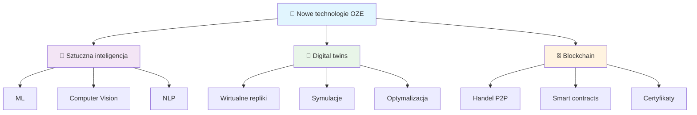
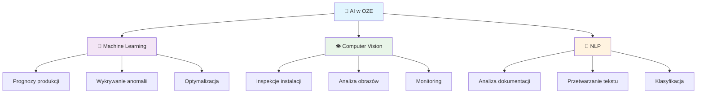
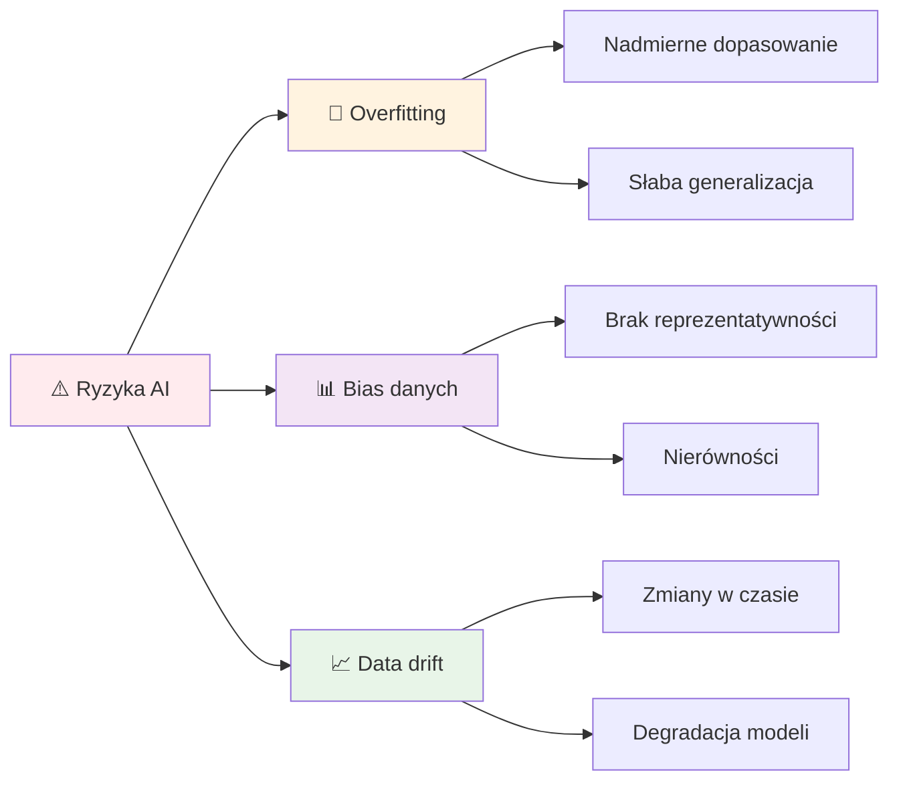

import { 
  SlideContainer, 
  Slide, 
  KeyPoints, 
  SupportingDetails, 
  InfoBox,
  WarningBox,
  SuccessBox,
  InstructorNotes,
  VisualSeparator 
} from '@site/src/components/SlideComponents';

<SlideContainer>

<Slide title="🚀 Trendy i przyszłość w OZE" type="info">

<KeyPoints title="🔮 Nowe technologie w energetyce odnawialnej">

</KeyPoints>

<InstructorNotes>
**Wprowadzenie do najnowszych trendów w technologiach OZE, które kształtują przyszłość branży.**

**🚀 Dlaczego trendy są ważne?**
- **Ewolucja technologii**: Szybki rozwój technologii wymaga ciągłego aktualizowania wiedzy
- **Konkurencyjność**: Znajomość trendów daje przewagę na rynku pracy
- **Innowacje**: Nowe technologie otwierają nowe możliwości w OZE
- **Przyszłość**: Przygotowanie do zmian w branży

**🔮 Kluczowe trendy w OZE:**
- **Sztuczna inteligencja**: ML, computer vision, NLP
- **Digital twins**: Wirtualne repliki instalacji
- **Blockchain**: Handel P2P energią, smart contracts
- **IoT**: Internet rzeczy, edge computing
- **5G**: Szybka komunikacja, niskie opóźnienia

**🔧 Specjalne wymagania OZE:**
- **Dane czasowe**: Optymalizacja dla szeregów czasowych
- **Geolokalizacja**: Dane przestrzenne, mapy, analizy zacienień
- **Integracja**: Różne systemy i protokoły komunikacyjne
- **Compliance**: Zgodność z normami branżowymi i prawnymi

**💡 Praktyczne wskazówki:**
- **Ciągłe uczenie**: Aktualizuj wiedzę o nowych technologiach
- **Eksperymentowanie**: Testuj nowe narzędzia i podejścia
- **Networking**: Uczestnicz w konferencjach, webinariach
- **Praktyka**: Stosuj nowe technologie w projektach
</InstructorNotes>

</Slide>

<VisualSeparator type="technical" />

<Slide title="🤖 Sztuczna inteligencja w OZE" type="tip">

<KeyPoints title="🧠 Zastosowania AI">

</KeyPoints>

<WarningBox title="⚠️ Ryzyka AI">

</WarningBox>

<InstructorNotes>
**Sztuczna inteligencja**

**🧠 Zastosowania AI w OZE:**
- **Machine learning**: Prognozy produkcji, wykrywanie anomalii
  - *Zalety*: Automatyzacja, precyzja, skalowalność
  - *Zastosowania*: Predykcja wydajności, utrzymanie predykcyjne
- **Computer vision**: Inspekcje instalacji, analiza obrazów
  - *Zalety*: Automatyzacja, szybkość, precyzja
  - *Zastosowania*: Inspekcje dronów, analiza zacienień
- **NLP**: Analiza dokumentacji, przetwarzanie tekstu
  - *Zalety*: Automatyzacja, ekstrakcja informacji
  - *Zastosowania*: Analiza raportów, klasyfikacja dokumentów

**⚠️ Ryzyka AI:**
- **Nadmierne dopasowanie**: Overfitting, słaba generalizacja
- **Brak reprezentatywnych danych**: Bias, nierówności
- **Dryf danych**: Zmiany w czasie, degradacja modeli
- **Czarna skrzynka**: Brak interpretowalności, trudność w debugowaniu

**✅ Dobre praktyki:**
- **Walidacja krzyżowa**: Testowanie modeli na różnych danych
- **Monitoring jakości**: Ciągłe monitorowanie wydajności
- **Okresowa rekalkibracja**: Aktualizacja modeli na nowych danych
- **Interpretowalność**: Zrozumienie decyzji modeli
- **Dokumentacja**: Dokumentowanie założeń i ograniczeń

**🔧 Specjalne wymagania OZE:**
- **Dane czasowe**: Optymalizacja dla szeregów czasowych
- **Geolokalizacja**: Dane przestrzenne, mapy, analizy zacienień
- **Integracja**: Różne systemy i protokoły komunikacyjne
- **Compliance**: Zgodność z normami branżowymi i prawnymi

**💡 Praktyczne wskazówki:**
- **Data quality**: Jakość danych, walidacja, imputacja
- **Model validation**: Walidacja modeli, backtesting
- **Uncertainty**: Ocena niepewności, analiza ryzyka
- **Best practices**: Dokumentacja, wersjonowanie, testy
</InstructorNotes>

</Slide>

<VisualSeparator type="technical" />

<Slide title="✅ Dobre praktyki AI" type="success">

<KeyPoints title="🎯 Kluczowe zasady">
- 🔄 **Walidacja krzyżowa** - testowanie modeli
- 📊 **Monitoring jakości danych** - ciągła kontrola
- 🔄 **Okresowa rekalkibracja** - aktualizacja modeli
</KeyPoints>

<InstructorNotes>
**Dobre praktyki AI w projektach OZE:**

**✅ Walidacja krzyżowa modeli:**
- **Cross-validation**: Testowanie na różnych podzbiorach danych
- **Hold-out validation**: Rezerwowanie danych testowych
- **Time series validation**: Walidacja dla danych czasowych
- **Spatial validation**: Walidacja dla danych przestrzennych

**📊 Monitoring jakości danych:**
- **Real-time monitoring**: Ciągłe monitorowanie jakości danych
- **Data drift detection**: Wykrywanie zmian w rozkładzie danych
- **Quality metrics**: Metryki jakości danych, alerty
- **Automated validation**: Automatyczna walidacja danych

**🔄 Okresowa rekalkibracja:**
- **Model retraining**: Ponowne trenowanie na nowych danych
- **Incremental learning**: Uczenie przyrostowe
- **A/B testing**: Testowanie różnych wersji modeli
- **Performance monitoring**: Monitorowanie wydajności modeli

**🧪 Testowanie modeli:**
- **Historical data**: Testowanie na danych historycznych
- **Real-world data**: Walidacja na danych rzeczywistych
- **Synthetic data**: Testowanie na danych syntetycznych
- **Edge cases**: Testowanie przypadków brzegowych

**🔧 Specjalne wymagania OZE:**
- **Dane czasowe**: Optymalizacja dla szeregów czasowych
- **Geolokalizacja**: Dane przestrzenne, mapy, analizy zacienień
- **Integracja**: Różne systemy i protokoły komunikacyjne
- **Compliance**: Zgodność z normami branżowymi i prawnymi

**💡 Praktyczne wskazówki:**
- **Data quality**: Jakość danych, walidacja, imputacja
- **Model validation**: Walidacja modeli, backtesting
- **Uncertainty**: Ocena niepewności, analiza ryzyka
- **Best practices**: Dokumentacja, wersjonowanie, testy
</InstructorNotes>

</Slide>

<VisualSeparator type="technical" />

<Slide title="👥 Digital twins" type="note">

<KeyPoints title="🎭 Koncepcja wirtualnych replik">
- 🖥️ **Wirtualne repliki instalacji** - dokładne modele cyfrowe
- 🎯 **Symulacje scenariuszy** „co jeśli"
- ⚡ **Optymalizacja w czasie rzeczywistym**
</KeyPoints>

<SupportingDetails title="🔧 Wymagania techniczne">
- 🔗 Spójny model komponentów
- 🖥️ Integracja z DCS/SCADA
- ⚡ Sprzężenie z danymi czasu rzeczywistego
</SupportingDetails>

<InstructorNotes>
**Digital twins**

- Wirtualne repliki instalacji
- Symulacje scenariuszy „co jeśli"
- Optymalizacja w czasie rzeczywistym

Wymagania: spójny model komponentów, integracja z DCS/SCADA, sprzężenie z danymi czasu rzeczywistego i historią awarii.
</InstructorNotes>

</Slide>

<VisualSeparator type="technical" />

<Slide title="⛓️ Blockchain w energetyce" type="warning">

<KeyPoints title="🔗 Zastosowania blockchain">
- ⚡ **Handel P2P energią** - bezpośrednie transakcje
- 📋 **Smart contracts dla PPA** - automatyczne umowy
- 📜 **Certyfikaty pochodzenia energii** - śledzenie źródła
</KeyPoints>

<WarningBox title="⚠️ Ograniczenia">
- 💰 Koszty transakcyjne
- 📋 Regulacje prawne
- 🔗 Interoperacyjność z rynkami energii
</WarningBox>

<InstructorNotes>
**Blockchain**

- Handel P2P energią
- Smart contracts dla PPA
- Certyfikaty pochodzenia energii

Ograniczenia: koszty transakcyjne, regulacje, interoperacyjność z rynkami energii.
</InstructorNotes>

</Slide>

<VisualSeparator type="default" />

<Slide title="📚 Lektury i źródła" type="info">

<KeyPoints title="📖 Dokumentacja techniczna">
- 📊 **NREL SAM documentation** (modele PV i wiatrowe)
- 📋 **IEC 61724** (monitoring PV) i **61850** (komunikacja)
- 📚 **Przeglądy literatury** o digital twins w energetyce (IEEE Access)
</KeyPoints>

<InstructorNotes>
**Lektury i źródła do samodzielnego studium**

- NREL SAM documentation (modele PV i wiatrowe)
- IEC 61724 (monitoring PV) i 61850 (komunikacja)
- Przeglądy literatury o digital twins w energetyce (IEEE Access)
</InstructorNotes>

</Slide>

</SlideContainer>
