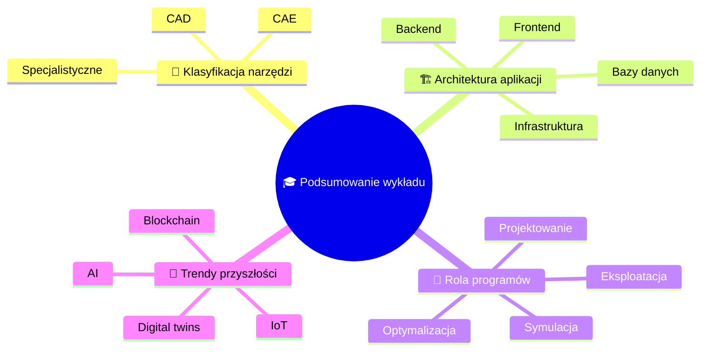
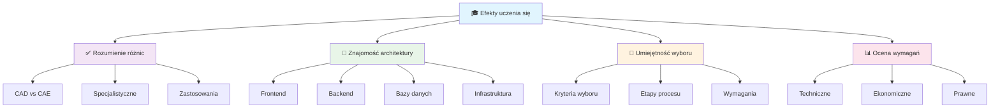

import { 
  SlideContainer, 
  Slide, 
  KeyPoints, 
  SupportingDetails, 
  InfoBox,
  WarningBox,
  SuccessBox,
  InstructorNotes,
  VisualSeparator 
} from '@site/src/components/SlideComponents';

<SlideContainer>

<Slide title="🎯 Podsumowanie pierwszego wykładu" type="info">

<KeyPoints title="📚 Kluczowe zagadnienia">

</KeyPoints>

<InstructorNotes>
**Podsumowanie pierwszego wykładu**

W pierwszym wykładzie omówiliśmy kluczowe zagadnienia związane z programami komputerowymi w projektowaniu instalacji OZE. Poznaliśmy klasyfikację narzędzi (CAD, CAE, oprogramowanie specjalistyczne), architekturę aplikacji wielowarstwowych, rolę programów w różnych etapach procesu projektowego oraz trendy przyszłości.

**Kluczowe wnioski:**
- Wybór odpowiedniego narzędzia zależy od celu analizy i wymagań projektu
- Architektura aplikacji OZE opiera się na wielowarstwowej strukturze
- Nowe technologie (AI, IoT, blockchain) zmieniają sposób projektowania i eksploatacji
- Ważne jest zrozumienie kryteriów wyboru narzędzi i ich ograniczeń
</InstructorNotes>

</Slide>

<VisualSeparator type="default" />

<Slide title="✅ Osiągnięte cele" type="success">

<KeyPoints title="🎓 Efekty uczenia się">

</KeyPoints>

<InstructorNotes>
**Efekty uczenia się zostały osiągnięte:**

- Studenci potrafią wyjaśnić różnice między klasami narzędzi: CAD, CAE i oprogramowaniem specjalistycznym
- Znają warstwy architektury aplikacji odpowiadające za interfejs, logikę, dane i infrastrukturę
- Potrafią rozpoznać, na którym etapie procesu projektowego użyć danego narzędzia
- Umieją ocenić, czy dany problem wymaga modelowania geometrycznego, symulacji numerycznej, czy analizy techno-ekonomicznej
</InstructorNotes>

</Slide>

<VisualSeparator type="default" />

<Slide title="🔄 Przepływ pracy w projektach OZE" type="note">

<KeyPoints title="📋 Etapy procesu">

**📊 Zbieranie danych:**
- Stacje meteorologiczne
- Systemy SCADA
- Sensory IoT

**🔄 Przetwarzanie:**
- Walidacja jakości
- Oczyszczanie danych
- Analiza statystyczna

**⚡ Symulacja:**
- Modele matematyczne
- Prognozy produkcji
- Symulacje systemów

**🎯 Optymalizacja:**
- Algorytmy optymalizacyjne
- Optymalizacja parametrów
- Optymalizacja systemów

**📊 Wizualizacja:**
- Dashboardy operacyjne
- Raporty analityczne
- Monitoring w czasie rzeczywistym

**🎯 Wspomaganie decyzji:**
- Analizy ekonomiczne
- Utrzymanie predykcyjne
- Wspomaganie decyzji strategicznych

</KeyPoints>

<InstructorNotes>
**Przepływ pracy w projektach OZE obejmuje sześć głównych etapów:**

1. **Zbieranie danych** - z różnych źródeł (stacje meteo, SCADA, sensory IoT)
2. **Przetwarzanie** - walidacja, oczyszczanie, analiza jakości danych
3. **Symulacja** - modele matematyczne, prognozy produkcji, analizy techniczne
4. **Optymalizacja** - algorytmy optymalizacyjne, optymalizacja systemów
5. **Wizualizacja** - dashboardy, raporty, monitoring w czasie rzeczywistym
6. **Wspomaganie decyzji** - analizy ekonomiczne, utrzymanie predykcyjne

Każdy etap wymaga odpowiednich narzędzi i technologii.
</InstructorNotes>

</Slide>

<VisualSeparator type="default" />

<Slide title="🎯 Kryteria wyboru narzędzi" type="warning">

<KeyPoints title="⚖️ Kluczowe czynniki">

**🎯 Cel analizy:**
- Geometria i dokumentacja
- Zjawiska fizyczne
- Symulacja systemów

**📊 Poziom dokładności:**
- Wymagania projektowe
- Dostępne dane wejściowe
- Możliwość walidacji

**✅ Zgodność ze standardami:**
- Standardy branżowe
- Wymagania prawne
- Certyfikacja systemów

**📚 Biblioteki komponentów:**
- Dostępność modeli
- Komponenty OZE
- Dane klimatyczne

**⏱️ Czas obliczeń:**
- Wydajność systemu
- Dokładność wyników
- Koszty licencji

</KeyPoints>

<InstructorNotes>
**Kryteria wyboru narzędzi OZE:**

- **Cel analizy**: czy potrzebujemy geometrii, zjawisk fizycznych, czy symulacji systemu
- **Poziom dokładności**: wymagania vs. dostępne dane wejściowe
- **Zgodność ze standardami**: branżowe i prawne wymagania
- **Biblioteki komponentów**: dostępność modeli i danych
- **Czas obliczeń**: wydajność vs. dokładność wyników
- **Możliwość walidacji**: porównanie z danymi rzeczywistymi

Wybór narzędzia powinien uwzględniać wszystkie te czynniki.
</InstructorNotes>

</Slide>

<VisualSeparator type="default" />

<Slide title="🚀 Przyszłość programów OZE" type="success">

<KeyPoints title="🔮 Nowe technologie">

**🤖 Sztuczna inteligencja:**
- Machine Learning (ML)
- Computer Vision
- Natural Language Processing (NLP)

**🌐 Internet rzeczy:**
- IoT - sensory i urządzenia
- Edge computing - przetwarzanie lokalne
- Smart sensors - inteligentne czujniki

**☁️ Chmura obliczeniowa:**
- Big data - duże zbiory danych
- Skalowalność systemów
- Serverless computing

**🔗 Blockchain:**
- Handel P2P energią
- Smart contracts
- Certyfikaty pochodzenia

**👥 Digital twins:**
- Wirtualne repliki instalacji
- Symulacje w czasie rzeczywistym
- Optymalizacja systemów

</KeyPoints>

<InstructorNotes>
**Przyszłość programów OZE jest kształtowana przez nowe technologie:**

- **Sztuczna inteligencja**: machine learning, computer vision, NLP
- **Internet rzeczy**: IoT, edge computing, smart sensors
- **Chmura obliczeniowa**: big data, skalowalność, serverless
- **Blockchain**: handel P2P energią, smart contracts, certyfikaty
- **Digital twins**: wirtualne repliki instalacji, symulacje w czasie rzeczywistym

Te technologie zmieniają sposób projektowania, eksploatacji i zarządzania instalacjami OZE.
</InstructorNotes>

</Slide>

<VisualSeparator type="default" />

<Slide title="❓ Pytania kontrolne" type="warning">

<KeyPoints title="🧠 Sprawdź swoją wiedzę">
1. **🔍 Jakie są główne różnice między narzędziami CAD, CAE i specjalistycznymi?**
2. **🏗️ Jakie warstwy architektury aplikacji są kluczowe w systemach OZE?**
3. **🎯 Jakie kryteria należy uwzględnić przy wyborze narzędzi OZE?**
4. **🚀 Jakie nowe technologie będą kształtować przyszłość programów OZE?**
</KeyPoints>

<InstructorNotes>
**Pytania kontrolne do samodzielnej weryfikacji wiedzy:**

1. **Różnice między narzędziami**: CAD (geometria), CAE (obliczenia), specjalistyczne (branżowe)
2. **Warstwy architektury**: frontend, middleware, backend, bazy danych, infrastruktura
3. **Kryteria wyboru**: cel analizy, dokładność, standardy, biblioteki, czas obliczeń
4. **Nowe technologie**: AI, IoT, chmura, blockchain, digital twins

Te pytania pomagają zweryfikować zrozumienie kluczowych zagadnień wykładu.
</InstructorNotes>

</Slide>

<VisualSeparator type="default" />

<Slide title="📚 Materiały dodatkowe" type="info">

<KeyPoints title="📖 Lektury i źródła">
- 📊 **NREL SAM documentation** (modele PV i wiatrowe)
- 📋 **IEC 61724** (monitoring PV) i **61850** (komunikacja)
- 📚 **Przeglądy literatury** o digital twins w energetyce (IEEE Access)
- 🎓 **Tutoriale** oprogramowania PV*SOL i PVsyst
- 📖 **Dokumentacja** narzędzi CAD (AutoCAD, SolidWorks)
</KeyPoints>

<SupportingDetails title="🎯 Przygotowanie do następnego wykładu">
W następnym wykładzie skupimy się na szczegółowej analizie narzędzi do projektowania systemów fotowoltaicznych. Przygotujcie się do omówienia:

- Narzędzi CAD do projektowania geometrycznego instalacji PV
- Oprogramowania specjalistycznego (PV*SOL, PVsyst, SAM)
- Procesu projektowego od koncepcji do realizacji
- Praktycznych przykładów projektów PV
</SupportingDetails>

<InstructorNotes>
**Materiały do samodzielnego studium**

- Dokumentacja NREL SAM - modele PV i wiatrowe
- Standardy IEC 61724 (monitoring PV) i 61850 (komunikacja)
- Przeglądy literatury o digital twins w energetyce (IEEE Access)
- Tutoriale oprogramowania PV*SOL i PVsyst
- Dokumentacja techniczna narzędzi CAD (AutoCAD, SolidWorks)

**Polecane źródła:**
- NREL (National Renewable Energy Laboratory)
- IEC (International Electrotechnical Commission)
- IEEE Access - przeglądy techniczne
- Dokumentacja producentów oprogramowania

**Zadanie domowe:** Przeanalizujcie dostępne narzędzia do projektowania PV i przygotujcie krótkie porównanie ich możliwości.
</InstructorNotes>

</Slide>

</SlideContainer>
