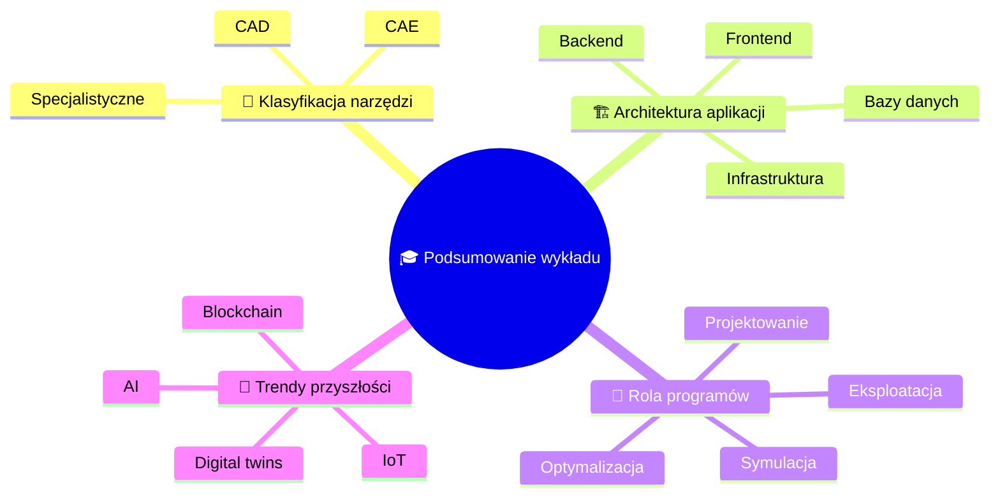

import { 
  SlideContainer, 
  Slide, 
  KeyPoints, 
  SupportingDetails, 
  InfoBox,
  WarningBox,
  SuccessBox,
  InstructorNotes,
  VisualSeparator 
} from '@site/src/components/SlideComponents';

<SlideContainer>

<Slide title="🎯 Podsumowanie pierwszej części wykładu" type="info">

<KeyPoints title="📚 Kluczowe zagadnienia">

</KeyPoints>

<InstructorNotes>
Podsumowanie pierwszego wykładu ma kluczowe znaczenie dla utrwalenia wiedzy studentów i przygotowania ich do kolejnych etapów kursu, pokazując jak wszystkie zagadnienia łączą się w spójną całość.

**Klasyfikacja narzędzi OZE** obejmuje **CAD** (modelowanie geometryczne - AutoCAD, SolidWorks), **CAE** (analizy inżynierskie - ANSYS, COMSOL) i **specjalistyczne narzędzia OZE** (PV-SOL, WindPRO) z dedykowanymi funkcjami branżowymi.

**1. 🔧 Klasyfikacja narzędzi OZE - fundament wiedzy:**
- **CAD (Computer-Aided Design)**: Narzędzia do modelowania geometrycznego
  - *Zastosowania*: Projektowanie layoutów, dokumentacja techniczna, wizualizacja
  - *Przykłady*: AutoCAD, SolidWorks, SketchUp, Revit
  - *Ograniczenia*: Brak obliczeń energetycznych, koszty licencji
  - *Kiedy używać*: Na początku procesu projektowego, do dokumentacji

- **CAE (Computer-Aided Engineering)**: Narzędzia do analiz inżynierskich
  - *Zastosowania*: Analizy wytrzymałościowe, CFD, symulacje fizyczne
  - *Przykłady*: ANSYS, COMSOL, MATLAB/Simulink
  - *Zalety*: Zaawansowane obliczenia, walidacja projektów
  - *Wyzwania*: Wysokie koszty, złożoność, czas obliczeń

- **Oprogramowanie specjalistyczne**: Dedykowane narzędzia OZE
  - *Zastosowania*: Symulacje systemów, analizy ekonomiczne, optymalizacja
  - *Przykłady*: PV*SOL, PVsyst, SAM, HOMER, RETScreen
  - *Zalety*: Dedykowane funkcje, bogate bazy danych, integracja
  - *Kiedy używać*: Głównie w projektach OZE, analizach techno-ekonomicznych

**2. 🏗️ Architektura aplikacji - techniczne fundamenty:**
- **Warstwa prezentacji (Frontend)**: Interfejs użytkownika
  - *Technologie*: React, Angular, Vue.js, HTML5/CSS3/JavaScript
  - *Funkcje*: Wizualizacja danych, interakcja z użytkownikiem, dashboardy
  - *Wymagania*: Responsywność, dostępność, wydajność

- **Warstwa logiki biznesowej (Backend)**: Przetwarzanie danych
  - *Technologie*: Python, Java, C#, Node.js, .NET
  - *Funkcje*: Algorytmy obliczeniowe, walidacja danych, integracje
  - *Wymagania*: Skalowalność, bezpieczeństwo, wydajność

- **Warstwa danych (Database)**: Przechowywanie informacji
  - *Technologie*: PostgreSQL, MySQL, MongoDB, InfluxDB
  - *Funkcje*: Przechowywanie danych klimatycznych, komponentów, projektów
  - *Wymagania*: ACID, indeksowanie, backup, replikacja

- **Warstwa infrastruktury**: Środowisko wykonawcze
  - *Technologie*: Docker, Kubernetes, AWS, Azure, Google Cloud
  - *Funkcje*: Hosting, skalowanie, monitoring, bezpieczeństwo
  - *Wymagania*: Dostępność, skalowalność, bezpieczeństwo

**3. 🎯 Rola programów w procesie projektowym - praktyczne zastosowania:**
- **Etap koncepcyjny**: Analiza wykonalności, wstępne szacunki
  - *Narzędzia*: RETScreen, HOMER, SAM
  - *Wyniki*: Studia wykonalności, analizy ekonomiczne
  - *Czas*: 1-2 tygodnie

- **Etap projektowy**: Szczegółowe projektowanie, optymalizacja
  - *Narzędzia*: PV*SOL, PVsyst, WindPRO, ANSYS
  - *Wyniki*: Projekty techniczne, analizy wytrzymałościowe
  - *Czas*: 2-4 tygodnie

- **Etap realizacji**: Monitoring, kontrola jakości
  - *Narzędzia*: SCADA, systemy monitoringu, drony
  - *Wyniki*: Raporty wykonawcze, dokumentacja
  - *Czas*: Cały okres realizacji

- **Etap eksploatacji**: Monitoring, optymalizacja, utrzymanie
  - *Narzędzia*: Systemy SCADA, AI/ML, IoT
  - *Wyniki*: Optymalizacja produkcji, predykcyjne utrzymanie
  - *Czas*: 20-25 lat eksploatacji

**4. 🚀 Trendy przyszłości - przygotowanie do zmian:**
- **Sztuczna inteligencja (AI)**: Rewolucja w projektowaniu OZE
  - *Machine Learning*: Prognozy produkcji, wykrywanie anomalii, optymalizacja
  - *Computer Vision*: Inspekcje dronami, analiza obrazów termicznych
  - *Natural Language Processing*: Analiza dokumentacji, raportów
  - *Deep Learning*: Zaawansowane modele predykcyjne

- **Internet rzeczy (IoT)**: Połączenie urządzeń i systemów
  - *Sensory*: Monitoring w czasie rzeczywistym, dane środowiskowe
  - *Komunikacja*: Protokoły MQTT, LoRaWAN, 5G
  - *Integracja*: Połączenie z systemami SCADA, chmurą
  - *Aplikacje*: Smart grids, zarządzanie energią, utrzymanie predykcyjne

- **Blockchain**: Bezpieczeństwo i transparentność
  - *Certyfikaty*: Weryfikacja pochodzenia energii, certyfikaty OZE
  - *Handel energią*: P2P trading, smart contracts
  - *Ślad węglowy*: Tracking emisji CO2, zrównoważony rozwój
  - *Finansowanie*: Tokenizacja projektów, crowdfunding

- **Digital twins**: Cyfrowe kopie systemów fizycznych
  - *Modelowanie*: Wierne odwzorowanie systemów OZE
  - *Symulacje*: Testowanie scenariuszy, optymalizacja
  - *Predykcja*: Prognozy wydajności, planowanie utrzymania
  - *Integracja*: Połączenie z systemami SCADA, AI

**💡 Praktyczne wskazówki dla wykładowcy:**

**🎯 Jak prowadzić podsumowanie:**
1. **Rozpocznij od pytań**: "Co było dla Was najważniejsze w dzisiejszym wykładzie?"
2. **Użyj mindmapy**: Wizualnie pokaż powiązania między konceptami
3. **Podaj przykłady**: Konkretne przypadki użycia narzędzi
4. **Zadaj pytania kontrolne**: Sprawdź zrozumienie kluczowych zagadnień
5. **Połącz z praktyką**: Jak studenci będą używać tej wiedzy w przyszłości

**❓ Pytania kontrolne do zadania studentom:**
- "Jakie narzędzie wybralibyście do projektowania farmy wiatrowej i dlaczego?"
- "Jakie są główne różnice między narzędziami CAD, CAE i specjalistycznymi?"
- "Jakie nowe technologie będą najważniejsze w OZE w najbliższych 5 latach?"
- "Jakie wyzwania stoją przed architekturą aplikacji OZE?"

**🔗 Powiązania z kolejnymi wykładami:**
- **Wykład 2 (PV)**: Szczegółowe narzędzia do projektowania systemów fotowoltaicznych
- **Wykład 3 (Solar termiczny)**: Narzędzia do systemów solarnych termicznych
- **Wykład 4 (Pompy ciepła)**: Oprogramowanie do projektowania pomp ciepła
- **Wykład 5 (Wiatr)**: Narzędzia do projektowania farm wiatrowych

**📚 Materiały dodatkowe dla studentów:**
- **Dokumentacja NREL SAM**: Oficjalne tutoriale i przykłady
- **Standardy IEC**: Wymagania techniczne dla systemów OZE
- **Case studies**: Przykłady projektów z różnych branż
- **Społeczności**: Fora użytkowników, grupy LinkedIn, konferencje

**⚠️ Częste błędy studentów:**
- **Mieszanie kategorii**: Używanie CAD do obliczeń energetycznych
- **Ignorowanie ograniczeń**: Nieuwzględnianie kosztów i złożoności
- **Brak walidacji**: Ufanie wynikom bez weryfikacji
- **Przecenianie technologii**: Oczekiwanie, że AI rozwiąże wszystkie problemy

**🎯 Cele na następny wykład:**
- **Praktyczne zastosowania**: Konkretne narzędzia do projektowania PV
- **Hands-on experience**: Demonstracje oprogramowania
- **Case studies**: Analiza rzeczywistych projektów
- **Przygotowanie**: Studenci powinni przeczytać dokumentację PV*SOL

**📊 Metryki sukcesu wykładu:**
- **Zrozumienie klasyfikacji**: Studenci potrafią sklasyfikować narzędzia
- **Znajomość architektury**: Rozumieją warstwy aplikacji
- **Awareness trendów**: Znają nowe technologie w OZE
- **Gotowość do praktyki**: Są przygotowani do pracy z narzędziami

**🚀 Inspiracja dla studentów:**
"Jesteście na początku ekscytującej podróży w świat technologii OZE. Narzędzia, które poznajecie, będą kształtować przyszłość energetyki. Każdy z Was może zostać pionierem w wykorzystaniu AI, IoT czy blockchain w projektach OZE. To Wasza szansa na wpływ na zrównoważoną przyszłość!"
</InstructorNotes>

</Slide>

</SlideContainer>
