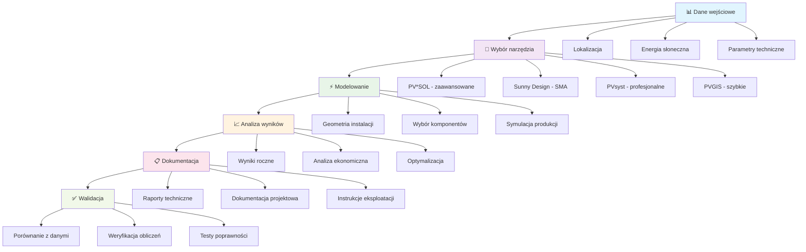

## Kluczowe zagadnienia

### Dobór narzędzia
- **PV*SOL**: zaawansowana symulacja i analiza techniczna
- **Sunny Design**: sprawny workflow i integracja SMA
- **PVsyst**: standard dla analiz profesjonalnych
- **PVGIS**: dane i szybkie estymacje
- **Aurora**: zdalne projektowanie i sprzedaż

### Praktyki projektowe
- **Weryfikacja zakresów MPPT**: kontrola napięć i prądów
- **Realistyczne straty przewodowe**: modelowanie rzeczywistych warunków
- **Model temperatury modułów**: wpływ temperatury na wydajność
- **Analiza zacienienia**: ocena wpływu cieni na produkcję
- **Spójna baza danych**: ceny, taryfy, parametry techniczne
- **Przejrzysta dokumentacja**: standardowe formaty raportów

### Współpraca i integracja
- **Łączenie narzędzi**: PV*SOL/PVsyst + PVGIS + chmura
- **Wersjonowanie plików**: śledzenie zmian w projektach
- **Standardowe formaty**: wymiana danych między systemami
- **Automatyzacja procesów**: skrypty i batch processing

## Osiągnięte cele

✅ **Poznanie procesu projektowania PV** - studenci rozumieją etapy projektowania  
✅ **Porównanie narzędzi** - znają możliwości i ograniczenia różnych programów  
✅ **Praktyczne umiejętności** - potrafią używać PV*SOL i Sunny Design  
✅ **Dobór narzędzi** - umieją wybrać odpowiednie narzędzie do projektu  

## Przepływ pracy w projektach PV

## Kryteria wyboru narzędzi

### Skala projektu
- **Małe instalacje**: PVGIS, proste kalkulatory
- **Średnie instalacje**: PV*SOL, Sunny Design
- **Duże farmy**: PVsyst, profesjonalne narzędzia
- **Komercyjne**: Aurora, zintegrowane platformy

### Wymagania techniczne
- **Dokładność modeli**: poziom szczegółowości obliczeń
- **Integracja sprzętowa**: kompatybilność z producentami
- **Analiza ekonomiczna**: wskaźniki finansowe
- **Raportowanie**: formaty dokumentów

### Dostępność i koszty
- **Licencje**: koszty oprogramowania
- **Szkolenia**: czas na naukę narzędzi
- **Wsparcie techniczne**: dostępność pomocy
- **Aktualizacje**: częstotliwość aktualizacji

## Dobre praktyki

### Przygotowanie danych
- **Weryfikacja lokalizacji**: współrzędne, wysokość
- **Dane meteorologiczne**: źródła, jakość, okres
- **Parametry techniczne**: aktualne dane komponentów
- **Wymagania prawne**: przepisy, pozwolenia

### Proces projektowy
- **Iteracyjne podejście**: wielowariantowe analizy
- **Walidacja wyników**: porównanie z benchmarkami
- **Dokumentacja**: śledzenie założeń i zmian
- **Współpraca**: komunikacja z zespołem

### Kontrola jakości
- **Sprawdzenie obliczeń**: weryfikacja wyników
- **Analiza wrażliwości**: wpływ parametrów
- **Testy poprawności**: porównanie z danymi rzeczywistymi
- **Przegląd projektowy**: kontrola przez ekspertów

## Pytania kontrolne

1. **Jakie są główne kryteria wyboru narzędzi do projektowania PV?**
2. **Jakie są zalety i wady PV*SOL, Sunny Design i PVsyst?**
3. **Jakie dane są niezbędne do rozpoczęcia projektu PV?**
4. **Jakie są kluczowe etapy procesu projektowego?**
5. **Dlaczego ważna jest walidacja wyników obliczeń?**

## Materiały dodatkowe

- **Dokumentacja PV*SOL**: podręczniki użytkownika i tutoriale
- **Sunny Design Guide**: przewodniki po funkcjach
- **PVsyst Help**: dokumentacja techniczna
- **PVGIS Documentation**: dane i modele
- **Standardy branżowe**: IEC, EN, normy krajowe

## Przygotowanie do następnego wykładu

W następnym wykładzie skupimy się na systemach solarnych termicznych. Przygotujcie się do omówienia:

- Narzędzi do projektowania systemów solarnych termicznych
- Procesu modelowania kolektorów słonecznych
- Porównania oprogramowania (T*SOL, RETScreen)
- Praktycznych przykładów projektów solarnych
