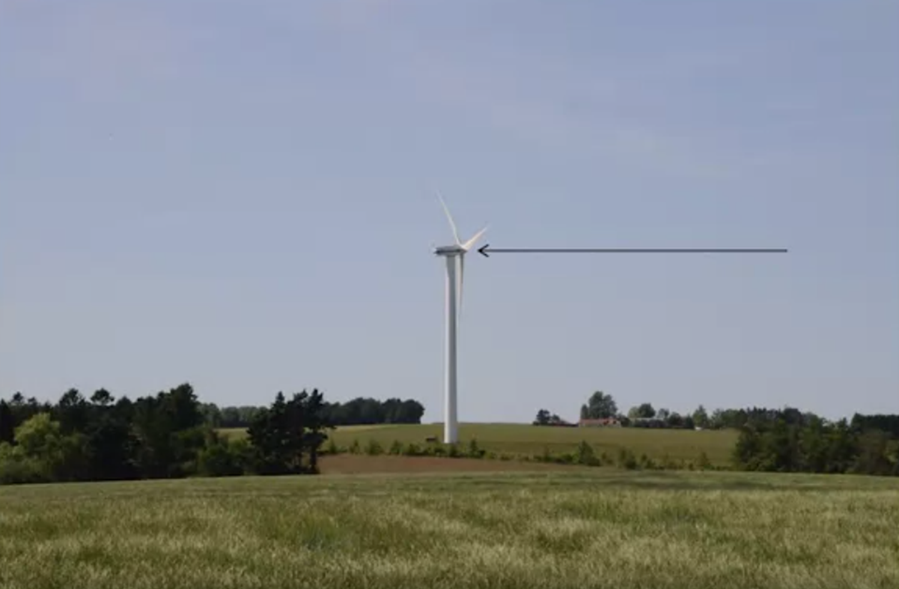
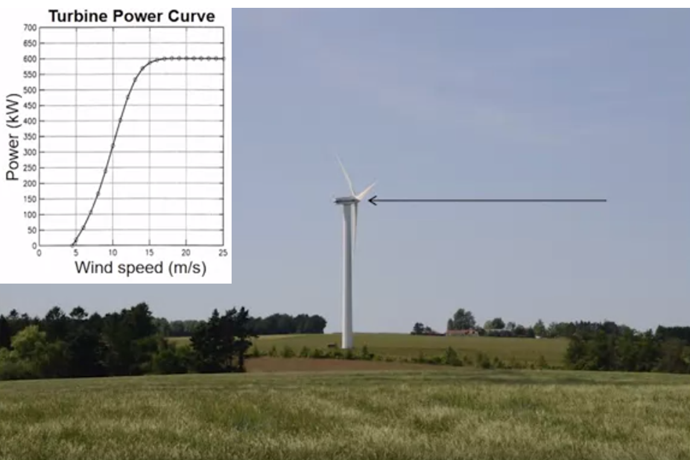
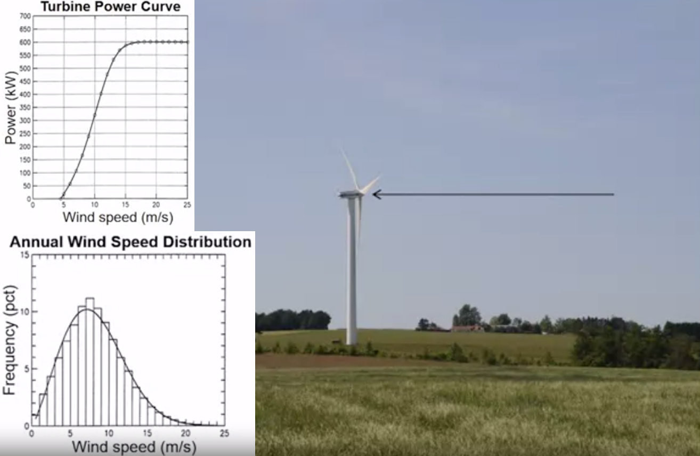
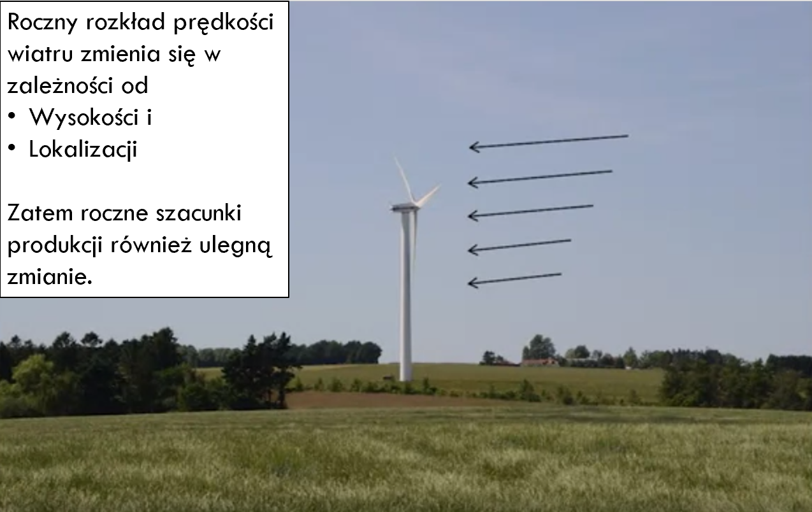
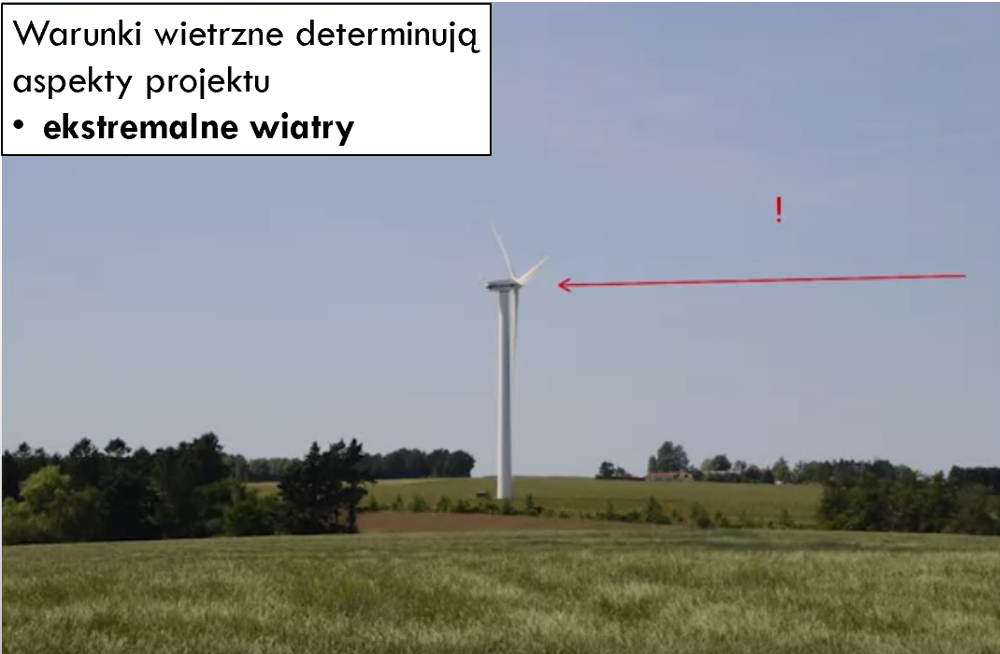
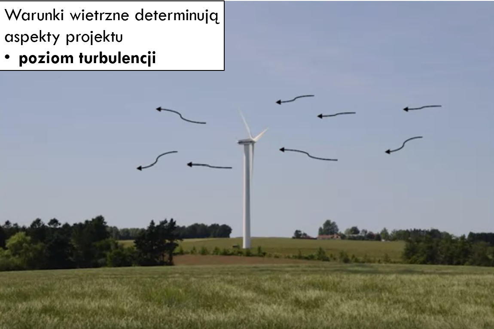
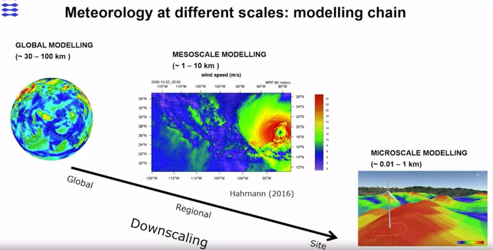
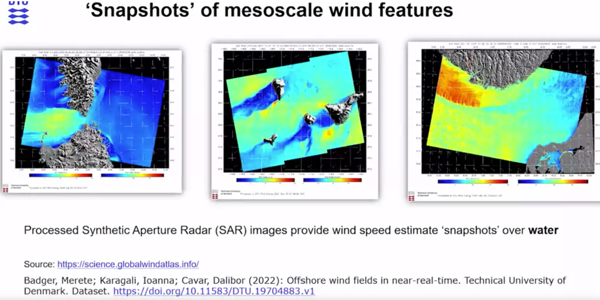
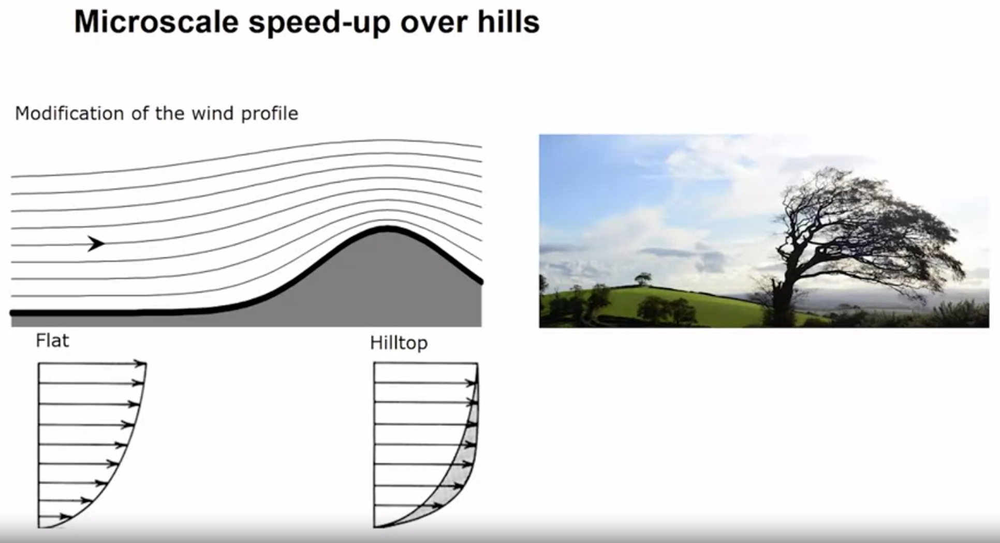
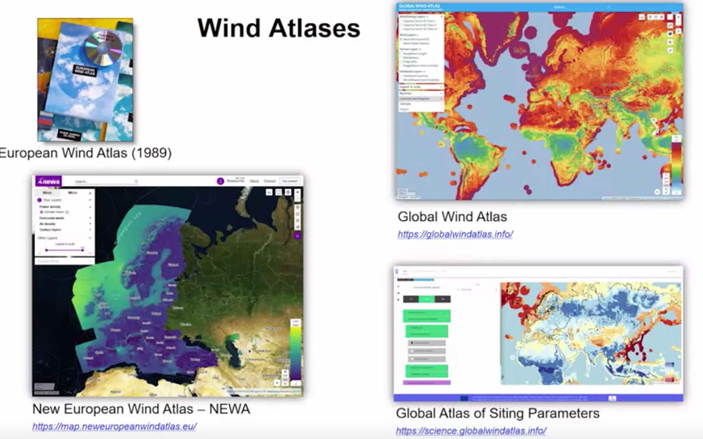

import { 
  SlideContainer, 
  Slide, 
  KeyPoints, 
  SupportingDetails, 
  InstructorNotes,
  VisualSeparator 
} from '@site/src/components/SlideComponents';

<SlideContainer>

<Slide title="📚 Teoria projektowania farm wiatrowych" type="info">

<KeyPoints title="📋 Materiały">
- Teoria projektowania farm wiatrowych
- Materiały dostępne lokalnie. Prezentacja Power Point (skrócić)
</KeyPoints>

<KeyPoints title="📑 Plan wykładu (wg obrazu)">
1. Systemy energetyczne wiatrowe.
   - Wprowadzenie do atlasów wiatrowych.
   - Projektowanie i optymalizacja farm wiatrowych.
2. Projektowanie turbin wiatrowych.
   - Teoria pędu jednowymiarowego i „Betz Limit” dla maksymalnej produkcji energii.
   - Różne metody i koncepcje pozyskiwania energii wiatrowej.
</KeyPoints>

<InstructorNotes>
Materiały do teorii projektowania farm wiatrowych znajdują się w folderze lokalnym "S1-sem5-WPL - Programy komputerowe w projektowaniu instalacji OZE".

Link do prezentacji umieszczonej na OneDrive: [3-Farmy energetyczne - wiatrowe](https://1drv.ms/p/c/ED7E97FABBA6FCBE/EU2NJgN6L-ZKu01m-1tlyx8BwBmy7eLYZyp77bFFwgML0Q?e=IeAvuh)

</InstructorNotes>

</Slide>

<Slide title="🎯 Znaczenie oceny warunków wiatrowych">

<InstructorNotes>
Zaczniemy od tego, że spróbujmy zrozumieć dlaczego ocena warunków wiatrowych jest ważna. Opiszemy, które czynniki wpływają na przepływ powietrza i warunki wiatrowe na terenie farmy wiatrowej.

Oto zdjęcie turbiny wiatrowej w krajobrazie i możecie się zastanawiać, co musimy wiedzieć o warunkach wiatrowych, aby umieścić tę turbinę we właściwym miejscu i wybrać odpowiednią turbinę.
</InstructorNotes>

</Slide>

<Slide title="📈 Prędkość wiatru na wysokości piasty i krzywa mocy">

<InstructorNotes>
Pierwsza rzecz, która może nas interesować, jest prędkość wiatru na wysokości piasty turbiny. Jest to ważne, ponieważ determinuje produkcję turbiny. Każda turbina wiatrowa ma krzywą mocy, i dzięki tej krzywej mocy możemy powiązać prędkość wiatru na wysokości piasty z produkcją mocy turbiny. Jeśli znamy roczny rozkład prędkości wiatru na tej wysokości w danej lokalizacji, możemy obliczyć roczną produkcję turbiny wiatrowej.
</InstructorNotes>

</Slide>

<Slide title="🗓️ Roczny rozkład prędkości wiatru (rozklad Weibulla)">

<InstructorNotes>
Czyli pierwszą rzeczą, którą chcielibyśmy wiedzieć o warunkach wiatrowych na miejscu instalacji turbiny, jest roczny rozkład prędkości wiatru.
</InstructorNotes>

</Slide>

<Slide title="📐 Wysokość, lokalizacja i zmiana rozkładu prędkości">

<InstructorNotes>
Roczny rozkład prędkości wiatru zmienia się w zależności od wysokości i lokalizacji. Gdy na przykład zwiększamy wysokość piasty tej turbiny, instalując wyższą wieżę, rozkład prędkości wiatru będzie inny. Przenosząc wieżę na inną lokalizację w krajobrazie, również zmieni się rozkład prędkości wiatru. Te czynniki razem będą również oznaczać zmianę w szacunkach rocznej produkcji.
</InstructorNotes>

</Slide>

<Slide title="⚠️ Ekstremalne wiatry i obciążenia konstrukcyjne">

<InstructorNotes>
Istnieje więcej aspektów warunków wiatrowych niż tylko patrzenie na produkcję turbiny wiatrowej. Ma to również wpływ na aspekty projektowe turbiny wiatrowej. Na przykład, bardzo interesują nas ekstremalne wiatry, jak wskazuje ta czerwona strzałka z dużym wykrzyknikiem. Aby wiedzieć o ekstremalnych wiatrach, mogłoby to być, na przykład, jakie są wiatry stulecia wpływające na lokalizację. Może to wpłynąć na ekstremalne obciążenia turbiny wiatrowej.
</InstructorNotes>

</Slide>

<Slide title="🌪️ Turbulencja i konieczność modelowania">

<InstructorNotes>
Interesuje nas również poziom turbulencji wokół miejsca instalacji turbiny. Interesuje nas intensywność turbulencji, jak wskazują te małe kręcone linie. 
Są to warunki wpływające na projekt turbiny z powodu obciążenia zmęczeniowego. 

Musimy rozumieć i kwantyfikować przepływ atmosferyczny wokół miejsca instalacji turbiny wiatrowej, aby dokonywać lepszych wyborów lokalizacyjnych.

Jednym ze sposobów, w jaki możemy zająć się zrozumieniem i kwantyfikowaniem warunków, jest użycie modelowania. 
</InstructorNotes>

</Slide>

<Slide title="🧰 Łańcuch modelowania: globalna → mezo → mikro">

<InstructorNotes>
Ten slajd pokazuje łańcuch modeli, których potrzebujemy używać aby dokonywać lepszych wyborów lokalizacji. Ten łańcuch modeli pozwala nam prowadzić meteorologię na różnych skalach. 

Zaczynamy od skali globalnej, gdzie mamy z centrów pogodowych na całym świecie, wieloletnie oszacowania stanu atmosfery. To jest bardzo użyteczne dla naszych celów, ale to tylko punkt wyjścia. Powodem, dla którego jest to punkt wyjścia, jest to, że najmniejsze cechy wynikowe w tego typu modelowaniu mają rozmiar około 30-100 kilometrów. Nie możemy tego bezpośrednio użyć w ocenie zasobów. 

Następną rzeczą, którą robimy, jest przejście do modelowanie mezoskalowe. Są to rodzaje modeli używane w centrach pogodowych do produkowania codziennych prognoz pogody. Tutaj zaczynamy dostrzegać interesujące cechy istotne dla warunków wiatrowych w miejscu turbiny, widzimy najmniejsze cechy o rozmiarze około 1-10 kilometrów. Możemy zobaczyć zmienność prędkości wiatru w ciągu dnia, możemy zobaczyć interesujący przepływ przez przełęcz, a także ekstremalne zdarzenie. 

Ale to nadal nie jest wystarczająco wysoka rozdzielczość, aby móc dokonać dobrej oceny zasobów wiatrowych lub warunków wiatrowych. Musimy przejść do modelowania mikroskalowego. Ty jesteśmy w stanie rozwiązać cechy do dziesiątek metrów. 

Wszystkie te składniki są potrzebne w naszym łańcuchu modeli, aby osiągnąć rozdzielczość wymaganą dla dobrej oceny zasobów wiatrowych lub warunków wiatrowych.
</InstructorNotes>

</Slide>

<Slide title="🌊 Przepływy nad wodą i wokół wysp">

<InstructorNotes>
Na tym slajdzie widzimy prędkości wiatru nad wodą. Można zobaczyć, na przykład, zwiększone prędkości wiatru występujące w przepływach przez luki. 

Tutaj mamy Wyspy Kanaryjskie i możemy zobaczyć zmniejszone prędkości wiatru w śladzie za wyspami. Możemy również zobaczyć przyspieszenie na ramionach wysp, a także pewne spowolnienie przed wyspami. 

Następnie mamy przypadek przepływu wokół Norwegii i Danii. Tutaj widzimy wysoką elewację Norwegii i niską elewację Danii. Widzimy dość inną naturę przepływu wokół tych dwóch krajów.
</InstructorNotes>

</Slide>

<Slide title="🧱 Chropowatość powierzchni a profil prędkości">

<InstructorNotes>
Inny ważny wpływ terenu i krajobrazu na wiatry wynika z chropowatości powierzchni. Tutaj mamy wykres, który pokazuje, jak prędkości wiatru zmniejszają się, gdy zbliżamy się do powierzchni. 
Tu efektywna wysokość na tej skali i prędkość wiatru na tej osi. 

Pierwszy przypadek dotyczy morza. Obserwujemy raczej wolne lub małe zmniejszenie prędkości wiatru. Nawet gdy znajdujemy się 100 metrów nad morzem, prędkości wiatru wciąż wynoszą około 8,5 metra na sekundę. Musimy zbliżyć się bardzo blisko powierzchni, zanim prędkość wiatru gwałtownie spadnie.

Natomiast jeśli weźmiemy inny typ charakterystyki powierzchni, naprzykład pole. To dość otwarty krajobraz. Mamy tę krzywą. Zmniejszenie jest większe niż w przypadku morza. Widzimy, że na wysokości 100 m prędkość wiatru wynosi około siedmiu metrów na sekundę. Podobnie zwiększamy długość chropowatości. 

Tutaj mamy miasto - krzywa B. Na wysokości 100 metrów jest to bardziej jak sześć metrów na sekundę. 

Ostatni przypadek dotyczy lasu, który jest bardzo chropowatą charakterystyką powierzchni. Widzimy, że prędkość wiatru zmniejszyła się jeszcze bardziej. Teraz na wysokości 100 metrów wynosi około czterech i pół metra na sekundę. 
</InstructorNotes>

</Slide>

<Slide title="⛰️ Ukształtowanie terenu: efekt wzgórza">

<InstructorNotes>
Inny czynnik wpływający na profil prędkości wiatru to kształt terenu. Tutaj mamy przykład wzgórza. Najpierw jako schemat, a potem jako prawdziwe wzgórze w krajobrazie. Patrząc na to wzgórze, widzimy pewien przepływ przed wzgórzem i pewien przepływ na szczycie wzgórza. 

Zauważmy, że linie prądu zbliżają się w tym obszarze. Oznacza to, że występuje związane z tym przyspieszenie. Gdy patrzymy na profile prędkości wiatru w zależności od wysokości, podobnie jak na poprzednim slajdzie, widzimy zmniejszenie prędkości wiatru w miarę zbliżania się do powierzchni. 
Gdy patrzymy na szczyt wzgórza, widzimy, że ten profil jest zmodyfikowany i otrzymujemy efekt przyspieszenia ze względu na zbliżanie się linii prądowych. 
Czyli zwiększoną prędkość wiatru związaną ze szczytem wzgórza. To sprawia, że miejsce to jest korzystne do umieszczania turbin wiatrowych. 

Przy okazji, bardzo wskazujące na dobre wietrzne miejsce jest tutaj takie flagowanie drzewa.
</InstructorNotes>

</Slide>

<Slide title="🗺️ Atlasy wiatrowe: źródła online i kontekst">

- [Global Wind Atlas – Science Viewer](https://science.globalwindatlas.info/#/map)
- [New European Wind Atlas (NEWA)](https://map.neweuropeanwindatlas.eu/)
- [Global Wind Atlas](https://globalwindatlas.info/en)

<InstructorNotes>
Atlasy wiatrowe, których możemy używać i które są łatwo dostępne, to te. Możemy spojrzeć wstecz na historię atlasów wiatrowych od DTU Wind. Widzimy Europejski Atlas Wiatrowy, który został opublikowany w 1989 roku jako książka i na CD. 
Teraz zmieniliśmy sposób, w jaki rozpowszechniamy nasze atlasy wiatrowe. Mamy na przykład nowy Europejski Atlas Wiatrowy oraz tutaj Globalny Atlas Wiatrowy. Mamy też globalny atlas parametrów lokalizacji, który dużo zajmuje się parametrami związanymi z projektowaniem turbin.
</InstructorNotes>

</Slide>

</SlideContainer>

