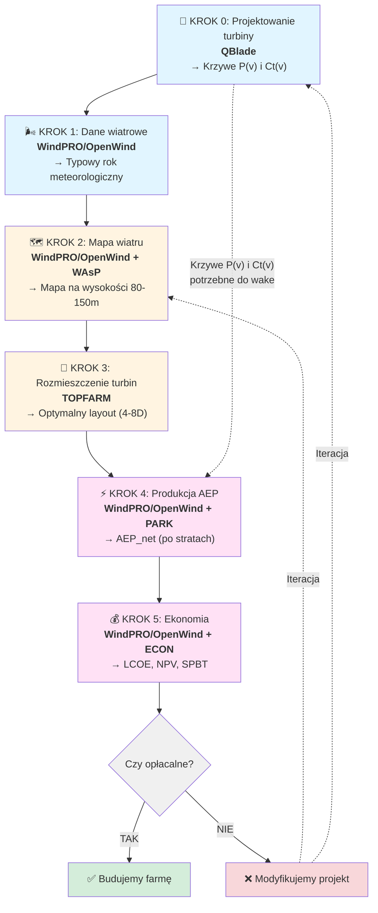

import { 
  SlideContainer, 
  Slide, 
  KeyPoints, 
  SupportingDetails, 
  InstructorNotes,
  VisualSeparator 
} from '@site/src/components/SlideComponents';

<SlideContainer>

<Slide title="🌀 Pełny proces projektowania farmy wiatrowej" type="info">

<KeyPoints title="🔄 Przepływ procesu projektowania">

**Legenda:**
- 🟦 Niebieski - przygotowanie danych wejściowych
- 🟨 Żółty - projektowanie layoutu
- 🟪 Różowy - analiza wyników
- ➖ Linia przerywana - wykorzystanie danych z wcześniejszego kroku

</KeyPoints>

<SupportingDetails title="🛠️ Kluczowe narzędzia">
- 🔧 **[QBlade](https://qblade.org/qblade-quick-start-guide/)** - aerodynamika wirnika, krzywe mocy
- 🎯 **[TOPFARM](https://topfarm.pages.windenergy.dtu.dk/TopFarm2/index.html)** - optymalizacja rozmieszczenia turbin i infrastruktury
- 📊 **[WindPRO](https://www.emd-international.com/software/windpro)**/[OpenWind](https://www.ul.com/software/openwind-wind-farm-modeling-and-layout-design-software) - integracja pomiarów, raporty środowiskowe
</SupportingDetails>

<InstructorNotes>
Dzisiaj przechodzimy przez **pełny proces projektowania farmy wiatrowej** - od pojedynczej turbiny aż po finalne obliczenie opłacalności. To sześć etapów, które się na siebie nakładają, i każdy wymaga innego narzędzia.

**Zacznijmy od początku - od samej turbiny.** To Etap zero, bo bez turbiny nie ma farmy. Tu używamy programu **QBlade**, żeby zaprojektować wirnik - czyli te wielkie łopaty, które widzimy na wietraku. Najważniejsze to znaleźć dobry profil aerodynamiczny łopaty, określić jej długość i skręcenie. Program robi za nas analizę BEM - to taka metoda, która łączy teorię łopaty z teorią pędu. Brzmi skomplikowanie, ale chodzi o to, żeby obliczyć, ile mocy da nam taka turbina przy różnych prędkościach wiatru.

**Na wyjściu z QBlade dostajemy znacznie więcej niż tylko dwie krzywe.** Oprócz krzywych P(v) - moc w funkcji prędkości wiatru, i Ct(v) - współczynnik ciągu, które są fundamentem dla kolejnych etapów, otrzymujemy także:

**Plik projektu** w formacie .qpr - to kompletne środowisko symulacyjne, które możemy później otworzyć i modyfikować.

**Dane szeregów czasowych** - szczegółowe metryki wydajności w różnych formatach eksportowych, gotowe do dalszej analizy.

**Geometria trójwymiarowa łopat** - pliki STL lub współrzędne punktów, które można bezpośrednio przekazać do produkcji.

**Wykresy charakterystyk** - współczynnik mocy Cp, współczynnik ciągu Ct, krzywe mocy - wszystko gotowe do umieszczenia w raportach.

Weźmy przykład - projektujemy turbinę trzech megawatową. Przy słabym wietrze, powiedzmy trzy metry na sekundę, turbina jeszcze nie startuje. Przy dwunastu metrach daje pełną moc, czyli te trzy megawaty. A przy bardzo silnym wietrze, dwadzieścia pięć metrów na sekundę, system się wyłącza ze względów bezpieczeństwa. Te informacje zapisujemy w krzywej P(v).

**Teraz Etap pierwszy - zbieramy dane o wietrze.** Mamy dwa źródła: albo stawiamy swój maszt pomiarowy albo korzystamy z baz danych. Coraz częściej używamy też LiDAR-u - to taki laser, który mierzy wiatr bez masztu. Wszystkie te dane wrzucamy do **WindPRO** lub **OpenWind**. Program sprawdza, czy dane są w porządku - czy nie ma dziur, błędów, czy wszystko się zgadza. Jeśli mierzymy tylko rok czy dwa, musimy to skorelować z długoterminowymi danymi z najbliższej stacji meteorologicznej. Stosujemy metodę MCP - czyli porównujemy nasze krótkie pomiary z długą serią z stacji, żeby uzyskać obraz typowego roku. **Bo rok do roku różni się**, jeden może być wietrzniejszy, drugi spokojniejszy.

**Etap drugi - tworzymy mapę wiatru dla całego terenu.** Problem w tym, że mierzymy wiatr na jednej wysokości, a gondola turbiny jest dużo wyżej - zazwyczaj osiemdziesiąt do sto pięćdziesiąt metrów nad ziemią. Więc musimy ekstrapolować - przeliczyć te dane w górę. Tu znowu pomagają **WindPRO** i **OpenWind**, które mają wbudowany model WAsP. Ten model uwzględnia ukształtowanie terenu - czy jest płasko, czy są wzgórza - i szorstkość powierzchni, czyli czy to las, łąka czy zabudowa. **Na wyjściu dostajemy mapę**, która pokazuje, gdzie na terenie wieje mocniej, a gdzie słabiej.

W prostym terenie to proste - dobre przybliżenie. Ale jak mamy doliny i wzgórza, to niepewność rośnie. Wtedy czasem używamy bardziej zaawansowanych modeli CFD w OpenWind, żeby lepiej to policzyć.

**Etap trzeci - rozmieszczamy turbiny.** To nie jest tak, że stawiamy je gdzie chcemy. Muszą być odpowiednie odstępy, żeby turbiny nie przeszkadzały sobie nawzajem. Zwykle to od czterech do ośmiu średnic wirnika. Tu głównie używamy programu **TOPFARM** - to narzędzie do optymalizacji. Mówimy mu: masz taką działkę, tyle turbin, maksymalizuj produkcję energii albo maksymalizuj zysk. Program sam szuka najlepszego układu, stosując różne algorytmy - gradientowe, genetyczne. Oczywiście musimy podać ograniczenia: są strefy zakazu, są wymagania hałasowe, cienie nie mogą padać na domy.

Często robimy to w dwóch krokach. Najpierw w **WindPRO** czy **OpenWind** robimy wstępny układ ręcznie, w jakiejś siatce. Potem **TOPFARM** to optymalizuje. Na końcu wracamy do WindPRO, żeby sprawdzić, czy wszystkie wymogi środowiskowe są spełnione.

**Etap czwarty - szacujemy produkcję energii.** To kluczowy moment. Używamy modułów PARK w **WindPRO** czy **OpenWind**. Tu właśnie potrzebujemy tych krzywych P(v) i Ct(v) z Etapu zerowego. Program bierze nasze rozmieszczenie turbin, dane o wietrze i liczy, ile energii wyprodukujemy w ciągu roku - to nazywamy AEP, roczna produkcja energii.

Ale uwaga - liczymy dwa rodzaje produkcji. **AEP gross**, czyli brutto - jakby wszystko działało idealnie. I **AEP net**, czyli netto - po uwzględnieniu strat. A strat jest sporo. **Wake**, czyli cień wiatrowy - gdy jedna turbina spowalnia wiatr dla następnej - to od pięciu do piętnastu procent strat. Potem mamy straty elektryczne w kablach - dwa, trzy procent. Są przestoje - turbina czasem stoi w serwisie, to kolejne dwa, pięć procent. Na północy mamy oblodzenie - jeszcze kilka procent. Sumując to wszystko, **AEP net** jest zwykle o dziesięć do dwadzieścia pięć procent niższe niż brutto.

Tu widać, dlaczego ta krzywa Ct(v) z Etapu zero jest taka ważna. Ona mówi, jak bardzo turbina spowalnia wiatr - czyli jak duży będzie ten wake, ten cień wiatrowy.

**I wreszcie Etap piąty - ekonomia.** Wiemy już, ile energii wyprodukujemy. Teraz pytanie brzmi: czy to się opłaca? Znowu **WindPRO** i **OpenWind** mają do tego moduły. Liczymy **CAPEX** - czyli koszty budowy: turbiny, fundamenty, drogi, kable, przyłącze do sieci. To wszystko daje jakąś kwotę, powiedzmy dwadzieścia milionów złotych dla małej farmy. Potem **OPEX** - koszty eksploatacji: serwis, ubezpieczenia, dzierżawa gruntów, zarządzanie. To rocznie może być pół miliona.

Teraz porównujemy koszty z przychodami. Ile dostaniemy za wyprodukowaną energię? To zależy od taryfikacji, od aukcji, czasem są umowy długoterminowe PPA. Na podstawie tego liczymy **LCOE** - koszt jednostkowy energii, ile nas kosztuje wyprodukowanie jednej kilowatogodziny. Liczymy **NPV** - wartość bieżącą netto, czyli czy po dwudziestu, trzydziestu latach zarobi się więcej niż się włożyło. I **IRR** - wewnętrzną stopę zwrotu, żeby wiedzieć, czy to lepsza inwestycja niż inne opcje.

Ciekawostka - **TOPFARM** potrafi też optymalizować pod kątem maksymalnego zysku, nie tylko maksymalnej energii. Bo czasem warto postawić turbinę trochę bliżej, nawet jeśli da mniej energii, bo zaoszczędzimy na kablu.

**Żeby to wszystko podsumować** - mamy taki przepływ danych. QBlade projektuje turbinę, daje nam krzywe. WindPRO zbiera dane o wietrze, tworzy mapę. TOPFARM układa turbiny optymalnie. WindPRO liczy produkcję, uwzględniając wake. I na końcu liczymy ekonomię, żeby zdecydować, czy budować.

**Jedna bardzo ważna rzecz** - przez cały proces musimy pilnować spójności. Gęstość powietrza w QBlade musi być taka sama jak w WindPRO. Jednostki muszą się zgadzać. Wysokości odniesienia muszą być spójne. Jeśli coś budzi wątpliwości, oznaczamy niepewność i pokazujemy wyniki w wariantach - P50 to scenariusz typowy, P90 to scenariusz ostrożny.

**I ostatnia rzecz - to wszystko jest iteracyjne.** Czasem dojdziemy do Etapu czwartego i okaże się, że produkcja jest za niska. Wtedy wracamy do Etapu trzeciego, zmieniamy rozmieszczenie. A może nawet do Etapu zerowego - może potrzebujemy inny model turbiny. To normalny proces projektowy - idziemy do przodu, sprawdzamy, czasem cofamy się i poprawiamy. **Każde narzędzie jest najlepsze w swojej dziedzinie**, dlatego używamy ich razem, uzupełniają się nawzajem.
</InstructorNotes>

</Slide>

</SlideContainer>

