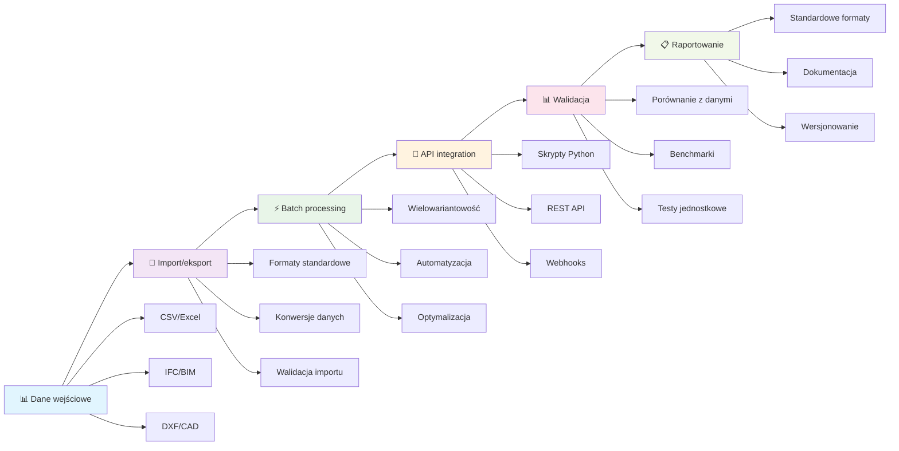

## Kluczowe zagadnienia

### Interoperacyjność w projektach OZE
- **Import/eksport danych**: CSV, IFC, DXF - standardowe formaty wymiany danych
- **Batch runs**: automatyzacja procesów projektowych dla wielu wariantów
- **API i skryptowalność**: programowe sterowanie narzędziami OZE
- **Integracja systemów**: łączenie różnych narzędzi w spójny workflow

### Walidacja i reproducibility
- **Dobre praktyki raportowania**: standardowe formaty i struktury dokumentów
- **Reproducibility**: możliwość odtworzenia wyników przez innych użytkowników
- **Walidacja wyników**: porównanie z danymi rzeczywistymi i benchmarkami
- **Dokumentacja procesów**: śledzenie zmian i wersjonowanie projektów

## Osiągnięte cele

✅ **Poznanie metod importu/eksportu danych** - studenci potrafią wymieniać dane między narzędziami OZE  
✅ **Zrozumienie batch runs** - automatyzacja procesów dla wielu wariantów projektowych  
✅ **Znajomość API** - programowe sterowanie narzędziami i integracja systemów  
✅ **Praktyki raportowania** - standardowe formaty dokumentacji projektów  
✅ **Walidacja wyników** - metody weryfikacji poprawności obliczeń  

## Przepływ pracy z interoperacyjnością

## Kryteria interoperacyjności

### Format danych
- **CSV/Excel**: dane tabelaryczne, wyniki obliczeń
- **IFC**: modele BIM, geometria 3D
- **DXF**: rysunki techniczne, plany instalacji
- **JSON/XML**: dane strukturalne, konfiguracje

### Poziomy integracji
- **Poziom 1**: Import/eksport plików
- **Poziom 2**: API i skrypty
- **Poziom 3**: Integracja w czasie rzeczywistym
- **Poziom 4**: Wspólne środowisko pracy

### Walidacja wyników
- **Porównanie z danymi rzeczywistymi**: weryfikacja modeli
- **Benchmarki branżowe**: standardowe przypadki testowe
- **Testy jednostkowe**: automatyzacja weryfikacji
- **Dokumentacja procesów**: śledzenie zmian

## Dobre praktyki

### Dokumentacja projektów
- **Standardowe formaty**: ujednolicone szablony raportów
- **Wersjonowanie**: śledzenie zmian w plikach projektowych
- **Metadane**: informacje o autorze, dacie, wersji oprogramowania
- **Archiwizacja**: długoterminowe przechowywanie projektów

### Reproducibility
- **Zapisywanie parametrów**: wszystkie ustawienia obliczeń
- **Środowisko obliczeniowe**: wersje oprogramowania i bibliotek
- **Dane wejściowe**: kompletne zestawy danych
- **Instrukcje odtworzenia**: krok po kroku

### Automatyzacja
- **Batch runs**: przetwarzanie wielu wariantów
- **Skrypty**: automatyzacja powtarzalnych zadań
- **API**: programowe sterowanie narzędziami
- **Workflow**: zautomatyzowane procesy projektowe

## Pytania kontrolne

1. **Jakie formaty danych są najczęściej używane do wymiany między narzędziami OZE?**
2. **Jakie są główne poziomy integracji systemów w projektach OZE?**
3. **Jakie metody walidacji wyników można zastosować w projektach OZE?**
4. **Dlaczego reproducibility jest ważna w projektach OZE?**
5. **Jakie są korzyści z automatyzacji procesów projektowych?**

## Materiały dodatkowe

- **Dokumentacja API** narzędzi OZE (PV*SOL, PVsyst, SAM)
- **Standardy wymiany danych** (IFC, DXF, CSV)
- **Przewodniki automatyzacji** (Python, R, MATLAB)
- **Dobre praktyki dokumentacji** projektów technicznych
- **Metody walidacji** modeli energetycznych

## Przygotowanie do następnego wykładu

W następnym wykładzie skupimy się na analizie ekonomicznej projektów OZE. Przygotujcie się do omówienia:

- Metod analizy kosztów i korzyści
- Wskaźników ekonomicznych (NPV, IRR, LCOE)
- Narzędzi do analizy finansowej
- Praktycznych przykładów kalkulacji ekonomicznych
